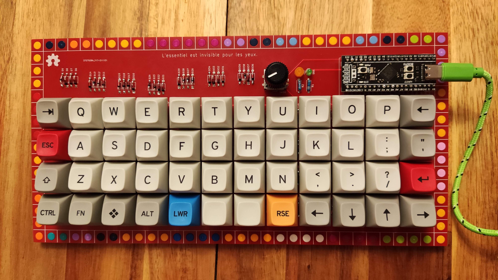
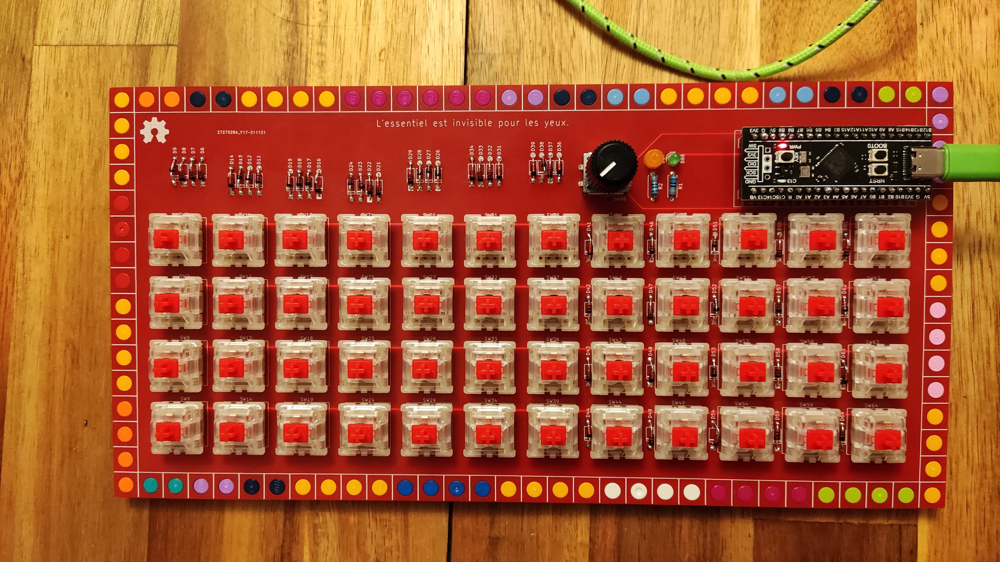
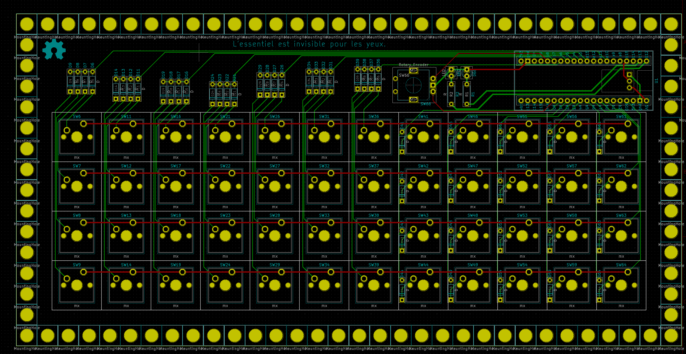

4x12 in lego
===============

  

  

this is practlically a planck style.

status: tested all ok!

* [x] gerbers designed
* [x] firmware
* [x] breadboard tested
* [x] gerbers printed
* [x] board tested


Features:

* 4x12
* 1 encoder
* led strip (optional)
* 5 pins
* stm32f401 or 411(if you ask) from we act https://github.com/WeActTC/MiniSTM32F4x1
* firmware qmk

the pcb
-------


  

  


parts
-----


* 1xSTM32F401 we act pins
* 48 signal diodes 1N4148 , do 35
* 1 encoder
* 2x220Ω or 350Ω these are for leds so you may have to compute the R to match your colours and desired brightness.
* 1 leds
* 1 40 pin DIL/DIP sockets whatever you prefer
* led strip 3pins, optional
* 5 pin MX switches 48
* lego see main article, and imagination.
* lego 32x16 plates for bottom, and bricks as you please


repo
----

gitlab repo https://gitlab.com/m-lego/m48/


firmware
--------

```bash
   git clone --recurse-submodules git@github.com:alinelena/qmk_firmware.git
   git checkout m48
   make m-lego/m48/rev1:default
   make m-lego/m48/rev1:default:flash


