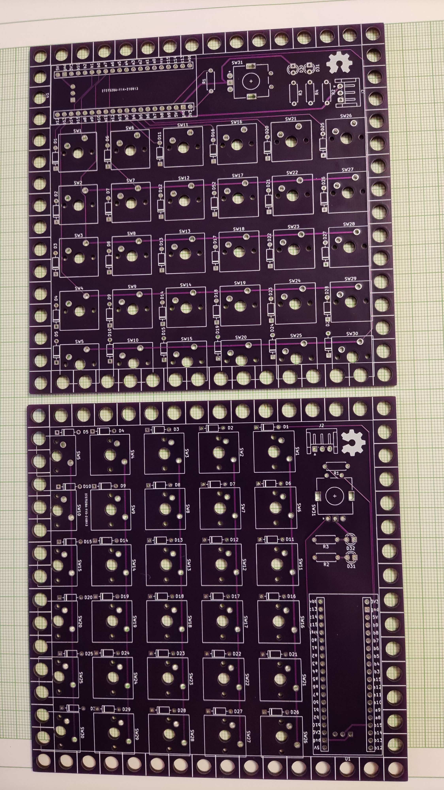
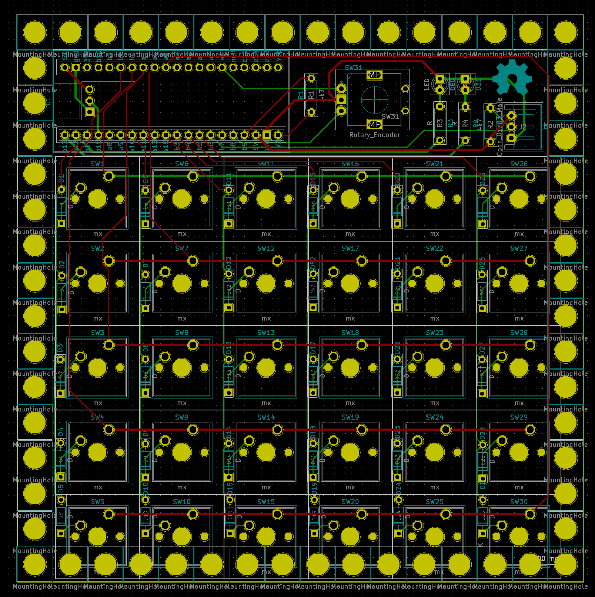
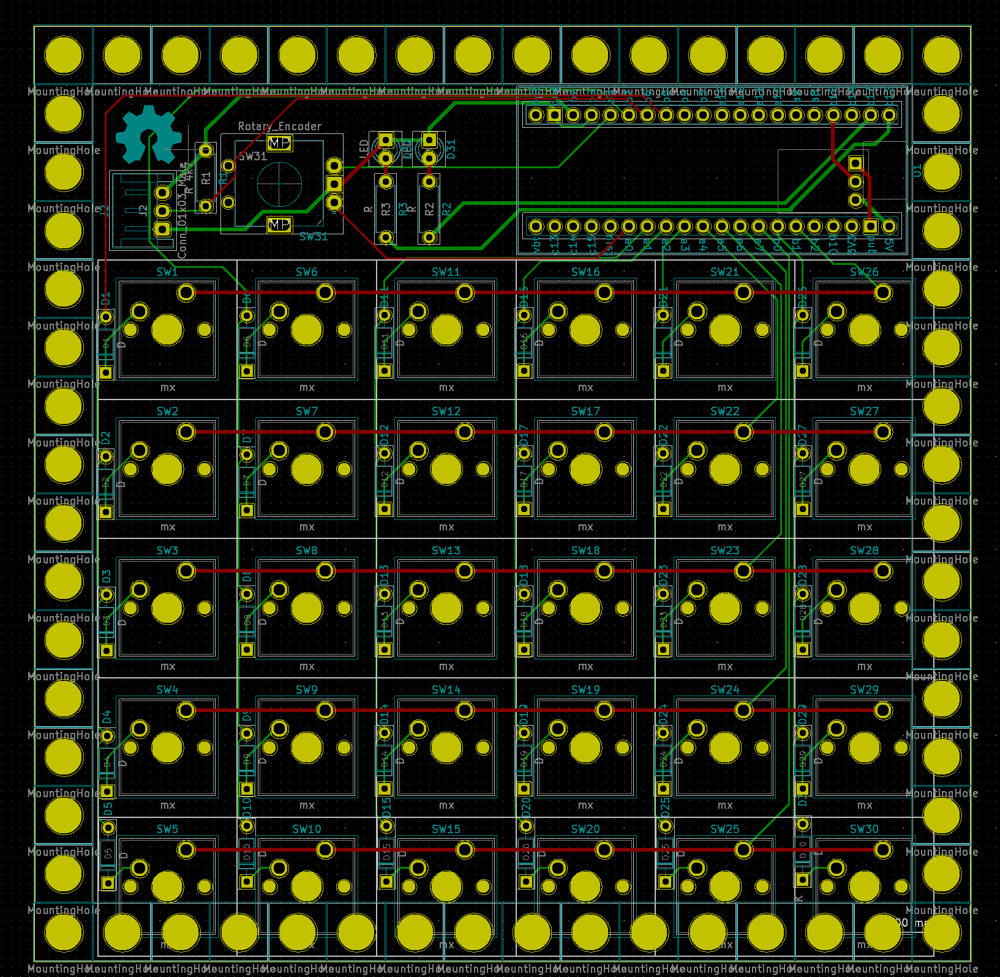
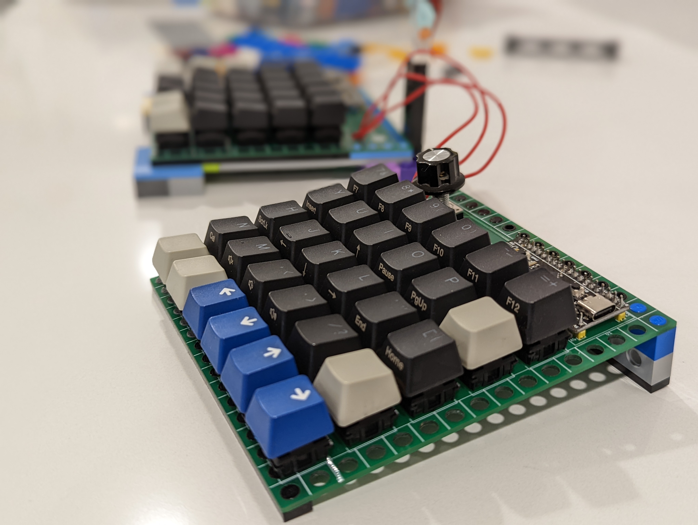
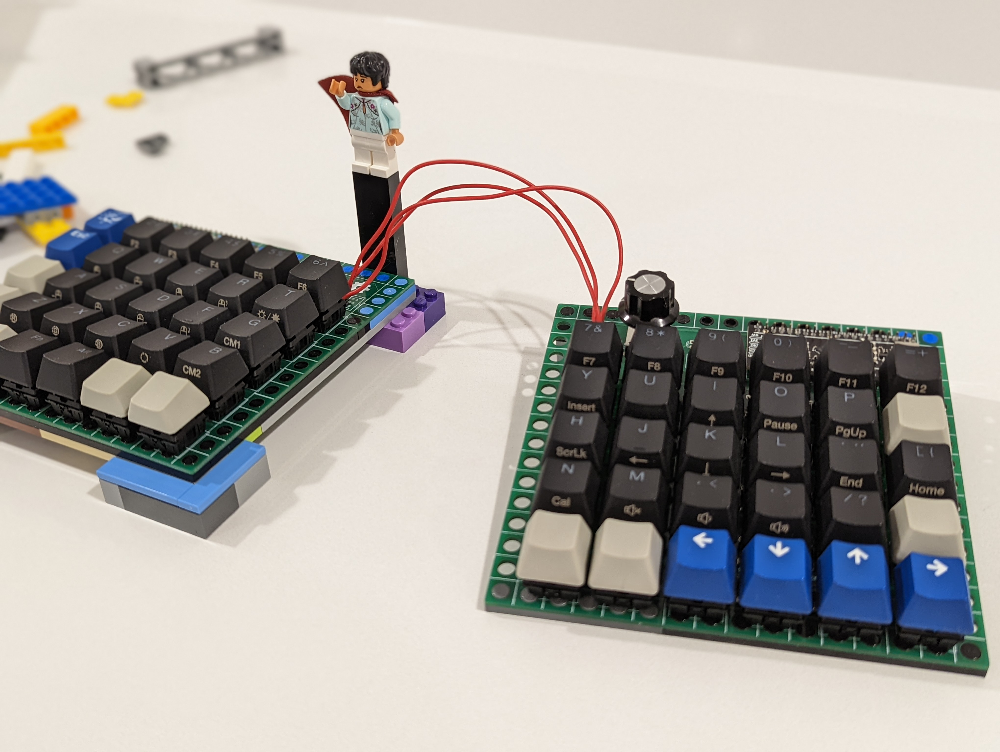

5x12 split in lego
==================

  

status:  tested all ok

* [x] gerbers designed
* [x] firmware
* [x] breadboard tested
* [x] gerbers printed
* [x] board tested

**note** I will release the project fully once things are tested. I am doing this out of hobby but the plan is to have a fully functional
product hence the delays. if you want to sponsor by ordering prototypes and sharing some of the boards and cost with me I am more
than happy. This will speedup the process and you will end up with some boards, if fully functional

Features:

* 5x12 split
* 1 encoder each side
* led strip
* 5 pins
* stm32f401 from we act https://github.com/WeActTC/MiniSTM32F4x1


the pcb
-------

printed one

  

left side pcb

  

right side pcb

  

parts
----

* 2xSTM32F401 we act pins
* 60 signal diodes 1N4148 , do 35
* 2 encoders
* 3x4.7kΩ
* 4x220Ω - these are for leds so you may have to compute the R to match your colours and desired brightness.
* 4 leds
* 2 40 pin DIL/DIP sockets whatever you prefer
* 2 JST XH 2.54 3P angle connectors, optionally another too for led strip
* cable to work with the sockets, direct not crossed wires
* led strip 3pins
* 5 pin MX switches 60


repo
----

gerbers and kicad files in here  https://gitlab.com/m-lego/m60_split/

firmware
--------

```bash
   git clone --recurse-submodules git@github.com:alinelena/qmk_firmware.git
   git checkout m60_split
   make mlego/m60_split/rev1:default
   make mlego/m60_split/rev1:default:flash
```

other builds
------------

these are Seth's builds (u/modularsynth123456/)




