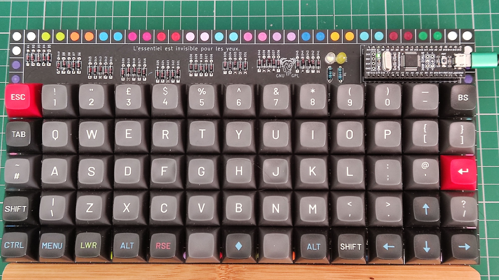

the lego keyboard
=================

motivation
----------

this is just a fun project started some time ago.
The idea was to have an iso friendly ortholinear keyboard.
Initially I started with a 6x13 but then settled to a 5x13 as best option.
more info in [here](https://alin.elena.space/blog/keeblego/)


There is a [6x13](https://github.com/Kyrremann/index-tab) project if you want
and a [4x13](https://github.com/farfalleflickan/nack)

I am not related with any of them and discovered some of them too late.

what is special about this one?

  * the case is set in lego (almost lego)
  * microcontroller is just a standard apm/stm32f103 blackpill from robotdyn  or gd32f303 bluepill plus from we act studio


bom
---

 * lego: suggested 1x2 plates or 1x4 plates you need to press them gently with a rolling pin
 * double sided plate 16x32 studs.... you will need to live with a compatible since lego does not make them in this size, one thing
   i noticed is some plates may make the pcb to slightly bend... seems gray coloured ones are ok... no idea why.
 * 4 1x1 lego tiles or eyes.
 * optional 4 2x2 corner plates
 * 65 signal diodes 1N4148 , do 35
 * 2 resistors  and 2 leds, resistors need to be computed to match the colour of the led
 * 1 apm/stm32f103 blackpill from robotdyn F303 will work also since they are pin identical.
 * or gd32f303 from we act studio...
 * switches (5 pin) and keycaps... for pcb mount

pictures
--------

  the 3d render looks like

  

  the pcb

  

  just switches mounted

  

  keyboard no 1 (mt3 tty bleached, kailh crystal royal)

  

  keyboard no 2 (mt3 susuwatari, kailh crystal jade)

  

  keyboard no 3 (mt3 tty, kailh crystal royal)

  

  

  keyboard no 4 (tbd, novelkeys blueberry in process of re-springing)

  

  keyboard no 5 (tbd, gateron ink v2 yellow and red)

  

  keyboard no 6 (kailh crystal jades with click bar removed... )

  

  keyboard no 7 (gateron whites and /dev/tty)

  

  

  keyboard no 8 ()

  keyboard no 9 ()

  keyboard no 10 ()

firmware
--------

   layout is bellow, but since is qmk can be whatever one likes, no 5 will be Danish for example.

   

   is qmk and is in a branch for the moment, I assume you already have qmk environment configured.

   microcontroller stm32f103/apm32 from robotdyn... aka black pill, https://robotdyn.com/black-pill-apm32f103cb-128kb-flash-20kb-sram-stm32-compatible-arm-cortexr-m3-mcu-mini-board.html

```bash
   git clone --recurse-submodules git@github.com:alinelena/qmk_firmware.git
   git checkout m65-dev
   make m65/rev1:uk
   make m65/rev1:uk:flash
```

you can use also gdf303 from we act aka bluepill plus  https://github.com/WeActTC/BluePill-Plus

```bash
   git clone --recurse-submodules git@github.com:alinelena/qmk_firmware.git
   git checkout m65-dev-rev2
   make m65/rev2:uk
   make m65/rev2:uk:flash
```
