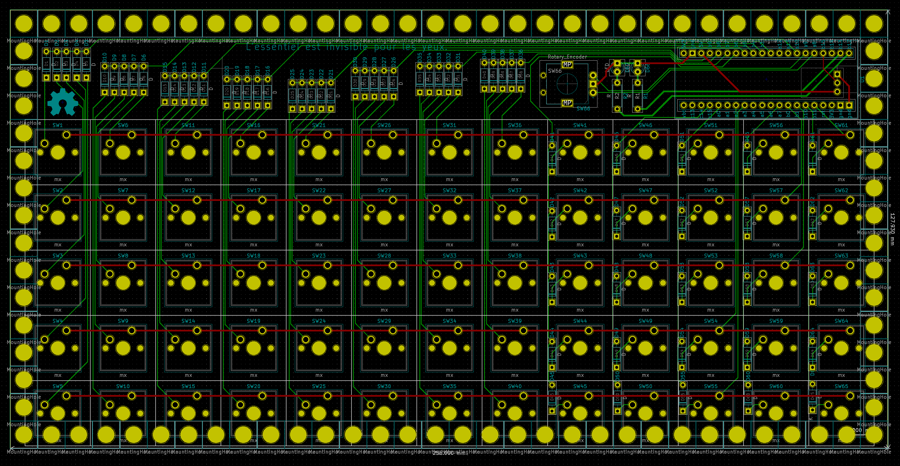
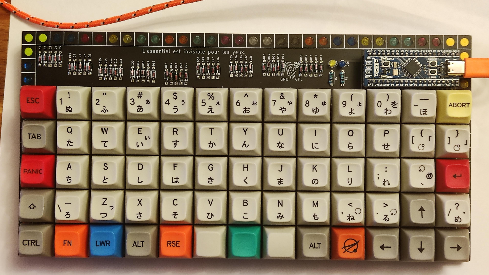

the lego keyboard
=================

motivation
----------

this is just a fun project started some time ago.
The idea was to have an iso friendly ortholinear keyboard.
Initially I started with a 6x13 but then settled to a 5x13 as best option.
more info in [here](https://alin.elena.space/blog/keeblego/)


There is a [6x13](https://github.com/Kyrremann/index-tab) project if you want
and a [4x13](https://github.com/farfalleflickan/nack)

I am not related with any of them and discovered some of them too late.

I have also made a split, 5x12 and 4x12, see below.


what is special about this one?

  * the case is set in lego (almost lego)
  * microcontroller is just a standard apm/stm32f103 blackpill from robotdyn  or gd32f303 bluepill plus from we act studio([gerbers](gerbers-stm32f103.zip)), version
    with stm32f401 available now too see the [gerbers](gerbers-stm32f401.zip)
  * rotary encoder (no switch)
  * optional led strip (you will need a full brick lego or one more layer..)

**note** the holes in current version are cut at the official lego dimension. Unfortunately the drilling machines have tolerance and
the same the lego making tools... the tolerance in lego varies with colour of the plastic... you will find some colours may not fit
as well as others. I suggest you to use 1x2 plates if you want the finest keyboard, since they tend to bend the pcb... you will be
amased but the force.

if you do not want an angle for typing use a single sided plate as base.

foaming the bottom makes a difference i use usually diy/hobbycraft foam, that you can buy for close to nothing in a4 sheets.


see also
--------

 * [5x12 split in lego](512s.md)
 * [5x12 in lego](512.md)
 * [4x12 in lego](412.md)

bom
---

 * lego: suggested 1x2 plates or 1x4 plates you need to press them gently with a rolling pin
 * double sided plate 16x32 studs.... you will need to live with a compatible since lego does not make them in this size, one thing
   i noticed is some plates may make the pcb to slightly bend... seems gray coloured ones are ok... no idea why.
 * 4 1x1 lego tiles or eyes.
 * optional 4 2x2 corner plates
 * 65 signal diodes 1N4148 , do 35
 * 2 resistors  and 2 leds, resistors need to be computed to match the colour of the led
 * 1 apm/stm32f103 blackpill from robotdyn, F303 will work also since they are pin identical.
 * or gd32f303 from we act studio...
 * or stm32f401 from we act
 * switches (5 pin) and keycaps... for pcb mount
 * rotary encoder (I got this Bourns 24 Pulse Incremental Mechanical Rotary Encoder with a 6 mm Flat Shaft but any similar shall do)
 * jst horizontal header 3 pin, if you add leds


thickness
----------


depending on what you want the box can come out very thin.. 1 base plate(single or double, flat or angled usage) plus pcb(1.6mm) plus one plate
intermediate(3.2mm).
that is thin. This shall allow you to put in a sheet of foam for sound dampening.


  


2 layers of intermediate plates, for thicker foam sheet or for led strip which is connected by hand to the pins or holes... no jst
header.

   

1 full brick if you want a jst header.

  


pictures
--------

  the 3d render looks like (version 1)

  

  version 2

  

  the pcb (version 1)

  

   version (2)

  

   version (3)

  

   version (4)

  

  just switches mounted

  

  keyboard no 1 (mt3 tty bleached, kailh crystal royal)

  

  

  keyboard no 2 (mt3 susuwatari, kailh crystal jade)

  

  

  keyboard no 3 (mt3 tty, kailh crystal royal)

  

  

  

  keyboard no 4 (tbd, novelkeys blueberry in process of re-springing)

  

  keyboard no 5 (tbd, gateron ink v2 yellow and red)

  

  keyboard no 6 (kailh crystal jades with click bar removed... )

  

  

  

  

  keyboard no 7 (gateron whites and /dev/tty)

  

  

  

  keyboard no 8 (frankenstein switches linears with mt3 camillo)

  

  keyboard no 9 (mt3 cyber if drop decides to ship)

  

  keyboard no 10 (mt3 dasher)

  

  keyboard no 11 (mt3 cybe)

  

  keyboard no 12 (mt3 3277)

  keyboard no 13 (mt3 fairlane)

firmware
--------

   layout is bellow, but since is qmk can be whatever one likes, no 5 will be Danish for example.

   

   

   

   is qmk and is in a branch for the moment, I assume you already have qmk environment configured.

   microcontroller stm32f103/apm32 from robotdyn... aka black pill, https://robotdyn.com/black-pill-apm32f103cb-128kb-flash-20kb-sram-stm32-compatible-arm-cortexr-m3-mcu-mini-board.html

```bash
   git clone --recurse-submodules git@github.com:alinelena/qmk_firmware.git
   git checkout m65
   make m65/rev1:uk
   make m65/rev1:uk:flash
```

you can use also gdf303 from we act aka bluepill plus  https://github.com/WeActTC/BluePill-Plus

```bash
   git clone --recurse-submodules git@github.com:alinelena/qmk_firmware.git
   git checkout m65
   make m65/rev2:uk
   make m65/rev2:uk:flash
```

you can use also stm32f401 from we act


```bash
   git clone --recurse-submodules git@github.com:alinelena/qmk_firmware.git
   git checkout m65
   make m65/rev3:uk
   make m65/rev3:uk:flash
```
