assembly guide
==============

before you start
----------------

mcu
---

whatever mcu you are using I suggest strongly to socket it.

first step is to add headers on it.

i use round pins and dil sockets, 40 way. picture below

put the headers into the socket no need to fully insert them just be sure the conical bit points towars the socket and the mcu on
top. see picture below.

be sure headers are vertical and stable. now you can start soldering.

I solder usually the extremes for each row and then the rest.

finally shall look like this

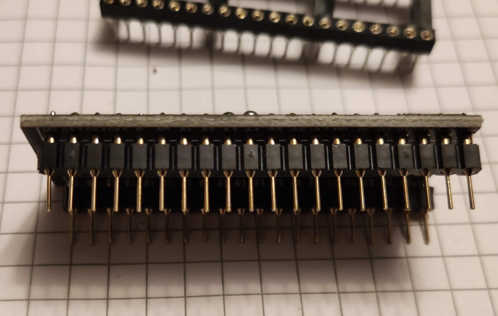

oled
----

if you are using an oled i suggest to socket it too. Again I use round pins 4 in a row are enough and use a low profile socket, see
below.

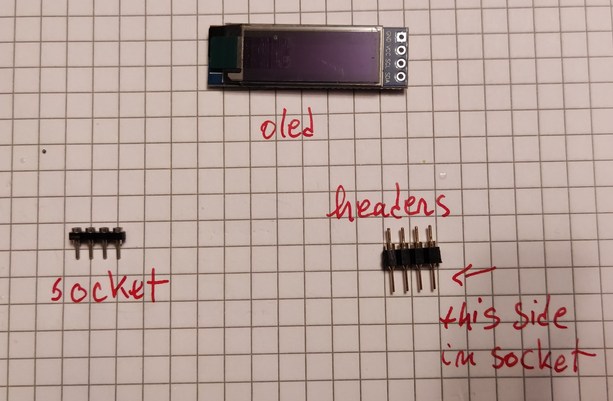

for soldering this you can use the pcb as support. add the headers into the pcb(conical side towards pcb) put the oled on top and be
sure is vertical. you can use some blue tack or whatever.

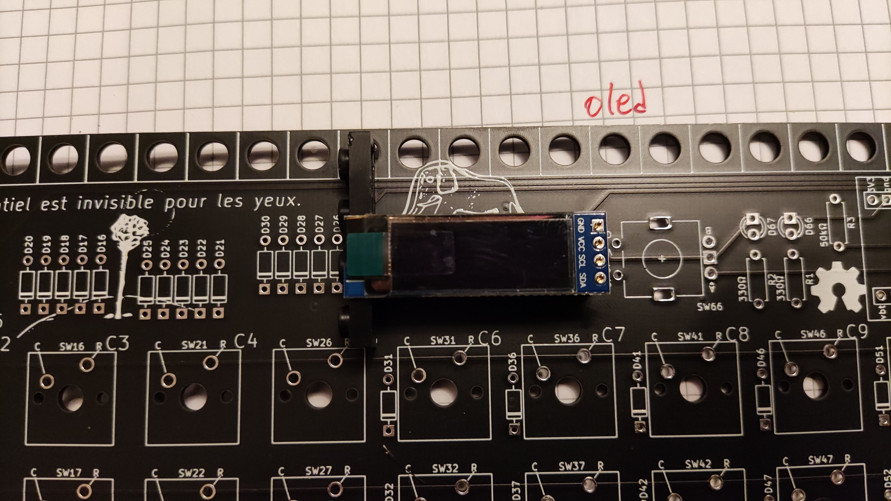

now you can solder the oled(be sure you do not solder the keyboard pcb
side). Once done you can remove it from pcb shall look like this.

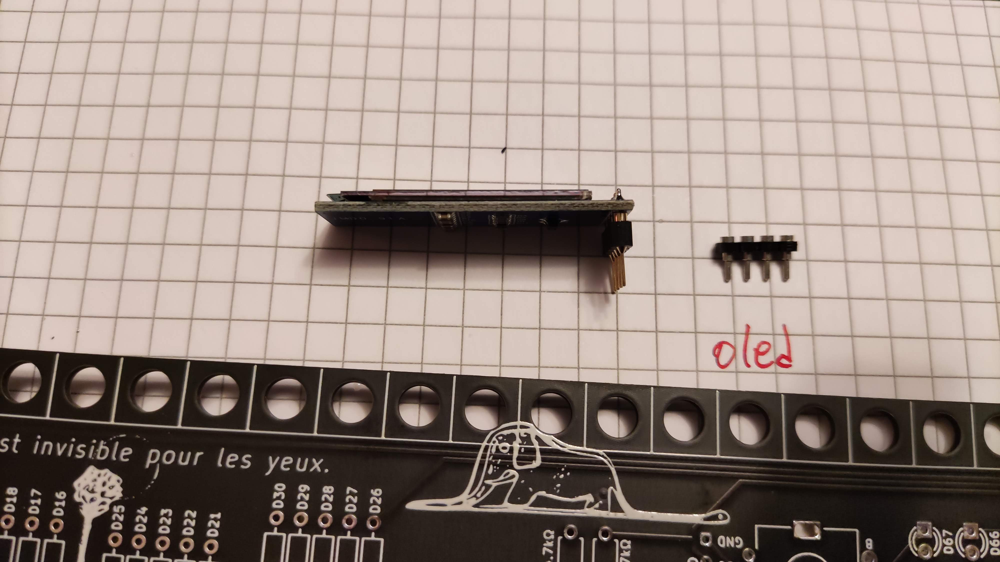

diodes
------

get 65 of them 1n4148 do-35, they look like this.

notice the black colar at one end.

bend the legs at 90˚ like in the picture above.

insert them in the holes, with the black colar oriented to the lower part of the board.
see picture.

bend the legs on the reverse of the pcb to assure the diode is fixed in the position.
see picture.

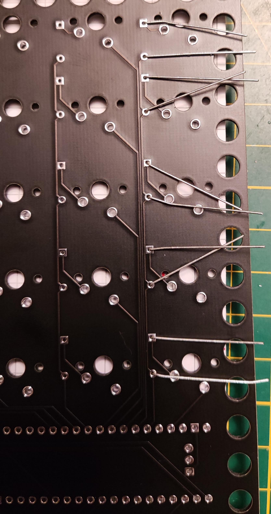

now you can solder, once done, wriggle the legs of the diode until they detach, leaving a clean cut at solder level.
see picture

repeat for all the diodes next to the switches.you may find it easier if you work your way for each column.

for the diodes at the top, bending shall be done differently, see picture. this allows to add them all in one go.

finally once you are over shall look like this or better

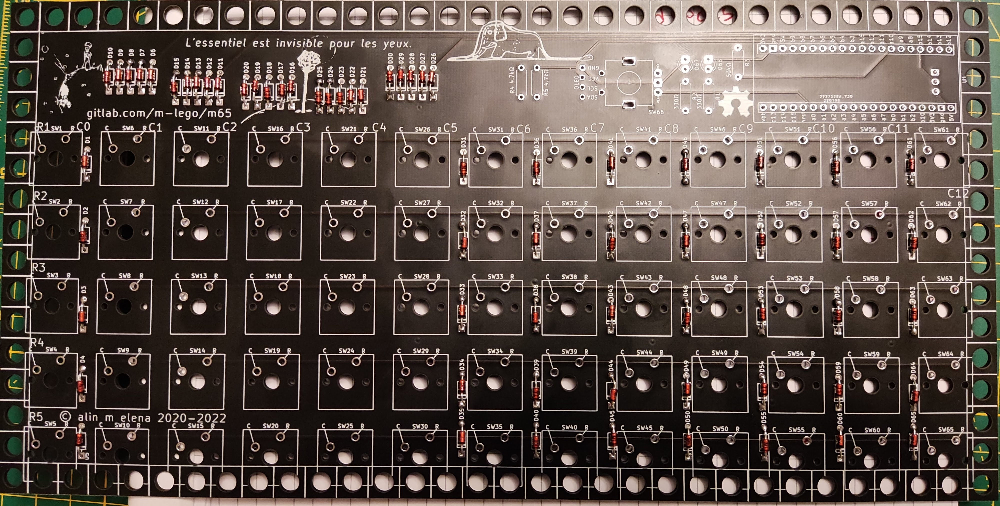

resistors
---------

there are max three resistors you need to put procedure is the same as for the diodes, bend, insert, bend.
it does not matter how you insert them, just be sure you have the right values in the right places.

R3  is 100kΩ R1 and R2 need to be calculated based on the colour of the led used and desired intensity. for yellow and green leds I
use 510Ω(not very bright) and for white leds 1kΩ (quite bright)

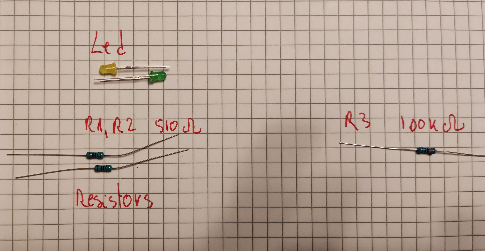

**note**: you may want to use a breadboard to test before to see if you are happy with the intensities, use a 3.3V DC source. alternatively
you can use the mcu itself. if you do not have a breadboard dupont wires may be enough.
also in this step you will determine the led orientation... note which leg goes to 3.3V and which one goes to ground.
this step is important since I noticed some of the leds do not follow the convention... long leg positive, short leg negative.

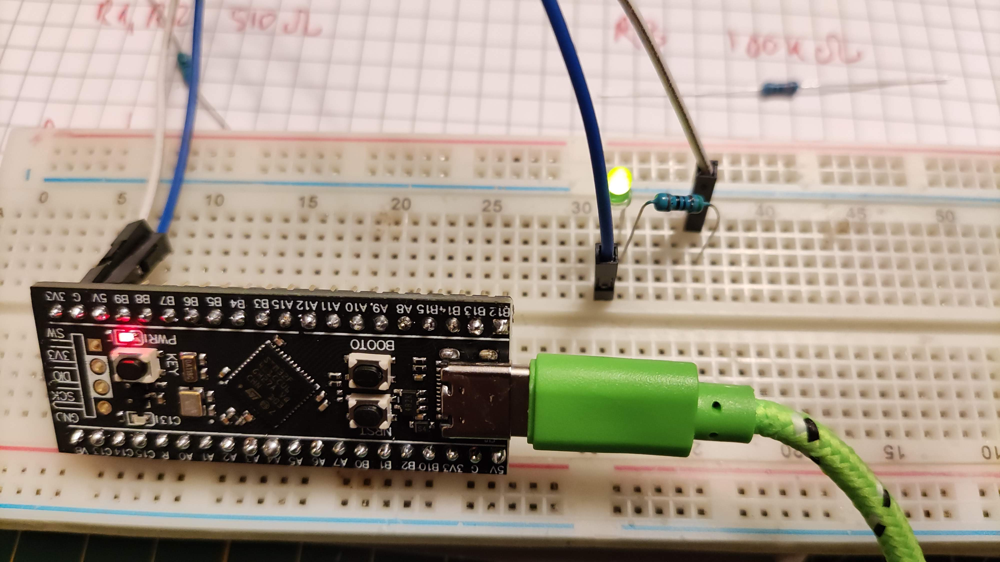

sockets
-------

put the 40 way dil socket into the pcb (front side). secure it with tape.

turn the pcb. you can solder the  extreme pins on rows. be sure the socket is properly aligned with the pcb

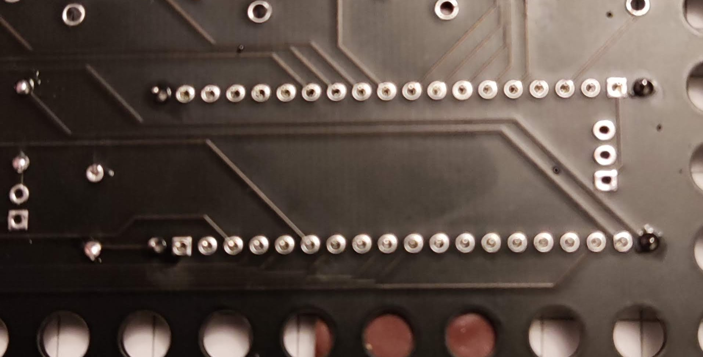

next repeat the same but with the oled socket.

leds
----

put the leds in the right position, matching the resistor value determined before. also you need to be sure the leg that pointed to
ground goes in the hole with the square plating. once inserted you can bend the legs on the back of the board and solder them.
wriggle to remove the legs.

switches
--------

you need 65 switches 5 pins. be sure the legs are not bent. in general switches shall fit quite tight so you may have to push.
once they are in place inspect all of them are aligned. just look along columns and rows and see if any is out of place... if yes
just push them.

some switches do not fit tight (kailh for example) you will need to be creative and use a hardcover book or something to turn then
on the over side to solder.

now you can solder...

encoder
-------

carefully push the encoder in its place. there are 5 pin but only 3 are user, solder all of them and also consider soldering the
oval ones too...

if all is ok now looks like this

at this point everything shall work..

the box
-------

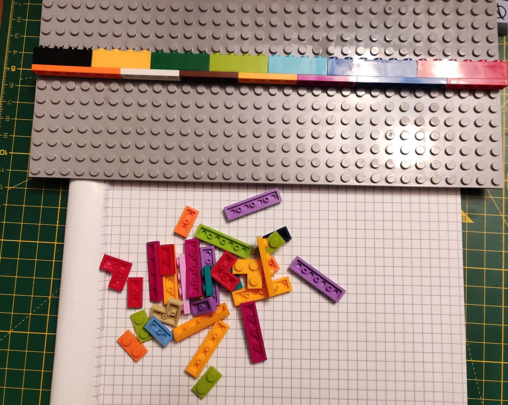

you can use a 16x32 plate and a mixture of lego plates, 1x2 and/or 1x4, corners if you have too.
Also you can use a full brick and plate to give it a typing angle (around 6˚) already assembled in the picture above.

put it as you please

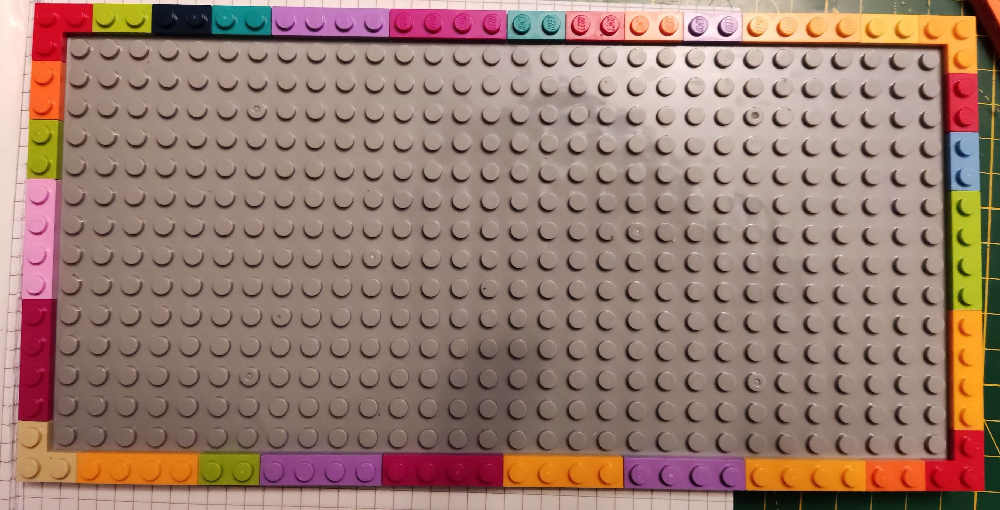

now you can put the pcb on top of the box base matching the lego inside. press gently till they are properly fit. thickness of the
pcb is same as the lego prongs so you shall see them flush.

now you can socket mcu, oled and the knob of the encoder and plug it in.

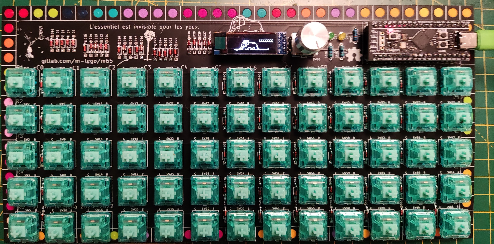

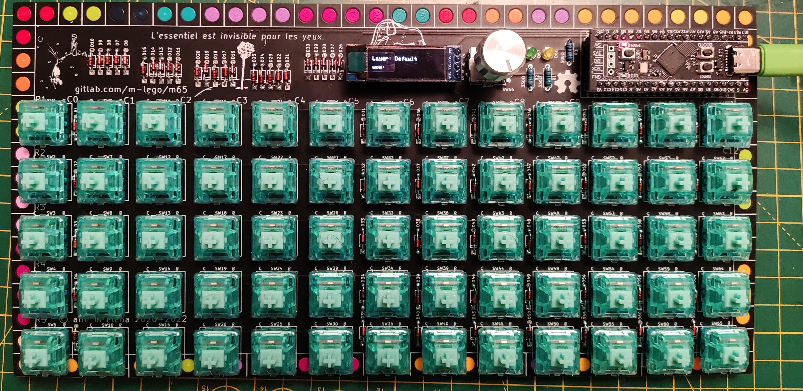

testing time
------------

+ if screen lights up showing an elephant inside a python it is perfectly fine. after few seconds, shall indicate you the the current
layer and show wpm(some estimate of words per minute)
+ encoder shall change the volume
+ double tap dance the third key from the left on the bottom row, first led from the encoder shall be on... do it again shall be off...
+ double tap dance the fifth key from the left on the bottom row, second led from the encoder shall be on... do it again shall be off...
+ now you are ready to test the keys...

if anything goes wrong you will need to debug... otherwise put the keycaps and enjoy.

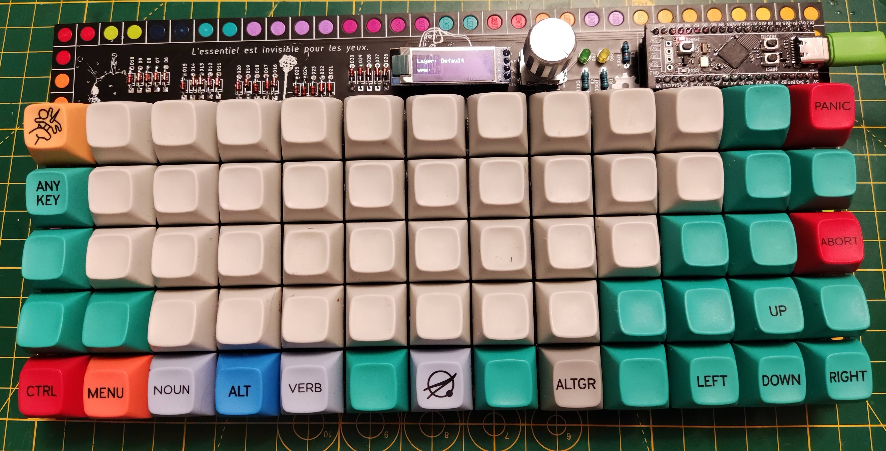

