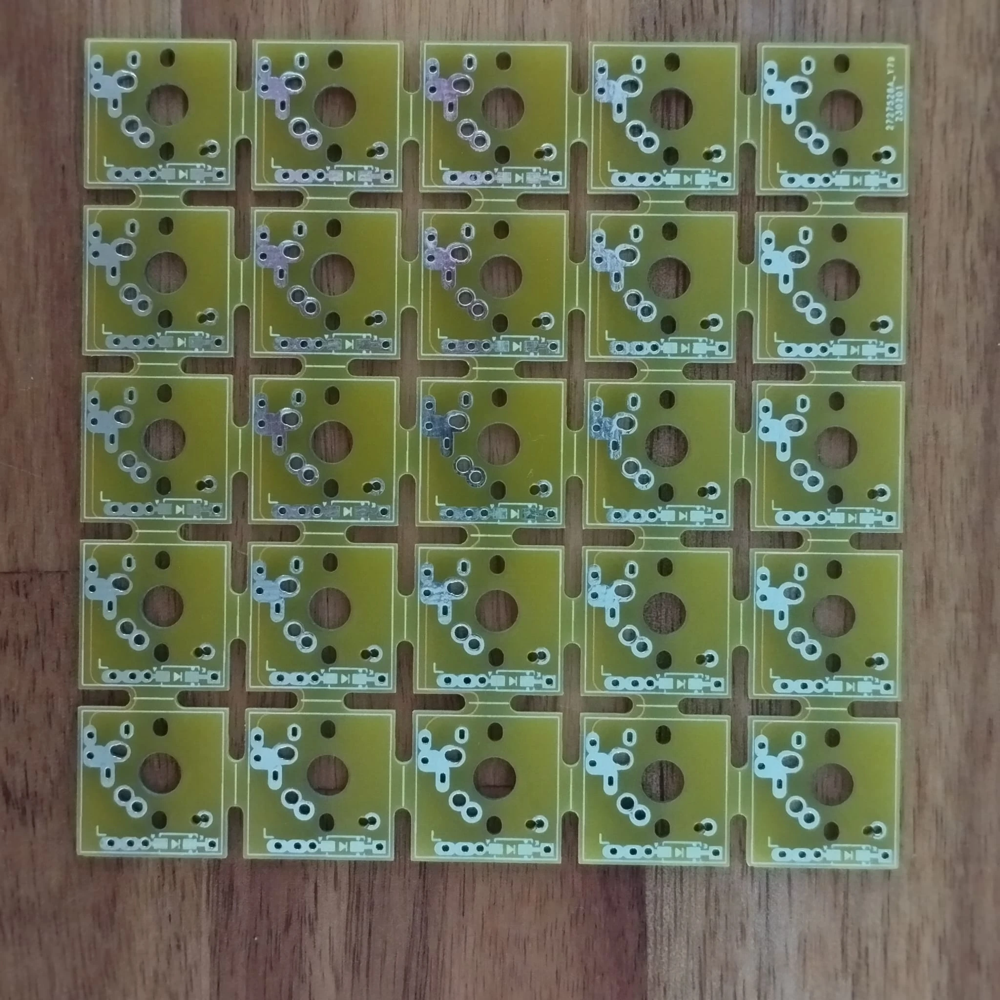

## handwire

handwire is great but is boring.
This is a small 5x5 panel of that supports both MX and chocov2.
needs to be cut to write dimensions.

  

  

## render

  

## pcb

  

## gerbers

ready may gerbers for jlcpcb are available [here](https://gitlab.com/m-lego/hand5x5/-/blob/main/gerbers-rev5.zip)

full kicad project is available https://gitlab.com/m-lego/hand5x5 footprints are shared from [m65](https://gitlab.com/m-lego/m65)
