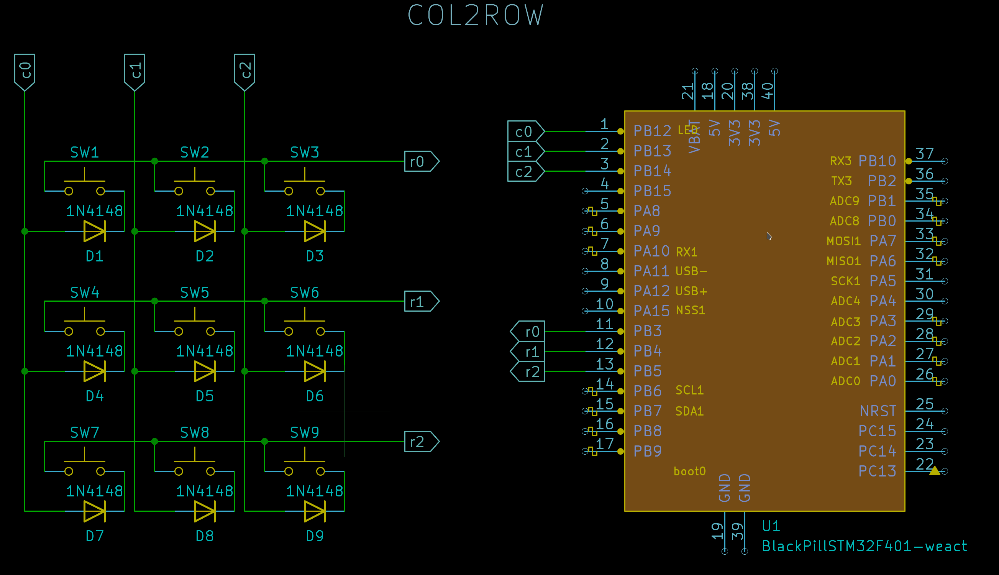
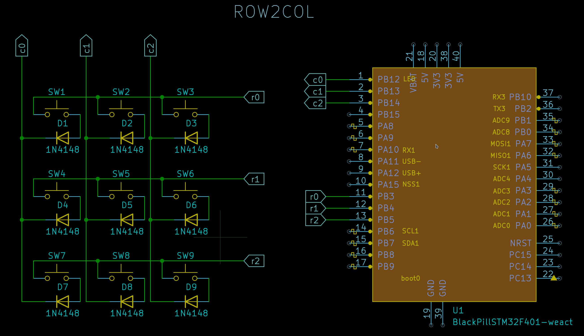
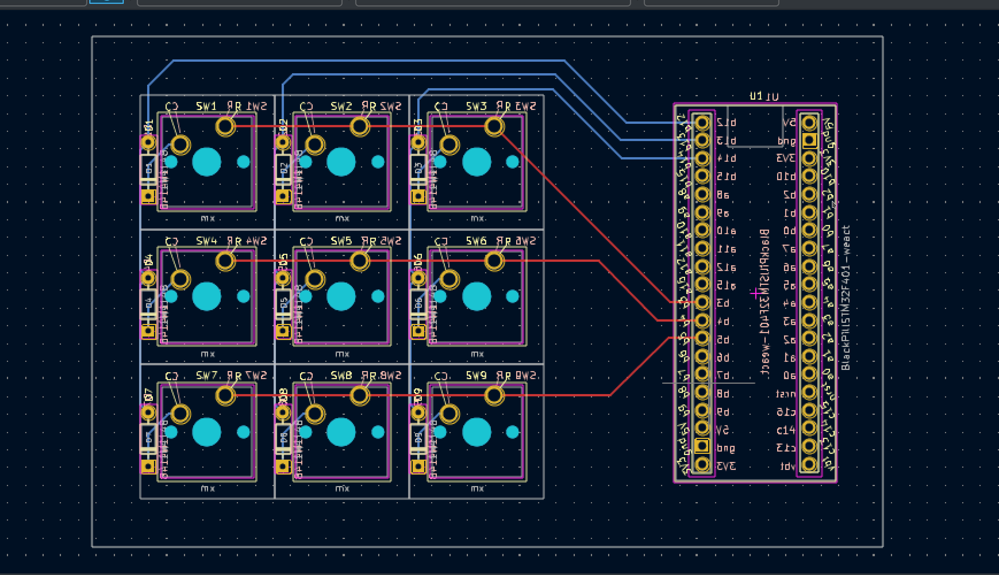
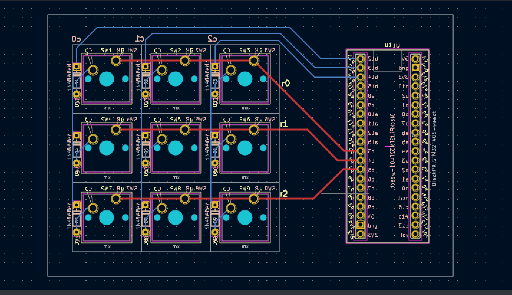
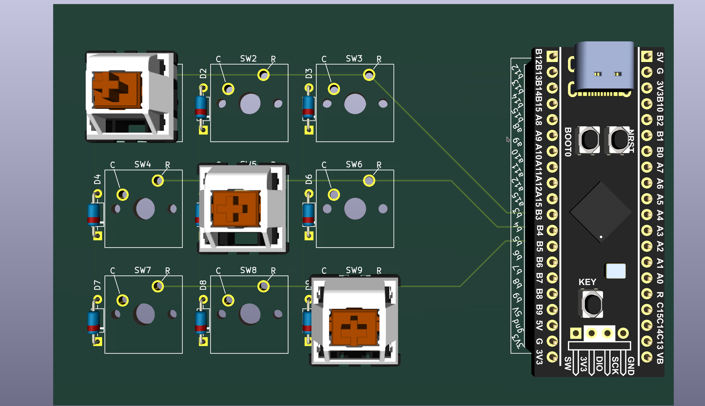
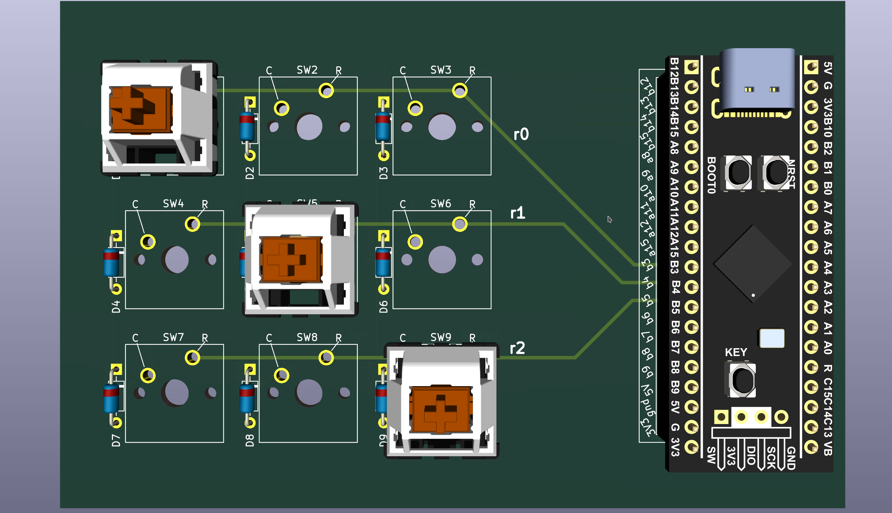
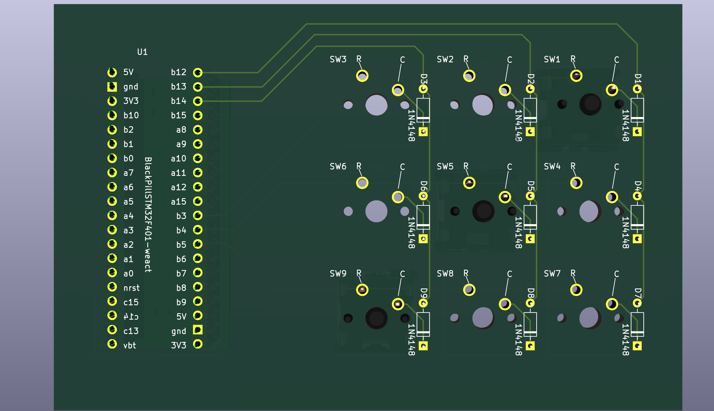
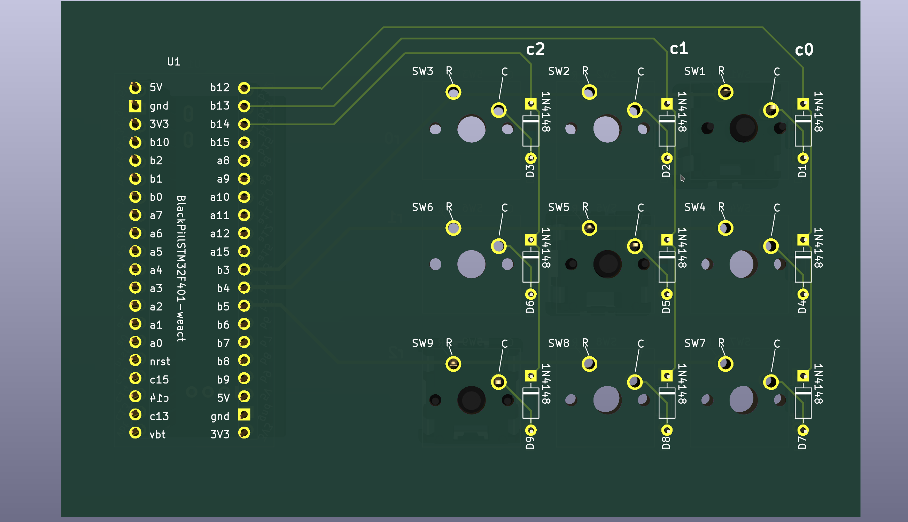

# How keyboard/matrix works - extra info

## set up the scene

If you have read [How a keyboard matrix works](https://docs.qmk.fm/#/how_a_matrix_works), [How keyboards work - QMK documentation](https://docs.qmk.fm/#/how_keyboards_work)
and probably and hopefully [Understanding QMK’s Code](https://docs.qmk.fm/#/understanding_qmk)
but you are still mistified this will try to clarify using simple examples what happens.

For example we choose a 3x3 keyboard matrix and as MCU STM32F401 aka BlackPill from weact. The arguments presented here however
apply to any matrix size and MCU supported by QMK given there are enough IO pins available to connect the rows and columns.

!!! note

    each MCU has its own quirks and sublteties so be sure you read and understand them before getting in any serious projects.
    Eg. which pins can be used for what and when? what extra circuitry is needed for things to work correctly.

You already know that in order to solve the ghosting issue one has to introduce a diode for each switch, (1N4148 in here but other diodes can be used).
Introducing a diode solves the ghosting but makes the current flow in only one direction. Now we have two possible circuits to
represent our matrix, see figure below, signal going from row to column, right panel, or from column to row, left panel.

|             |             |
| ----------- | ----------- |
| Schematic circuit of a 3x3 keyboard matrix | |
|       |        |
| diode orientation columns to rows   | diode orientation rows to columns        |


You notice that all it changed in the two cases is the orientaion of the diode. In both cases rows are connected, startting with r0 to B3, B4 and B5
and columns starting with c0 to B12, B13 and B14.

you can find a lot of info about the blackpill 401 available pins here
[blackpill 401](https://stm32-base.org/boards/STM32F401CCU6-WeAct-Black-Pill-V1.2.html)
or [blackpill 411](https://stm32-base.org/boards/STM32F411CEU6-WeAct-Black-Pill-V2.0.html)

more qmk specific notes on blackpills [here](https://docs.qmk.fm/#/platformdev_blackpill_f4x1?id=weact-blackpill-stm32f4x1)

QMK takes care of this in an elegant way, you have to set a configuration option for your firmware **DIODE_DIRECTION** which can
have two values *COL2ROW* and *ROW2COL*

for left handside circuit that is

```C

#define DIODE_DIRECTION COL2ROW

```

and for right handside circuit that is

```C

#define DIODE_DIRECTION ROW2COL

```

At this stage you have all the information to write and test the firmware (this is the approach I recommend) using a breadboard or
something similar. All you will need is the MCU, dupont wires and a breadboard.

## creating a simple firmware

Creating the firmware may look like a complex task but for a simple one, QMK already does all the hard work for you.
Once you have qmk setup, {add link for qmk setup}

Before we start we need some info.

!!! info

    * Name of the MCU: blackpill_f401 (or blackpill_f411 if you have that one)
    * pins for columns: B12, B13, B14, order is important starting with col 0
    * pins for rows: B3, B4, B5, same as above
    * diode directions: COL2ROW or ROW2COL, we assume COL2ROW
    * name for the keyboard: m3x3, needs to be different from others in qmk
    * optionally a github username: alinelena
    * a name for the user that creates the keyboard: "dr faustroll"

```bash

qmk new-keyboard --help
usage: qmk new-keyboard [-h] [-n REALNAME] [-u NAME] [-t TYPE] [-l LAYOUT] [-kb KEYBOARD]

options:
  -h, --help            show this help message and exit
  -n REALNAME, --realname REALNAME
                        Specify your real name if you want to use that. Defaults to username
  -u NAME, --username NAME
                        Specify your username (default from Git config)
  -t TYPE, --type TYPE  Specify the keyboard MCU type (or "development_board" preset)
  -l LAYOUT, --layout LAYOUT
                        Community layout to bootstrap with
  -kb KEYBOARD, --keyboard KEYBOARD
                        Specify the name for the new keyboard directory


```

we will provide qmk new-keyboard as much info as possible, the rest we will be asked for.

```bash

qmk new-keyboard -n "dr faustroll" -u alinelena -t blackpill_f401 -kb m3x3 -l ortho_3x3                                                                                              2 ⨯ 14/02/23 07:11:32

```

if you let any of the options above out, you will be prompted by question to specify it

if all went well, you shall see something like

```bash

Ψ Generating a new QMK keyboard directory

Ψ Created a new keyboard called m3x3.
Ψ To start working on things, `cd` into keyboards/m3x3,
Ψ or open the directory in your preferred text editor.
Ψ And build with qmk compile -kb m3x3 -km default.

```

a folder was created with the following files and folders inside

```bash
ls keyboards/m3x3                                                                                                  05/06/22 15:16:10

config.h  info.json  keymaps  readme.md  rules.mk

```

you can build it but since does not contain our settings will be quite useless.
To have a functional firmware we need to edit two files

```bash

keyboards/m3x3/info.json

```

**step 0**: diodes direction, open keyboards/m3x3/info.json and identify the line with diode_direction and change COL2ROW to match
what we choosed


```

"diode_direction": "COL2ROW",

```


**step 1**: specify pins, open keyboards/m3x3/info.json and find the section

```

    "matrix_pins": {
        "cols": ["C2", "C2", "C2"],
        "rows": ["D1", "D1", "D1"]
    },

```

and changed it to


```

    "matrix_pins": {
        "cols": ["B12", "B13", "B14"],
        "rows": ["B3", "B4", "B5"]
    },

```


**step 3** optional, edit the keymap. for this you need to know the codes of the keys you want to use a basic list is [here](https://docs.qmk.fm/#/keycodes_basic).

open the file keyboards/m3x3/keymaps/default/keymap.c and find the block

```c

    [0] = LAYOUT_ortho_3x3(
        KC_A,    KC_B,    KC_C,
        KC_D,    KC_E,    KC_F,
        KC_G,    KC_H,    KC_I
    )


```

and change it to match our needs, eg, i want numbers, at the end, the block shall look like this.

```c

    [0] = LAYOUT_ortho_3x3(
        KC_7,   KC_8,   KC_9,
        KC_4,   KC_5,   KC_6,
        KC_1,   KC_2,   KC_3
    )

```

**step 4**: compile the firmware

```bash

qmk compile -kb m3x3 -km default

```

if successful you shall see something like this

```bash
Linking: .build/m3x3_default.elf                                                                    [OK]
Creating binary load file for flashing: .build/m3x3_default.bin                                     [OK]
Creating load file for flashing: .build/m3x3_default.hex                                            [OK]

Size after:
   text    data     bss     dec     hex filename
      0   23032       0   23032    59f8 m3x3_default.bin

Copying m3x3_default.bin to qmk_firmware folder                                                     [OK]
(Firmware size check does not yet support STM32F401; skipping)


```

**step 5**: flash the firmware


```bash

qmk flash -kb m3x3 -km default

```

put your MCU in flash mode and it will be flashed.

now you are ready to test. add picture breadboard.


Now you are ready to create the physical keyboard... by handwiring it or creating a pcb.


### my layout is not listed

not a big problem, choose the closest layout to the one you are after, in this case let us assume 3x3 did not exist but we have 4x4.
you will need to edit two files now

```bash

keyboards/m3x3/info.json
keyboards/m3x3/keymaps/default/keymap.c

```

**step 0**: diodes direction, open keyboards/m3x3/info.json and identify the line with diode_direction and change COL2ROW to match
what we choosed


```

"diode_direction": "COL2ROW",

```


**step 1**: specify pins, open keyboards/m3x3/info.json and find the section

```

    "matrix_pins": {
        "cols": ["C2", "C2", "C2", "C2"],
        "rows": ["D1", "D1", "D1", "D1"]
    },

```

and changed it to


```

    "matrix_pins": {
        "cols": ["B12", "B13", "B14"],
        "rows": ["B3", "B4", "B5"]
    },

```

**step 2**: specify the layout, open keyboards/m3x3/info.json and find the section

```

"LAYOUT_ortho_4x4": {
            "layout": [
                { "matrix": [0, 0], "x": 0, "y": 0 },
                { "matrix": [0, 1], "x": 1, "y": 0 },
                { "matrix": [0, 2], "x": 2, "y": 0 },
                { "matrix": [0, 3], "x": 3, "y": 0 },
                { "matrix": [1, 0], "x": 0, "y": 1 },
                { "matrix": [1, 1], "x": 1, "y": 1 },
                { "matrix": [1, 2], "x": 2, "y": 1 },
                { "matrix": [1, 3], "x": 3, "y": 1 },
                { "matrix": [2, 0], "x": 0, "y": 2 },
                { "matrix": [2, 1], "x": 1, "y": 2 },
                { "matrix": [2, 2], "x": 2, "y": 2 },
                { "matrix": [2, 3], "x": 3, "y": 2 },
                { "matrix": [3, 0], "x": 0, "y": 3 },
                { "matrix": [3, 1], "x": 1, "y": 3 },
                { "matrix": [3, 2], "x": 2, "y": 3 },
                { "matrix": [3, 3], "x": 3, "y": 3 }
            ]
        }

```

we need to change few things *LAYOUT_ortho_4x4* to *LAYOUT_ortho_3x3* and remove all the lines that containi 3 in. also the last ,
At the end the block shall look like

once done shall look like

```

        "LAYOUT_ortho_3x3": {
            "layout": [
                { "matrix": [0, 0], "x": 0, "y": 0 },
                { "matrix": [0, 1], "x": 1, "y": 0 },
                { "matrix": [0, 2], "x": 2, "y": 0 },
                { "matrix": [1, 0], "x": 0, "y": 1 },
                { "matrix": [1, 1], "x": 1, "y": 1 },
                { "matrix": [1, 2], "x": 2, "y": 1 },
                { "matrix": [2, 0], "x": 0, "y": 2 },
                { "matrix": [2, 1], "x": 1, "y": 2 },
                { "matrix": [2, 2], "x": 2, "y": 2 }
            ]
        }

```

**step 4** edit the keymap. for this you need to know the codes of the keys you want to use a basic list is [here](https://docs.qmk.fm/#/keycodes_basic).

open the file keyboards/m3x3/keymaps/default/keymap.c and find the block

```c

    [0] = LAYOUT_ortho_4x4(
        KC_P7,   KC_P8,   KC_P9,   KC_PSLS,
        KC_P4,   KC_P5,   KC_P6,   KC_PAST,
        KC_P1,   KC_P2,   KC_P3,   KC_PMNS,
        KC_P0,   KC_PDOT, KC_PENT, KC_PPLS
    )


```

and change it to match our layout of 3x3. rename *LAYOUT_ortho_4x4* to *LAYOUT_ortho_3x3* to match the name from the .json file and
remove one line and one colum, pay attention to he missing , at the end. Block shall look like this.

```c

    [0] = LAYOUT_ortho_3x3(
        KC_7,   KC_8,   KC_9,
        KC_4,   KC_5,   KC_6,
        KC_1,   KC_2,   KC_3
    )

```

**step 5**: compile the firmware

see prev section, **step 4**

**step 6**: flash the firmware

see previous section **step 5**

### I want to use Raspberry pico rp2040

Simple, all we need is to choose the rigth mcu and the right pins

the full pinout can be seen [here](https://datasheets.raspberrypi.com/pico/Pico-R3-A4-Pinout.pdf) Pay attention since different rp2040 boards may have pins in different positions be sure you check the pinout for your specific board you use and not the general rpico board.

qmk specific notes on rpico [here](https://docs.qmk.fm/#/platformdev_rp2040)

We choose GP0, GP1, GP2 for columns (c0 to c2) and GP10, GP11, and GP12 for rows.

for a generic rp2040

```bash

qmk new-keyboard -n "dr faustroll" -u alinelena -t RP2040 -kb m3x3 -l ortho_3x3

```

and now we need to edit info.json as above

**step 0**: diodes direction, open keyboards/m3x3/info.json and identify the line with diode_direction and change COL2ROW to match
what we choosed


```

"diode_direction": "COL2ROW",

```


**step 1**: specify pins, open keyboards/m3x3/info.json and find the section

```

    "matrix_pins": {
        "cols": ["C2", "C2", "C2"],
        "rows": ["D1", "D1", "D1"]
    },

```

and changed it to


```

    "matrix_pins": {
        "cols": ["GP0", "GP1", "GP2"],
        "rows": ["GP10", "GP11", "GP12"]
    },

```


### link to handwire

### pcbs

there are many guides on how to start designing a pcb and tools to help with it.
I prefer to use KiCad which is opensource and runs on different operating systems.
As a starting guide to design you can use [this tutorial from al03](https://wiki.ai03.com/books/pcb-design) it contains more
information than is needed for a simple keyboard with an mcu on a external board but it is a good start.

the other bit which is important is to have a good selection of symbols and footprints for your project. Fortunately some exist
already so you can use for example [this one](https://github.com/ebastler/marbastlib)

check tools and tutorials on [mechkey.org](https://mechkey.org/) for more information.


|             |             |
| ----------- | ----------- |
| Pcb of a 3x3 keyboard matrix | |
|       |        |
| diode orientation columns to rows   | diode orientation rows to columns        |


pcb renders

|             |             |
| ----------- | ----------- |
| Pcb render of a 3x3 keyboard matrix  front view | |
|       |        |
| diode orientation columns to rows   | diode orientation rows to columns        |
| Pcb render of a 3x3 keyboard matrix  bottom view | |
|       |        |
| diode orientation columns to rows   | diode orientation rows to columns        |


