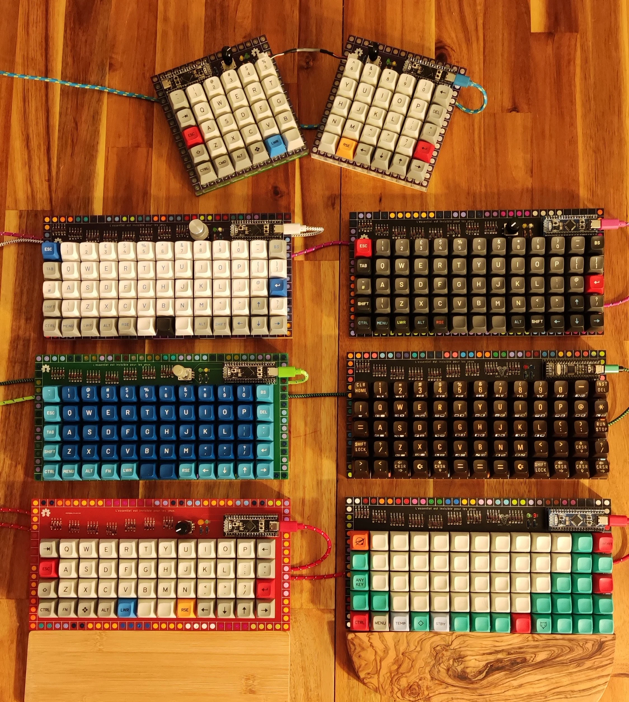

# mlego

{ loading=lazy }

!!! warning

!!! success "this project is"

    * fun
    * educational
    * functional
    * cheap(ish), till switches and keycaps.

!!! danger "this project is not"

    * end game

## motivation

this is just a fun project started some time ago.
The idea was to have an iso friendly ortholinear keyboard.
Initially I started with a 6x13 but then settled to a 5x13 as best option.
more info in [here](https://alin.elena.space/blog/keeblego/)

There is a [6x13](https://github.com/Kyrremann/index-tab) project if you want
and a [4x13](https://github.com/farfalleflickan/nack) and plenty of others see [help-14](https://mechkey.org/)
or [mechdb](https://mechdb.net/)

I am not related with any of them and discovered some of them too late.

I have also made a 5x12 split, 5x12 and 4x12, 5x4, 2x2 see below.

## designed keyboards

what is special about these ones?

  * the case is set in lego (almost lego)
  * microcontroller is just a standard apm/stm32f103 blackpill from robotdyn, gd32f303 bluepill plus, blackpill from we act (stm32f401/411), raspberry pico, rp2040 compatible or seeeduino xiao
  * rotary encoder with switch for some models.
  * oled 128x32 i2c
  * optional led strip (you will need a full brick lego or one more layer..)
  * some use shift registers HC595, HC165 or HC589
  * eink screen support

!!! warning "Lego"

    the holes are cut at the official lego dimension. Unfortunately the drilling machines have tolerance and
    the same is true for the lego making tools... the tolerance in lego varies with colour of the plastic... you will find some colours may not fit
    as well as others. I suggest you to use 1x2 and 1x4 plates if you want the finest keyboard, since they tend to bend the pcb... you will be
    amased but the force.

!!! tips

    if you do not want an angle for typing use a single sided plate as base.

!!! tips

    foaming the bottom makes a difference i use usually diy/hobbycraft foam, that you can buy for close to nothing in a4 sheets.

