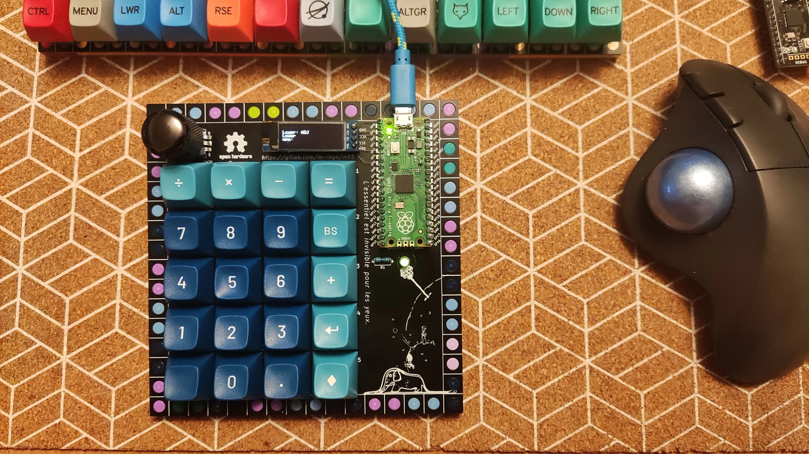
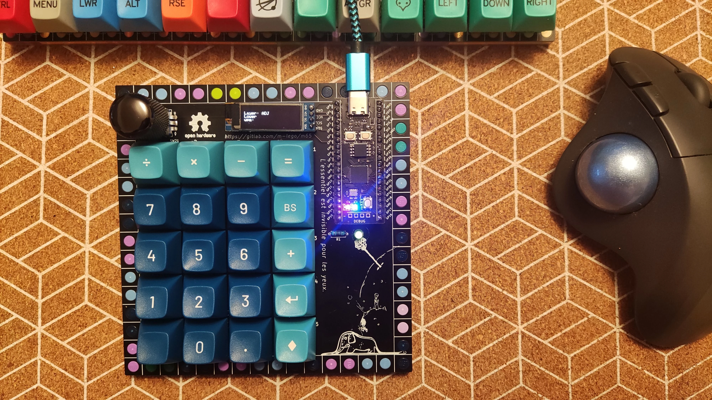
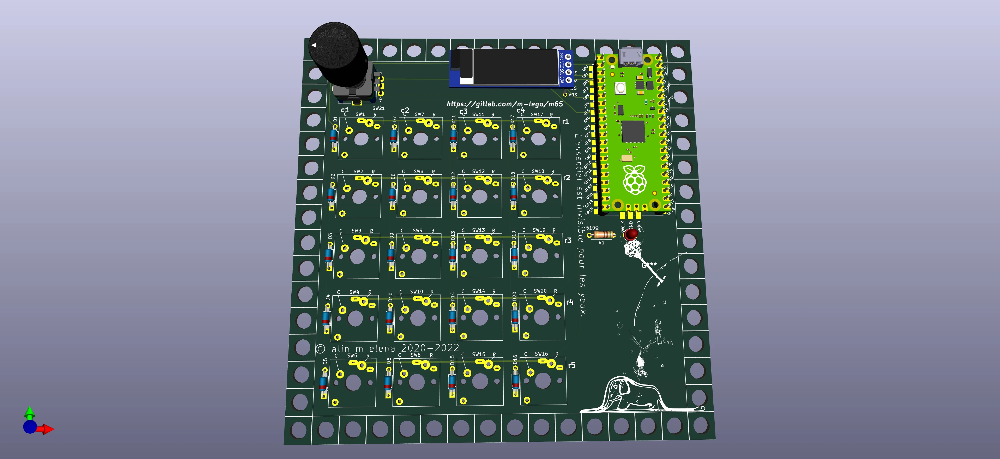
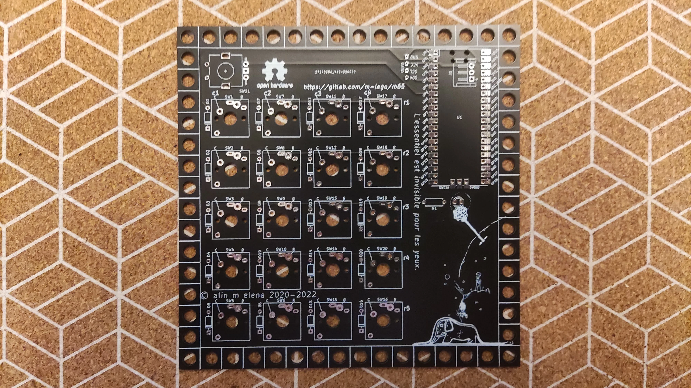
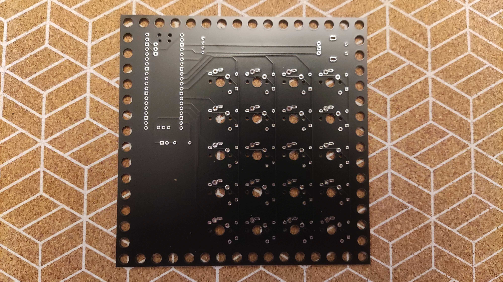
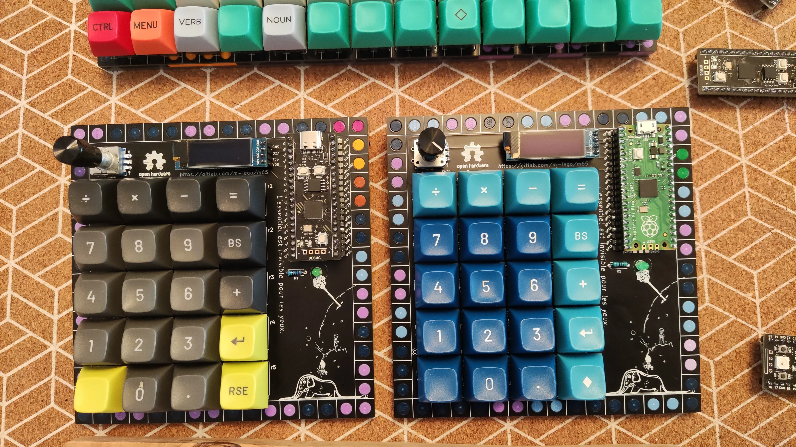
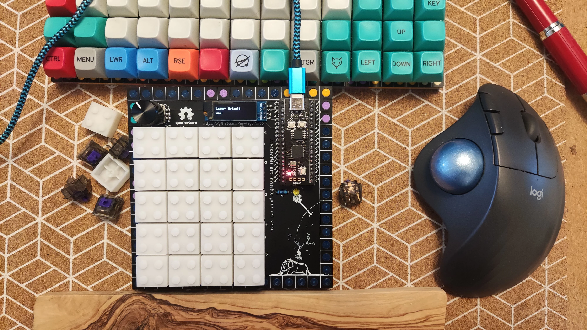
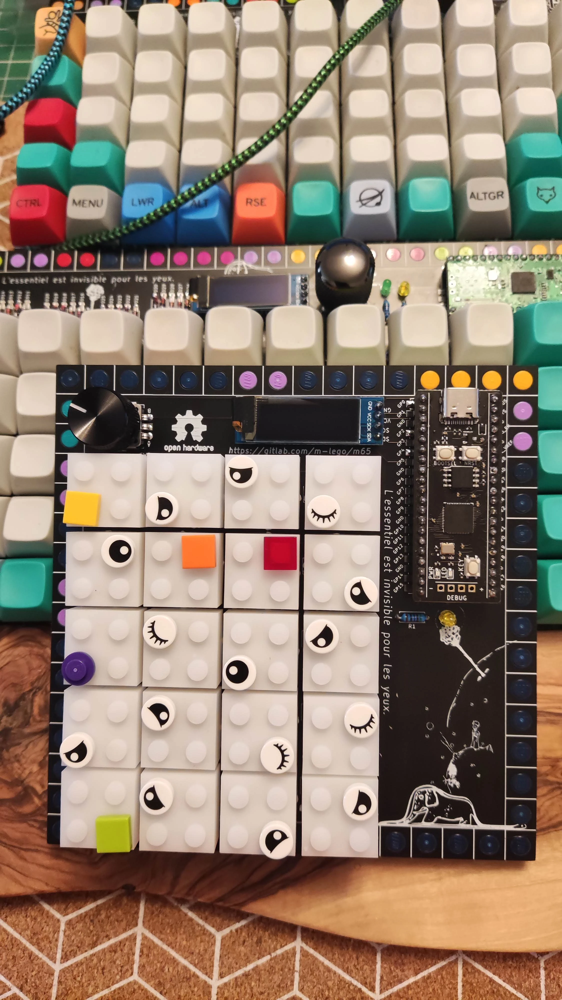

### m60 5x4 in lego

  
  


an ortholinear keyboard set in lego 5x4 with optional encoders, leds and oled

this is part of a bigger family of ortholinear keyboards in lego see for reference
https://mlego.elena.space

status:  tested all ok

* [x] gerbers designed
* [x] firmware
* [x] breadboard tested
* [x] gerbers printed
* [x] board tested

Features:

* 5x4
* 1 encoder, optional
* led strip, optional
* 5 pins MX or choco v2 switches
* Raspberry pico 2040 or compatible clones
* oled, optional
* firmware qmk
* tht or surface mount diodes

#### render
3d render

 

#### pcb

printed one

  
  


#### bom

* 1 RP2040 or compatible, we act, teenstar
* 20 signal diodes 1N4148 , do-35 or sod123 (updated gerbers to support them)
* 1 encoders
* 1x510Ω - for led so you may have to compute the R to match your colours and desired brightness.
* 1 leds
* 2x20 pin DIL/DIP sockets whatever you prefer and headers to match
* led strip 3pins
* 5 pin MX switches 20 or kailh choco v2
* lego 16x16 plates for bottom, and bricks/tiles as you please

#### case

case information can be found [here](https://mlego.elena.space/m65/#case)

#### assembly

this is a very rushed [assembly guide](assembly.md) but shall give you the main idea.

#### gerbers

 gerbers ready to be printed at jlcpcb are available

 + [rev 1](https://gitlab.com/m-lego/m60/-/blob/main/gerbers-stm32f401.zip)

  full kicad project if you want to generate your own or modify is available [here](https://gitlab.com/m-lego/m20/)
  kicad symbols/footprints are in the [m65 repo](https://gitlab.com/m-lego/m65/)


#### firmware

```
   git clone --recurse-submodules -b mlego https://github.com/alinelena/qmk_firmware.git qmk-alin
   cd qmk-alin
   qmk compile -kb mlego/m20/rev1 -km default

   # or the old way
   make mlego/m20/rev1:default
```

#### pins

  - columns: "GP1", "GP6", "GP7", "GP8"
  - rows: "GP9", "GP10", "GP11", "GP12", "GP13"

**Encoders**

  - Pad_A: GP4
  - Pad_B: GP5

**Leds**

| Leds        | Pin  |
| ----------- | ---- |
| NUM_LOCK    | GP14 |
| SCROLL_LOCK | GP25 |
| RBG_DI      | GP0  |

**Oled**

  - SDA: GP2
  - SCL/SCK: GP3

#### other pictures




