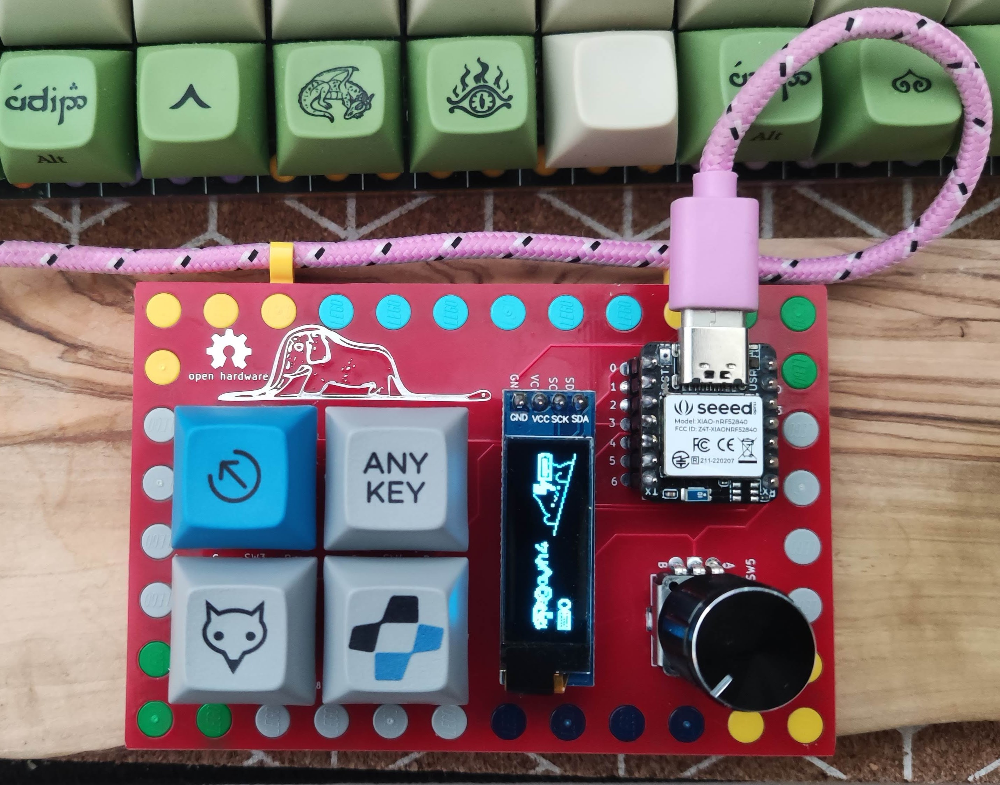

### m4 2x2 in lego

  

an ortholinear keyboard set in lego 2x2 with optional encoder and oled.
this uses [seed studio xiao rp2040](https://www.seeedstudio.com/XIAO-RP2040-v1-0-p-5026.html) or [seed studio xiao nrf52840] (https://www.seeedstudio.com/Seeed-XIAO-BLE-nRF52840-p-5201.html)... these are test beds for something else.
xiao boards are nice since they are small but the do not have a lot of pins... so i used two chained shift registers for columns...
this is simply a playground for porting the 5x13 to xiao.
Another consequence since qmk does not support xiao yet, firmware is zmk.

in the xiao family there are other boards [samd21](https://www.seeedstudio.com/Seeeduino-XIAO-Arduino-Microcontroller-SAMD21-Cortex-M0+-p-4426.html), [sense](https://www.seeedstudio.com/Seeed-XIAO-BLE-Sense-nRF52840-p-5253.html) and [esp32c3](https://www.seeedstudio.com/Seeed-XIAO-ESP32C3-p-5431.html)... I do not have them so I did not test them that means they may
work or not. Feel free to send me one of them if you want me to test.

this is part of a bigger family of ortholinear keyboards in lego see for reference
https://mlego.elena.space

Please note that I am aware of the [xiao contest for mechanical keyboards](https://www.seeedstudio.com/seeed-fusion-diy-xiao-mechanical-keyboard-contest.html) and their [fusion pcb assembly service](https://www.seeedstudio.com/pcb-assembly.html). while none was used for this project, seeed studio kindly agreed to sponsor 5x13 version with pcbs and MCUs.

status: all ok

* [x] gerbers designed
* [x] firmware
* [x] breadboard tested
* [x] gerbers printed
* [x] board tested

Features:

* 2x2
* 1 encoder, optional
* oled, optional
* 5 pins
* seeduino xiao nrf52840 or xiao rp2040, others too probably but not tested
* firmware zmk

#### render

  

#### pcb

* kicad pcb

  

  

#### bom

* 1 [seeed studio xiao nrf52840](https://www.seeedstudio.com/Seeed-XIAO-BLE-nRF52840-p-5201.html) or [seeed studio xiao rp2040](https://www.seeedstudio.com/XIAO-RP2040-v1-0-p-5026.html)  pins
* 4 signal diodes 1N4148 , do 35 or sod-123
* 1 encoders
* 2x7 pin DIL/DIP sockets whatever you prefer
* 2x7 pin male headers, rounded or straight to match the socket
* 5 pin MX switches 4
* 2 HC595 shift registers... surface mount
* lego 8x12 plate for bottom, and bricks as you please

#### case

lego... 8x12 for plate... you can use 2x(4x12) plates with the normal legos as described here

case information can be found [here](https://mlego.elena.space/m65/#case)

#### assembly

this is a very rushed [assembly guide](assembly.md) but shall give you the main idea.

#### gerbers

 gerbers ready to be printed at jlcpcb are available

 + [rev 1](https://gitlab.com/m-lego/m4/-/blob/main/gerbers.zip)

  full kicad project if you want to generate your own or modify is available [here](https://gitlab.com/m-lego/m4/)
  kicad symbols/footprints are in the [m65 repo](https://gitlab.com/m-lego/m65/)

#### firmware

#### rev1

xiao nrf52840

#### rev2

xiao rp2040

to be made public once pcb tested

#### pins

  - r0: 1
  - r0: 4

  - c0: shift register 1 - QA
  - c1: shift register 2 - QA

** 74HC595N **

  - data: 11
  - latch: 8
  - clock: 9

**Encoders**

  - Pad_A: 2
  - Pad_B: 3

**Oled**

  - SDA: 5
  - SCL/SCK: 6

#### other pictures

  
  
  

