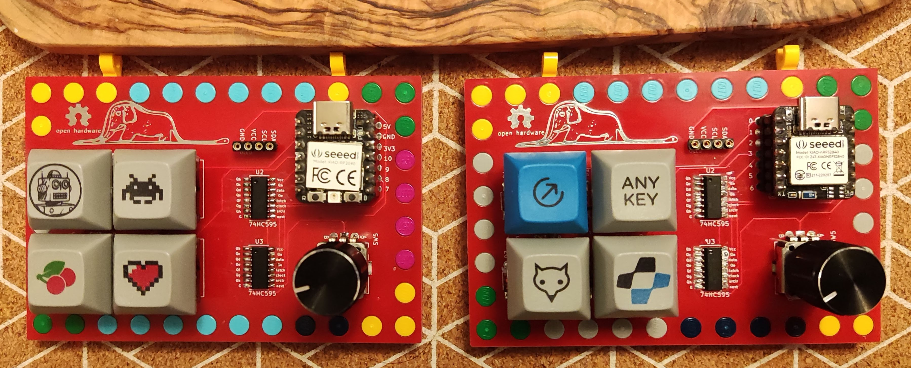
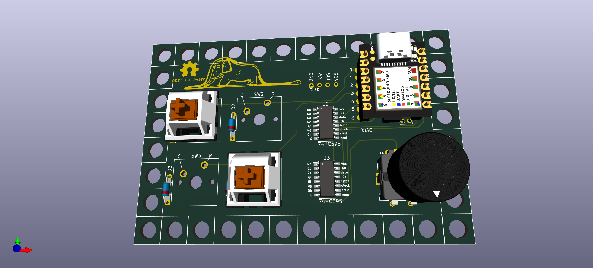
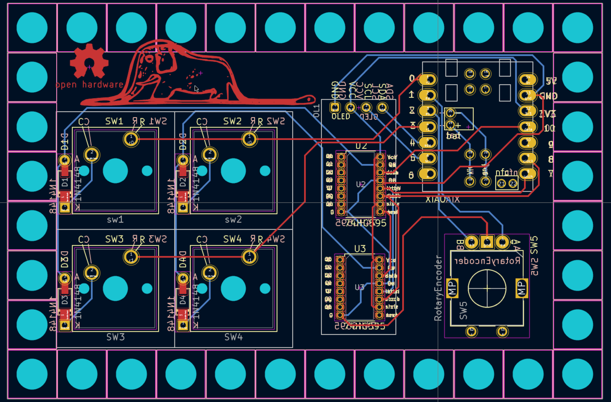
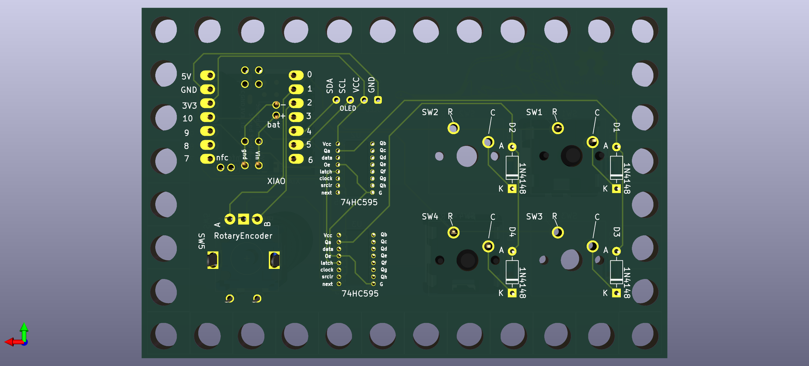
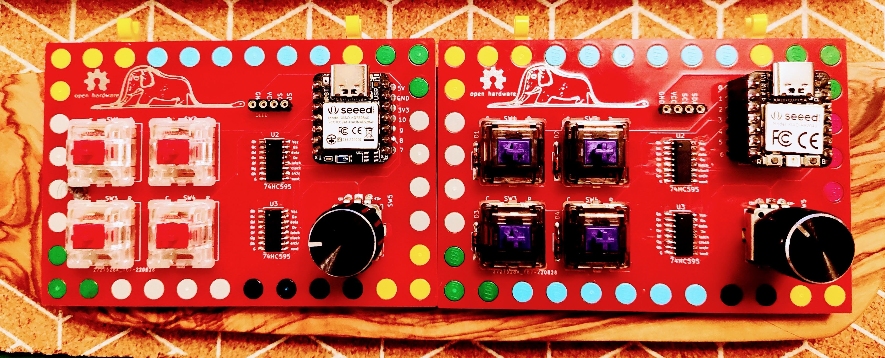
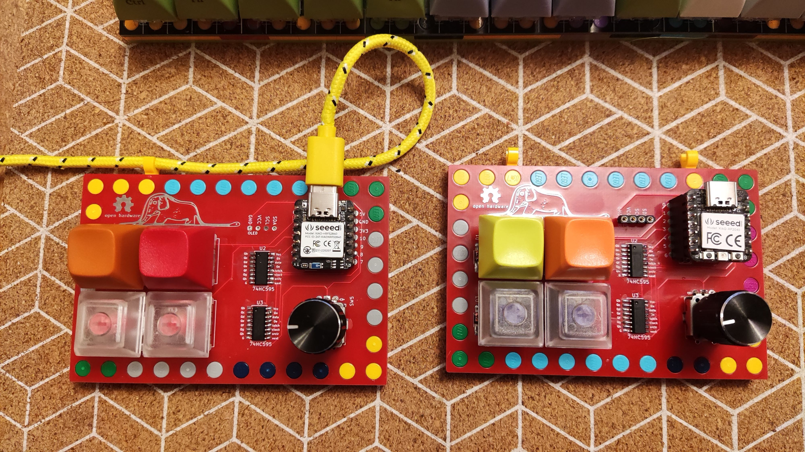

### m4 2x2 in lego

  

an ortholinear keyboard set in lego 2x2 with optional encoder and oled.

this is part of a bigger family of ortholinear keyboards in lego see for reference
https://mlego.elena.space

status: all ok

* [x] gerbers designed
* [x] firmware
* [x] breadboard tested
* [x] gerbers printed
* [x] board tested

Features:

* 2x2
* 1 encoder, optional
* oled, optional
* 5 pins
* seeduino xiao nrf52840 or xiao rp2040, others too probably but not tested
* firmware zmk

#### render

  

#### pcb

* kicad pcb

  

  

#### bom

* 1 xiao nrf52840 or rp2040  pins
* 4 signal diodes 1N4148 , do 35 or sod-123
* 1 encoders
* 2x7 pin DIL/DIP sockets whatever you prefer
* 2x7 pin male headers, rounded or straight to match the socket
* 5 pin MX switches 4
* 2 HC595 shift registers... surface mount
* lego 8x12 plate for bottom, and bricks as you please

#### case

case information can be found [here](https://mlego.elena.space/m65/#case)

#### assembly

this is a very rushed [assembly guide](assembly.md) but shall give you the main idea.

#### gerbers

 gerbers ready to be printed at jlcpcb are available

 + [rev 1](https://gitlab.com/m-lego/m4/-/blob/main/gerbers.zip)

  full kicad project if you want to generate your own or modify is available [here](https://gitlab.com/m-lego/m4/)
  kicad symbols/footprints are in the [m65 repo](https://gitlab.com/m-lego/m65/)

#### firmware

#### rev1

xiao nrf52840

#### rev2

xiao rp2040

to be made public once pcb tested

#### pins

  - r0: 1
  - r0: 4

  - c0: shift register 1 - QA
  - c1: shift register 2 - QA

** 74HC595N **

  - data: 11
  - latch: 8
  - clock: 9

**Encoders**

  - Pad_A: 2
  - Pad_B: 3

**Oled**

  - SDA: 5
  - SCL/SCK: 6

#### other pictures

  
  
