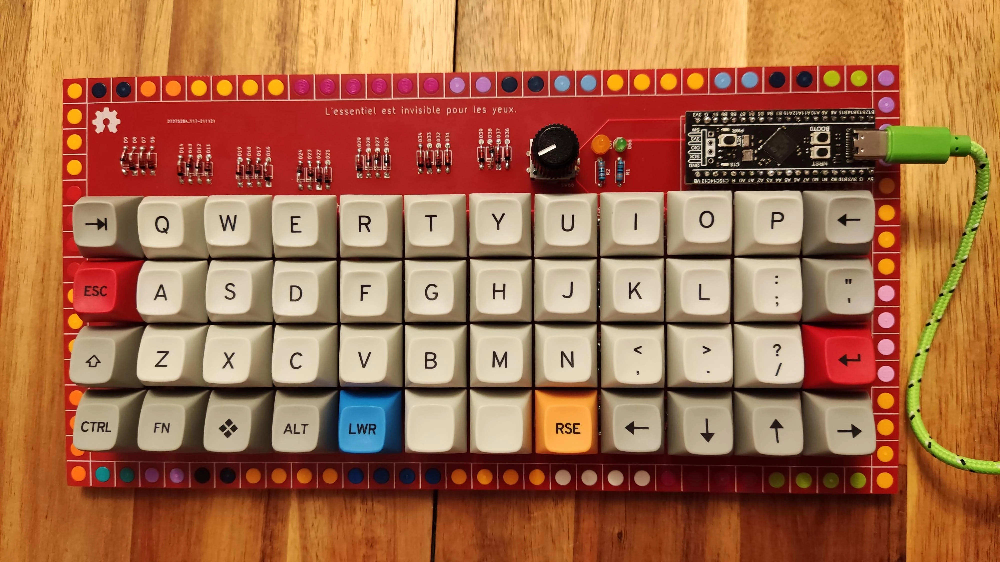
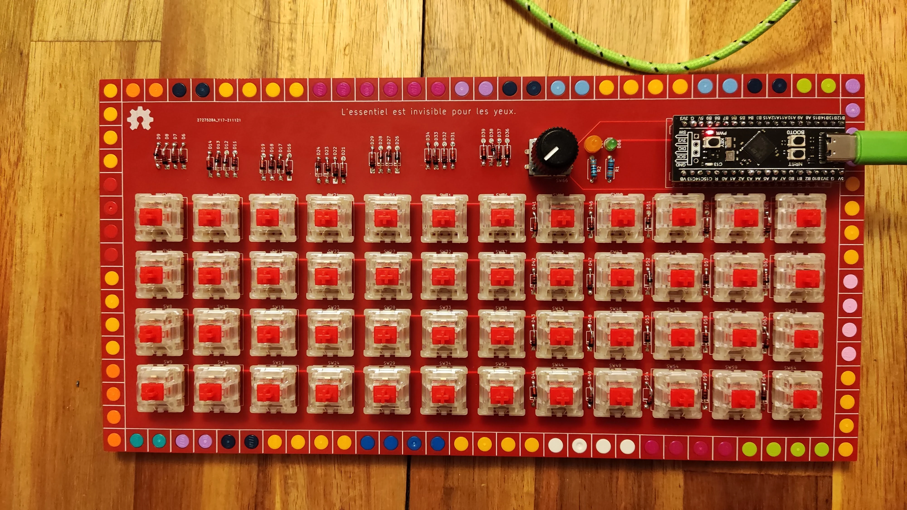
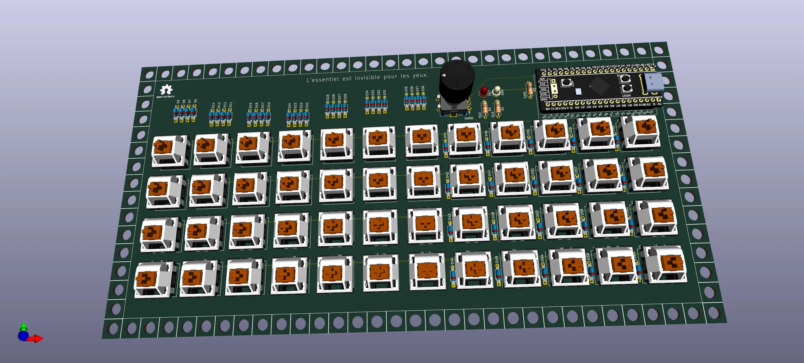
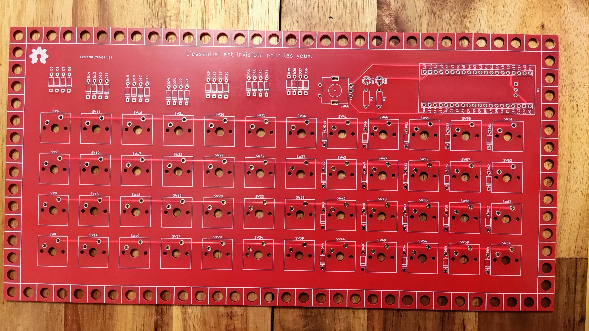
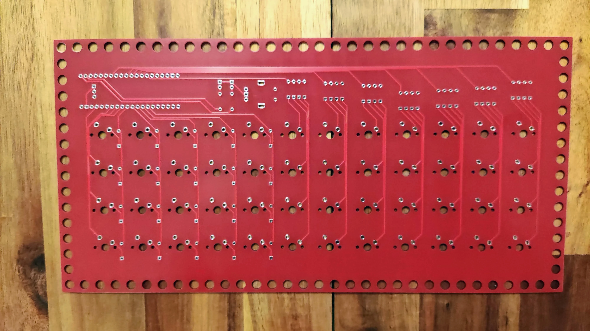
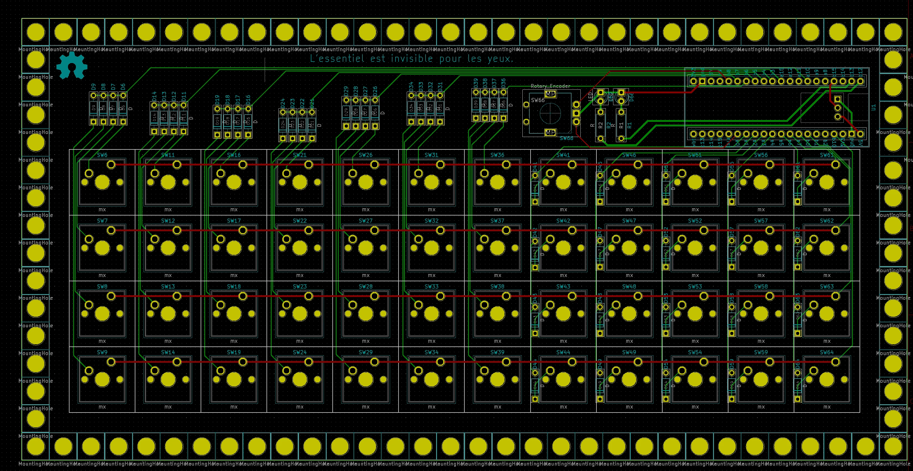

### m48 4x12 in lego

  

  

this is practlically a planck style.

an ortholinear keyboard set in lego 4x12 with optional encoder and leds
this is part of a bigger family of ortholinear keyboards in lego see for reference
https://mlego.elena.space/

status: tested all ok!

* [x] gerbers designed
* [x] firmware
* [x] breadboard tested
* [x] gerbers printed
* [x] board tested


Features:

* 4x12
* 1 encoder
* led strip (optional)
* 5 pins
* stm32f401 or 411(if you ask) from we act https://github.com/WeActTC/MiniSTM32F4x1
* firmware qmk

#### 3d render

  

#### pcb

* front

  


* back

  


* kicad

  

#### bom

* 1xSTM32F401 we act pins
* 48 signal diodes 1N4148 , do 35
* 1 encoder
* 2x220Ω or 350Ω these are for leds so you may have to compute the R to match your colours and desired brightness.
* 1 leds
* 1 40 pin DIL/DIP sockets whatever you prefer
* led strip 3pins, optional
* 5 pin MX switches 48
* lego see main article, and imagination.
* lego 32x16 plates for bottom, and bricks as you please
see notes on [m65](m65/#bom)

#### case

case information can be found [here](https://mlego.elena.space/m65/#case)

#### assembly

this is a very rushed [assembly guide](assembly.md) but shall give you the main idea.


#### gerbers

gerbers ready to be printed at jlcpcb are available

 + [rev 1](https://gitlab.com/m-lego/m48/-/blob/main/gerbers-stm32f401.zip)

  full kicad project if you want to generate your own or modify is available [here](https://gitlab.com/m-lego/m48/)
  kicad symbols/footprints are in the [m65 repo](https://gitlab.com/m-lego/m48/-/blob/main/firmware/mlego_m48_rev1_default.uf2)

#### firmware

```bash
   git clone --recurse-submodules -b mlego https://github.com/alinelena/qmk_firmware.git qmk-alin
   cd qmk-alin

   qmk compile -kb m-lego/m48/rev1 -km default

   #or
   make m-lego/m48/rev1:default
```

#### pins

##### rev1

  - columns: "A10", "A15", "B3", "B4", "B5", "B7", "B6", "A1", "A2", "A3", "A4", "A5"
  - rows: "A6", "A7", "B0", "B10"

**Encoders**

  - Pad_A: A0
  - Pad_B: A8

**Leds**

| Leds        | Pin |
| ----------- | --- |
| NUM_LOCK    | B12 |
| CAPS_LOCK   | C13 |
| SCROLL_LOCK | B13 |
| RBG_DI      | B15 |

