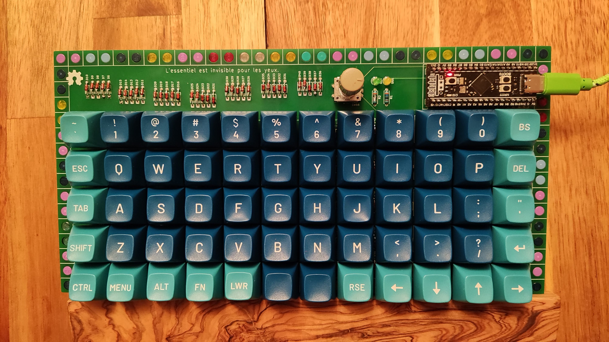
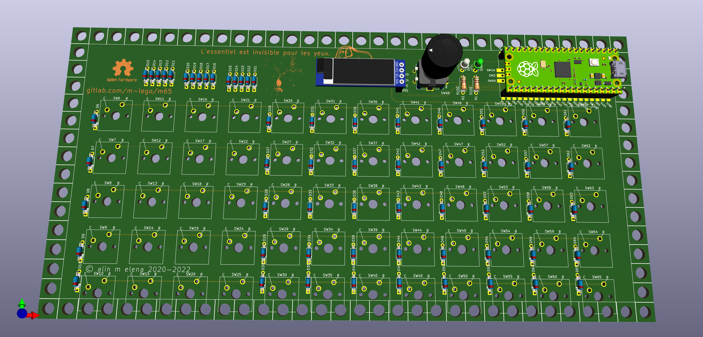
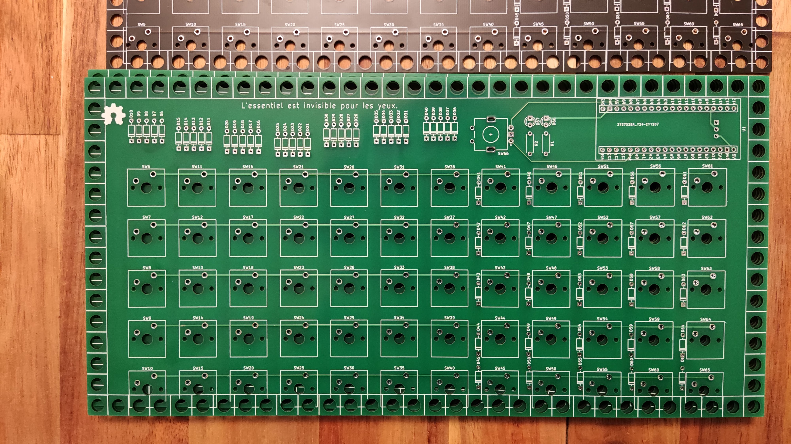
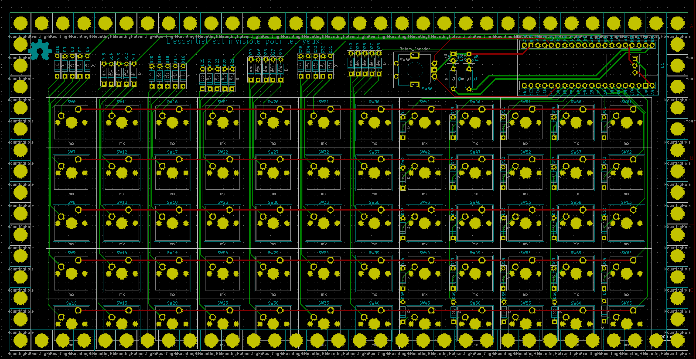
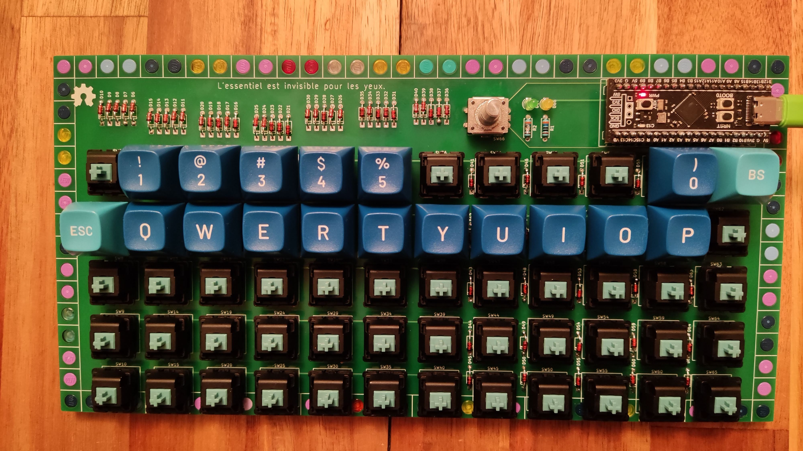

###  m60

  

an ortholinear keyboard set in lego 5x12 split with optional encoder and leds. this is a preonic inspired.

this is part of a bigger family of ortholinear keyboards in lego see for reference
https://mlego.elena.space/

status: all ok

* [x] gerbers designed
* [x] firmware
* [x] breadboard tested
* [x] gerbers printed
* [x] board tested

Features:

* 5x12
* 1 encoder, optional
* led strip, optional
* oled, optional, rev2 only
* 5 pins
* stm32f401 or 411 from we act https://github.com/WeActTC/MiniSTM32F4x1 rev1 or rp2040 rpico compatible pinouts rev 2
* firmware qmk
* uf2 support by default


#### render

- rev 2 3d render

  

#### pcb

- rev 1

* printed pcb

  

* kicad

  


#### bom

##### rev 1

* 1 STM32F401 we act pins
* 60 signal diodes 1N4148 , do 35
* 1 encoders
* 2x 350Ω or 220Ω - these are for leds so you may have to compute the R to match your colours and desired brightness.
* 2 leds
* 1 40 pin DIL/DIP sockets whatever you prefer
* led strip 3pins, optional
* 5 pin MX switches 60
* lego 16x32 plate for bottom, and bricks as you please


##### rev 2

* 60 signal diodes 1N4148 , do 35
* 1 encoders
* 2x 350Ω or 220Ω - these are for leds so you may have to compute the R to match your colours and desired brightness.
* 2 leds
* 1 40 pin DIL/DIP sockets whatever you prefer
* led strip 3pins, optional
* 5 pin MX switches 60
* lego 16x32 plate for bottom, and bricks as you please
* rp2040 raspberry pico or compatible pinout


#### assembly

this is a very rushed [assembly guide](assembly.md) but shall give you the main idea.

### gerbers

kicad symbols/footprints are in the m65 repo above


gerbers and kicad files in here  gitlab repo https://gitlab.com/m-lego/m60/

#### firmware

- rev 1 or simply use this [firmware](https://gitlab.com/m-lego/m60/-/blob/main/firmware/mlego_m60_rev1_default.uf2) be sure tiny uf2 has the uf2 bootloader.
to install it use https://github.com/adafruit/tinyuf2

```bash
   git clone --recurse-submodules -b mlego https://github.com/alinelena/qmk_firmware.git qmk-alin
   cd qmk-alin
   qmk compile -kb mlego/m60/rev1 -km default

   # or the old way
   make mlego/m60/rev1:default
```

- rev 2 (rpico version) or simply use [firmware](https://gitlab.com/m-lego/m60/-/blob/main/firmware/mlego_m60_rev1_default.uf2)

```
   git clone --recurse-submodules -b mlego https://github.com/alinelena/qmk_firmware.git qmk-alin
   cd qmk-alin
   qmk compile -kb mlego/m60/rev2 -km default

   # or the old way
   make mlego/m60/rev2:default
```

#### other pics

  


