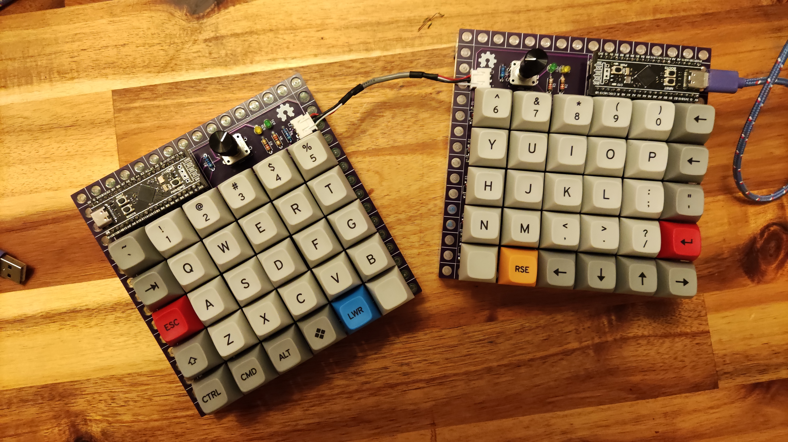
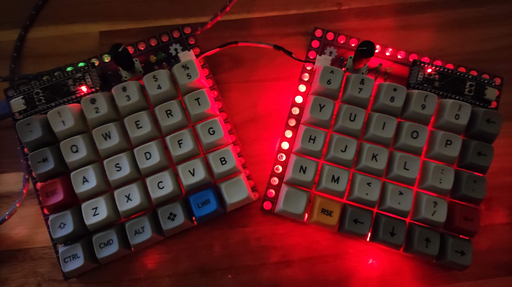
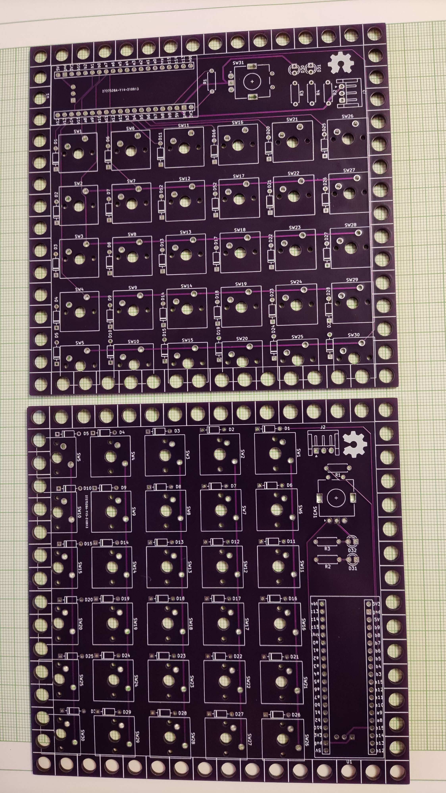
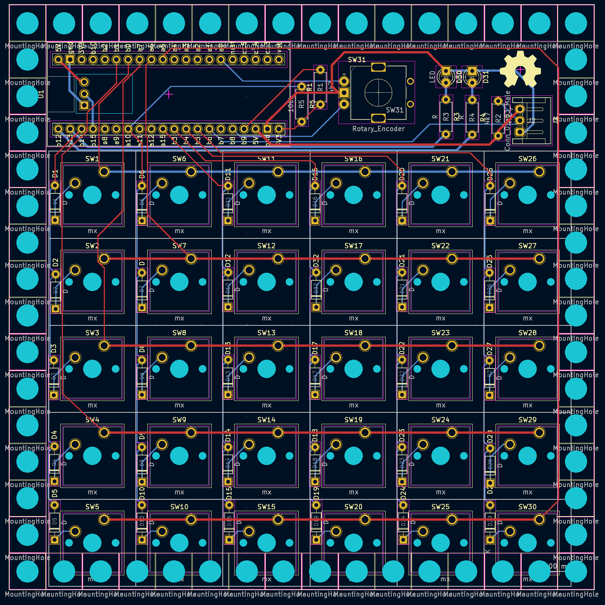
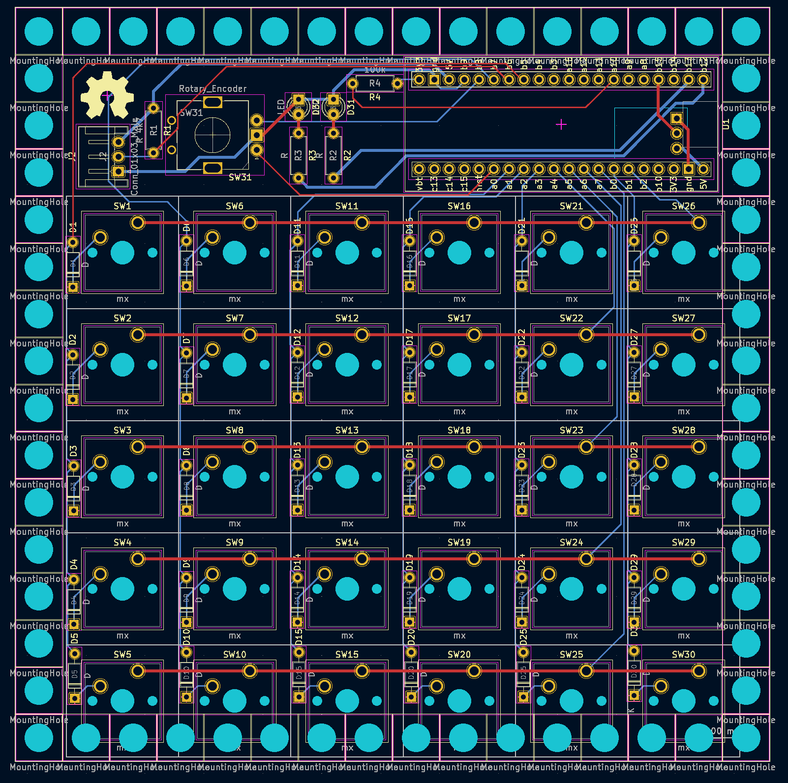
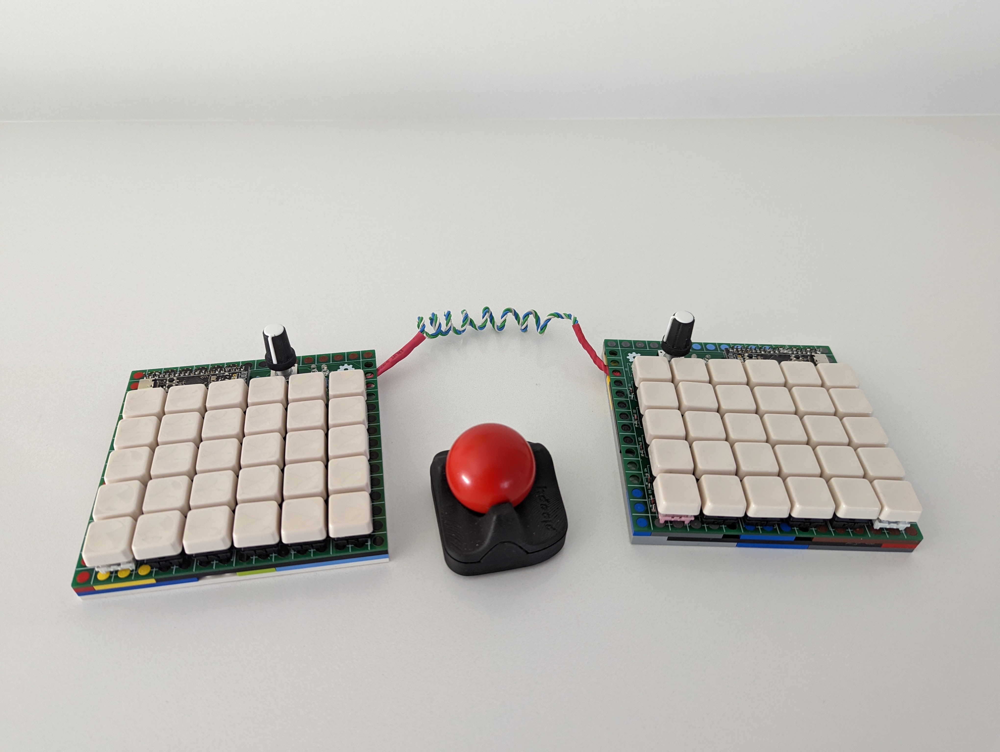
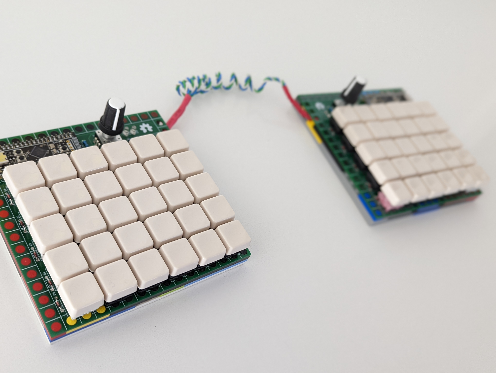
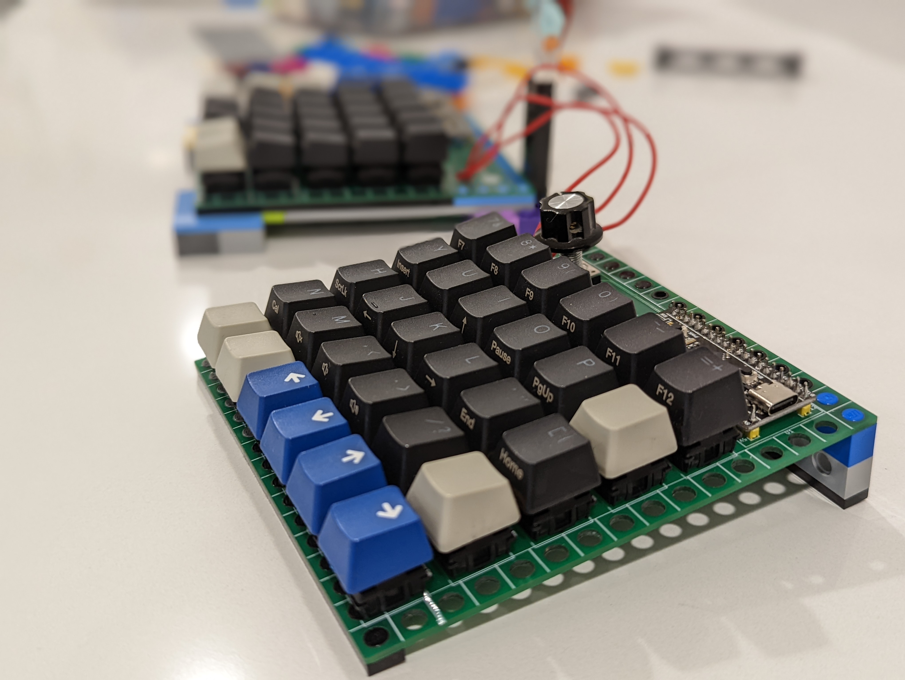
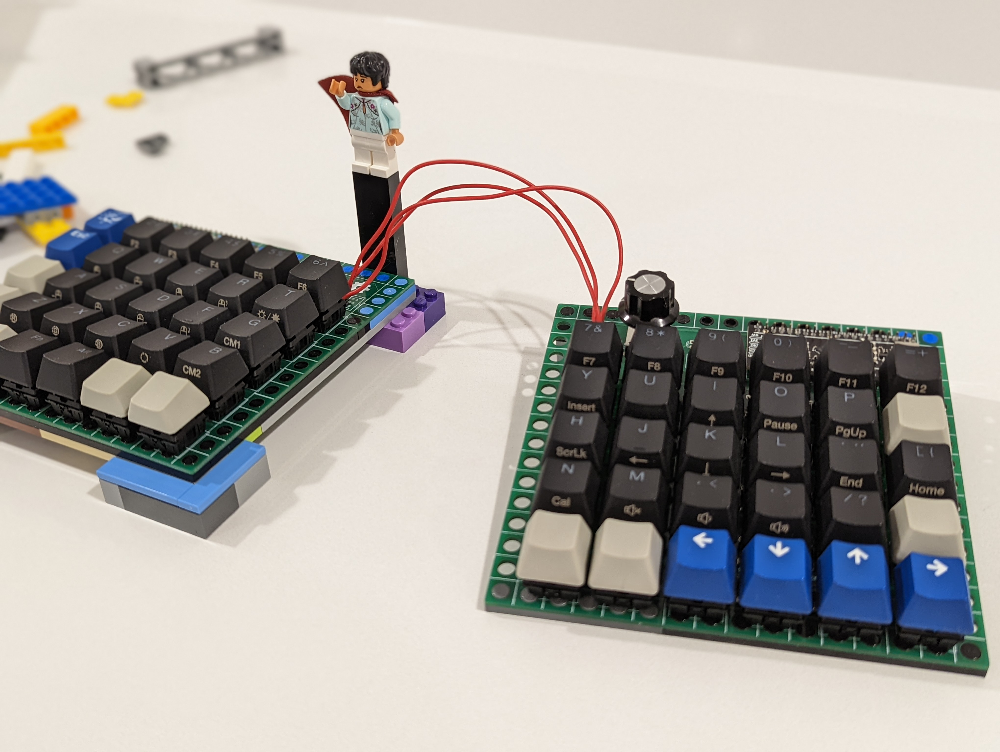

### m60 5x12 split in lego

  

  

an ortholinear keyboard set in lego 5x12 split with optional encoders and leds

this is part of a bigger family of ortholinear keyboards in lego see for reference
https://mlego.elena.space

status:  tested all ok

* [x] gerbers designed
* [x] firmware
* [x] breadboard tested
* [x] gerbers printed
* [x] board tested

Features:

* 5x12 split
* 1 encoder each side
* led strip
* 5 pins
* stm32f401 or 411 from we act https://github.com/WeActTC/MiniSTM32F4x1
* firmware qmk

#### renders

#### pcb

printed one

  

left side pcb

  

right side pcb

  

#### bom

* 2xSTM32F401 we act pins
* 60 signal diodes 1N4148 , do-35
* 2 encoders
* 3x4.7kΩ on left hand side R1 and R2 and on right hand side R1
* 2x100kΩ on left hand side R5 and on right hand side R4
* 4x220Ω - these are for leds so you may have to compute the R to match your colours and desired brightness. on left side that are
  R3 and R4 on right side R2 and R3
* 4 leds
* 2 40 pin DIL/DIP sockets whatever you prefer
* 2 JST XH 2.54 3P angle connectors, optionally another too for led strip
* cable to work with the sockets, direct not crossed wires
* led strip 3pins
* 5 pin MX switches 60
* lego 16x16 plates for bottom, and bricks as you please

#### case

case information can be found [here](https://mlego.elena.space/m65/#case)

#### assembly

this is a very rushed [assembly guide](assembly.md) but shall give you the main idea.

#### gerbers

 gerbers ready to be printed at jlcpcb are available

 + [rev 1 left](https://gitlab.com/m-lego/m60_split/-/blob/main/m60-split-left/gerbers-left.zip)
 + [rev 1 right](https://gitlab.com/m-lego/m60_split/-/blob/main/m60-split-right/gerbers-right.zip)

  full kicad project if you want to generate your own or modify is available [here](https://gitlab.com/m-lego/m60_split/)
  kicad symbols/footprints are in the [m65 repo](https://gitlab.com/m-lego/m65/)


#### firmware

##### rev1 stm32f401 or simply use this [firmware](https://gitlab.com/m-lego/m60_split/-/blob/main/firmware/mlego_m60_split_rev1_default.uf2) be sure tiny uf2 has the uf2 bootloader.
to install it use https://github.com/adafruit/tinyuf2


```bash
   git clone --recurse-submodules -b mlego https://github.com/qmk/qmk_firmware.git qmk-alin
   cd qmk-alin

   qmk compile -kb mlego/m60_split/rev1 -kb default
   make mlego/m60_split/rev1:default
```

##### rev2 stm32f411 or simply use this [firmware](https://gitlab.com/m-lego/m60_split/-/blob/main/firmware/mlego_m60_split_rev2_default.uf2) be sure tiny uf2 has the uf2 bootloader.
to install it use https://github.com/adafruit/tinyuf2

```bash
   git clone --recurse-submodules -b mlego https://github.com/qmk/qmk_firmware.git qmk-alin
   cd qmk-alin

   qmk compile -kb mlego/m60_split/rev2 -kb default
   make mlego/m60_split/rev2:default
```

#### pins

#### other builds

these are Seth's builds (u/modularsynth123456/)








