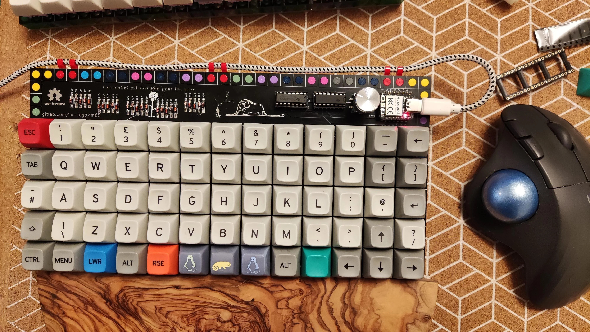

### m65 - the lego keyboard

  

  

  

  

this is a 5 rows 13 columns ortholinear keyboard intented to allow all the keycaps that you will find on an iso layout.

  current iteration... this is a departure from the normal matrix keyboard. I am using [seeed studio xiao rp2040](https://wiki.seeedstudio.com/XIAO-RP2040/) or [seeed studio xiao nrf52840](https://wiki.seeedstudio.com/XIAO_BLE/) (probably
samd21 will work too but I have none to test) and also play with zmk as firmware since I was curious on bt. Since xiao does not have enough pins for the full
matrix... The approach I use is, rows are read from one shift register HC165 while columns use 2 HC595 shift registers chained, oled
and rotary encoder. Please note the shift register use the SPI, sharing clock and latch pins. The rotary encoder now supports the push button too, which makes it technically a 14 columns ortho.


Please note that I am aware of the [xiao contest for mechanical keyboards](https://www.seeedstudio.com/seeed-fusion-diy-xiao-mechanical-keyboard-contest.html) and their [fusion pcb assembly service](https://www.seeedstudio.com/pcb-assembly.html). For rev7, seeed studio kindly agreed to sponsor 5x13 version with pcbs and MCUs.


#### status: **rev 9** done and tested, see note

* [x] gerbers designed
* [x] firmware
* [x] breadboard tested
* [x] gerbers printed
* [x] board tested

+ v1 (rev1) and v2 (rev2) are fully tested, deprecated
+ v3 I never printed and do not intend to do so, deprecated
+ v4 is tested and working (rev3) is the firmware working with it, deprecated
+ v5 is current and working (rev4)
+ rev5/rev6 - rp2040 support, rpico, weact and other compatible clones.
+ rev7/8 xiao rp2040 and nrf52840 with 2 shift registers HC595, rotary encoder and no oled, for rp2040 version both qmk and zmk firmware
+ rev9 xiao rp2040 with 3 shift registers 2xHC595 and 1xHC165, oled and rotary encoder with qmk ( actively looking into zmk firmware support for both rp2040 and nrf52840)


#### bom

##### rev 9

 * lego: suggested 1x2 plates(46) or 1x4 plates some colours fit better than others. bricks of same sizes if you want to use
    battery
 * double sided plate 16x32 studs or 2 16x16 (helps with pcb bending).... you will need to live with a compatible since lego does not make them in this size, one thing
   i noticed is some plates may make the pcb to slightly bend... seems gray coloured ones are ok... no idea why.
 * 4 1x1 lego tiles or eyes.(optionally)
 * optional 4 2x2 corner plates(optionally)
 * 65 signal diodes 1N4148 , do 35 or sod 123
 * 5 10KΩ tht resitors
 * xiao rp2040( and soon I hope or nrf52840), see links above.
 * 2 shift registers 74HC595, tht style and dip 16 sockets
 * 1 shift registers 74HC165, tht style and dip 16 socket
 * optional, decoupling capacitors 3, 100nf, or sockets with them already installed
 * optional but recommended female headers for socketing the mcu.
 * pogo pins if you want a battery
 * lipo battery if you want to power it by battery.
 * socket for batter, 2 pin PH 2.0
 * rotary encoder (I got this ec11 Bourns 24 Pulse Incremental Mechanical Rotary Encoder with a 6 mm Flat Shaft but any similar shall do)
 * micro switch on/off 1p2t 4mm.


##### rev 7/8

 * lego: suggested 1x2 plates(46) or 1x4 plates some colours fit better than others. bricks of same sizes if you want to use
    battery
 * double sided plate 16x32 studs or 2 16x16 (helps with pcb bending).... you will need to live with a compatible since lego does not make them in this size, one thing
   i noticed is some plates may make the pcb to slightly bend... seems gray coloured ones are ok... no idea why.
 * 4 1x1 lego tiles or eyes.(optionally)
 * optional 4 2x2 corner plates(optionally)
 * 65 signal diodes 1N4148 , do 35 or sod 123
 * xiao rp2040 or nrf52840, see links before.
 * 2 shift registers 74HC595, tht style and dip 16 sockets
 * optional, decoupling capacitors 2, 100nf
 * optional but recommended female headers for socketing the mcu.
 * pogo pins if you want a battery
 * lipo battery if you want to power it by battery.
 * rotary encoder (I got this ec11 Bourns 24 Pulse Incremental Mechanical Rotary Encoder with a 6 mm Flat Shaft but any similar shall do)

##### rev5/6

 * lego: suggested 1x2 plates(46) or 1x4 plates some colours fit better than others.
 * double sided plate 16x32 studs.... you will need to live with a compatible since lego does not make them in this size, one thing
   i noticed is some plates may make the pcb to slightly bend... seems gray coloured ones are ok... no idea why.
 * 4 1x1 lego tiles or eyes.(optionally)
 * optional 4 2x2 corner plates(optionally)

 * 65 signal diodes 1N4148 , do 35 or sod 123
 * 2 resistors (510Ω (R1,R2) works fine for green and yellow leds you need to check the resistance for the right intensity you want)  and 2 leds, resistors need to be computed to match the colour of the led 1kΩ for whites will be bright
 * or rp2040 aka Raspberry pico, weact version, teenstar or...
 * switches (5 pin) and keycaps... for pcb mount
 * rotary encoder (I got this ec11 Bourns 24 Pulse Incremental Mechanical Rotary Encoder with a 6 mm Flat Shaft but any similar shall do)
 * jst horizontal header 3 pin, if you add leds strip
 * oled 128x32 i2c (4 pins)
 * dil socket 1x4 row for oled.
 * round pin headers 2x20 for MCU
 * 2x20 dil sockets
 * usb cable, c or mini depending on the mcu.

##### rev4

 * lego: suggested 1x2 plates(46) or 1x4 plates some colours fit better than others.
 * double sided plate 16x32 studs.... you will need to live with a compatible since lego does not make them in this size, one thing
   i noticed is some plates may make the pcb to slightly bend... seems gray coloured ones are ok... no idea why.
 * 4 1x1 lego tiles or eyes.(optionally)
 * optional 4 2x2 corner plates(optionally)

 * 65 signal diodes 1N4148 , do 35 or sod 123
 * 2 resistors (510Ω (R1,R2) works fine for green and yellow leds you need to check the resistance for the right intensity you want)  and 2 leds, resistors need to be computed to match the colour of the led 1kΩ for whites will be bright
 * or stm32f401 from we act
 * or stm32f411 from we act, ask for the firmware
 * 100kΩ resistor for (R3)
 * switches (5 pin) and keycaps... for pcb mount
 * rotary encoder (I got this Bourns 24 Pulse Incremental Mechanical Rotary Encoder with a 6 mm Flat Shaft but any similar shall do)
 * jst horizontal header 3 pin, if you add leds strip
 * oled 128x32 i2c (4 pins)
 * dil socket 1x4 row for oled.
 * round pin headers 2x20 for MCU
 * dil socket for MCU 40 way 15.24mm or 2x20 dil sockets
 * usb cable, c or mini depending on the mcu.

for other revisions not listed same as rev4 but replace the mcu with the right one

#### case

  3d render

  

  parts for case

  

  case front

  

   case back

  

   case side

  

#### assembly

this is a very rushed [assembly guide](assembly.md) but shall give you the main idea.

#### thickness

depending on what you want the box can come out very thin.. 1 base plate(single or double, flat or angled usage) plus pcb(1.6mm) plus one plate
intermediate(3.2mm).
that is thin. This shall allow you to put in a sheet of foam for sound dampening.

  

2 layers of intermediate plates, for thicker foam sheet or for led strip which is connected by hand to the pins or holes... no jst
header.

   

1 full brick if you want a jst header.

  

#### 3d render

  the 3d render rev7/rev8

  

  the 3d render rev5/rev6

  

  

  the 3d rev4

  

  version 2

  

  the 3d render looks like (version 1)

  

#### pcb


   the pcb for rev 9

  

  

  

  the pcb for rev5/6

  

  the real pcb

  

  

  version (4) stm32f401 from we act

  

  

  

  version (3) stm32f103 compatible pinout superseeded by version 4 and 401 go for that

  

  version (2)

  

  the pcb (version 1)

  

#### gerbers

  gerbers ready to be printed at jlcpcb are available

  + [rev9](https://gitlab.com/m-lego/m65/-/blob/devel/gerbers-rev9.zip)
  + [rev7/rev8](https://gitlab.com/m-lego/m65/-/blob/devel/gerbers-xiao.zip)
  + [rev5/rev6](https://gitlab.com/m-lego/m65/-/blob/devel/m65-rev5-gerbers.zip)
  + [rev4](https://gitlab.com/m-lego/m65/-/blob/devel/gerbers-rev4.zip)

  full kicad project if you want to generate your own or modify is available [here](https://gitlab.com/m-lego/m65/)

#### firmware

   is qmk or zmk, I assume you already have qmk environment configured.
   can be donloaded, depending on the revision from list below or build by yourself
##### zmk
    rev7,rev5 and rev4 support zmk

  - [firmware/mlego5x13_rev7-seeeduino_xiao_ble-zmk.uf2](https://gitlab.com/m-lego/m65/-/blob/devel/firmware/mlego5x13_rev7-seeeduino_xiao_ble-zmk.uf2)
  - [firmware/mlego5x13_rev7-seeeduino_xiao_rp2040-zmk.uf2](https://gitlab.com/m-lego/m65/-/blob/devel/firmware/mlego5x13_rev7-seeeduino_xiao_rp2040-zmk.uf2)
  - [firmware/mlego5x13_rev4-blackpill_f401ce-zmk.uf2](https://gitlab.com/m-lego/m65/-/blob/devel/firmware/mlego5x13_rev4-blackpill_f401ce-zmk.uf2)
  - [firmware/mlego5x13_rev5-rpi_pico-zmk.uf2](https://gitlab.com/m-lego/m65/-/blob/devel/firmware/mlego5x13_rev5-rpi_pico-zmk.uf2)

   source for is available

  - [for xiao ble  and stm32 blackpill](https://github.com/alinelena/mlego-zmk)
  - [for rp2040](https://github.com/alinelena/mlego-zmk-rp2040)


  - [rev 4 - stm32f401 blackpill](https://github.com/alinelena/mlego-zmk/tree/main/config/boards/shields/mlego5x13)
  - [rev 5 - raspberry pico rp2040](https://github.com/alinelena/mlego-zmk-rp2040/tree/main/config/boards/shields/mlego5x13_rev5)
  - [rev 7 - xiao ble (sense)](https://github.com/alinelena/mlego-zmk/tree/main/config/boards/shields/mlego5x13_rev7)
  - [rev 7 - xiao rp2040](https://github.com/alinelena/mlego-zmk-rp2040/tree/main/config/boards/shields/mlego5x13_rev7)

##### qmk

  - [firmware/mlego_m65_rev9_default_rev9.uf2](https://gitlab.com/m-lego/m65/-/blob/devel/firmware/mlego_m65_rev9_default_rev9.uf2)
  - [firmware/mlego_m65_rev9_uk_rev9.uf2](https://gitlab.com/m-lego/m65/-/blob/devel/firmware/mlego_m65_rev9_uk_rev9.uf2)
  - [firmware/mlego_m65_rev7_default.uf2](https://gitlab.com/m-lego/m65/-/blob/devel/firmware/mlego_m65_rev7_default.uf2)
  - [firmware/mlego_m65_rev7_uk.uf2](https://gitlab.com/m-lego/m65/-/blob/devel/firmware/mlego_m65_rev7_uk.uf2)
  - [firmware/mlego_m65_rev6_default.uf2](https://gitlab.com/m-lego/m65/-/blob/devel/firmware/mlego_m65_rev6_default.uf2)
  - [firmware/mlego_m65_rev6_uk.uf2](https://gitlab.com/m-lego/m65/-/blob/devel/firmware/mlego_m65_rev6_uk.uf2)
  - [firmware/mlego_m65_rev5_default.uf2](https://gitlab.com/m-lego/m65/-/blob/devel/firmware/mlego_m65_rev5_default.uf2)
  - [firmware/mlego_m65_rev5_uk.uf2](https://gitlab.com/m-lego/m65/-/blob/devel/firmware/mlego_m65_rev5_uk.uf2)
  - [firmware/mlego_m65_rev4_default.uf2](https://gitlab.com/m-lego/m65/-/blob/devel/firmware/mlego_m65_rev4_default.uf2)
  - [firmware/mlego_m65_rev4_uk.uf2](https://gitlab.com/m-lego/m65/-/blob/devel/firmware/mlego_m65_rev4_uk.uf2)
  - [firmware/mlego_m65_rev3_default.uf2](https://gitlab.com/m-lego/m65/-/blob/devel/firmware/mlego_m65_rev3_default.uf2)
  - [firmware/mlego_m65_rev3_uk.uf2](https://gitlab.com/m-lego/m65/-/blob/devel/firmware/mlego_m65_rev3_uk.uf2)


   qmk build instructions

=== "rev 9"

    ```bash
      git clone --recurse-submodules -b mlego_dev https://github.com/alinelena/qmk_firmware.git qmk-alin
      cd qmk-alin
      qmk compile -kb mlego/m65/rev9 -km uk_rev9
      qmk compile -kb mlego/m65/rev9 -km default_rev9


      #or
      make mlego/m65/rev7:uk_rev9
      make mlego/m65/rev7:default_rev9
      # copy the resulting uf2 on the mcu as per instructions.
    ```

===  "rev 7"

    ```bash
      git clone --recurse-submodules -b mlego_dev https://github.com/alinelena/qmk_firmware.git qmk-alin
      cd qmk-alin
      qmk compile -kb mlego/m65/rev7 -km uk
      qmk compile -kb mlego/m65/rev7 -km default


      #or
      make mlego/m65/rev7:uk
      make mlego/m65/rev7:default
      # copy the resulting uf2 on the mcu as per instructions.
    ```

===  "rev 5/6"

    ```bash
      git clone --recurse-submodules -b mlego https://github.com/alinelena/qmk_firmware.git qmk-alin
      cd qmk-alin
      qmk compile -kb mlego/m65/rev5 -km uk
      qmk compile -kb mlego/m65/rev6 -km uk


      #or
      make mlego/m65/rev5:uk
      make mlego/m65/rev6:uk
      # copy the resulting uf2 on the mcu as per instructions.
    ```
=== "rev4"

    ```bash
      git clone --recurse-submodules https://github.com/qmk/qmk_firmware.git
      cd qmk_firmware
      make mlego/m65/rev4:uk

      #for latest version

      git clone --recurse-submodules -b mlego https://github.com/alinelena/qmk_firmware.git qmk-alin
      cd qmk-alin
      qmk compile -kb mlego/m65/rev4 -km uk

      #or
      make mlego/m65/rev4:uk
      #copy the resulting uf2 on the mcu as per instructions.
    ```


=== "rev 3"


    ```bash
      # you can use also stm32f401 from we act

      git clone --recurse-submodules https://github.com/qmk/qmk_firmware.git
      cd qmk_firmware
      make mlego/m65/rev3:uk
      make mlego/m65/rev3:uk:flash
    ```

=== "rev 2"

    ```bash
      # you can use also gdf303 from we act aka bluepill plus  https://github.com/WeActTC/BluePill-Plus

      git clone --recurse-submodules https://github.com/qmk/qmk_firmware.git
      cd qmk_firmware
      make mlego/m65/rev2:uk
      make mlego/m65/rev2:uk:flash
    ```

=== "rev 1"

    ```bash
      git clone --recurse-submodules https://github.com/qmk/qmk_firmware.git
      cd qmk_firmware
      make mlego/m65/rev1:uk
      make mlego/m65/rev1:uk:flash
    ```


#### pictures


  revitions 7/8

  

  

  

  revision 5/6 with rp2040 usb-c, raspberry pico clone

  

  just switches mounted

  

  keyboard no 1 (mt3 tty bleached, kailh crystal royal)

  

  

  keyboard no 2 (mt3 susuwatari, kailh crystal jade)

  

  

  keyboard no 3 (mt3 tty, kailh crystal royal)

  

  

  

  keyboard no 4 (tbd, novelkeys blueberry in process of re-springing)

  

  keyboard no 5 (tbd, gateron ink v2 yellow and red)

  

  keyboard no 6 (kailh crystal jades with click bar removed... )

  

  

  

  

  keyboard no 7 (gateron whites and /dev/tty)

  

  

  

  keyboard no 8 (frankenstein switches linears with mt3 camillo)

  

  keyboard no 9 (mt3 2048)

  

  keyboard no 10 (mt3 dasher)

  

  keyboard no 11 (mt3 cyber)

  

  keyboard no 12 (mt3 3277)

  

  keyboard no 13 (mt3 fairlane)

  

  keyboard no 14 (commodore c64 harvest keycaps with mx adapters)

  

  keyboard no 15 (mt3 camillo, eva 02)

  

  keyboard no ... (mt3 elvish, eva 02)

  

  keyboard no ... (mt3 dwarvish, gateron ink v2 yellow and red)

  


#### keymaps/layout

   layout is bellow, but since is qmk can be whatever one likes.

   

   

   


#### pins

##### rev9 seeeduino xiao rp2040

```
ShiftRegister SN74HC595N

1
QB |1    16| VCC
QC |2    15| QA
QD |3    14| SER data
QE |4    13| OE
QF |5    12| RCLK latch
QG |6    11| SRCLK clock
QH |7    10| SRCLR
 G |8    9 | QH*

2
QB |1    16| VCC
QC |2    15| QA
QD |3    14| SER
QE |4    13| OE
QF |5    12| RCLK
QG |6    11| SRCLK
QH |7    10| SRCLR
 G |8    9 | QH*

shift register 74HC165N

3
nPL |1    16| VCC
 CP |2    15| nCE
 D4 |3    14| D3
 D5 |4    13| D2
 D6 |5    12| D1
 D7 |6    11| D0
nQ7 |7    10| DS
  G |8    9 | Q7
```

| Rows  | C0    | C1    | C2    | C3    | C4    | C5    | C6    | C7    | C8    | C9    | C10   | C11   | C12   | C13   | Pins  |
| :---: | :---: | :---: | :---: | :---: | :---: | :---: | :---: | :---: | :---: | :---: | :---: | :---: | :---: | :---: | :---: |
| R0    | Esc   | 1     | 2     | 3     | 4     | 5     | 6     | 7     | 8     | 9     | 0     | -     | Bksp  | MUTE  |  3D0  |
| R1    | Tab   | q     | w     | e     | r     | t     | y     | u     | i     | o     | p     | [     | ]     |  X*   |  3D1  |
| R2    | #     | a     | s     | d     | f     | g     | h     | j     | k     | l     | ;     | '     | Enter |  X*   |  3D2  |
| R3    | Shift | \     | z     | x     | c     | v     | b     | n     | m     | ,     | .     | Up    | /     |  X*   |  3D3  |
| R4    | Ctrl  | Menu  | Lower | Alt   | Raise | Space | Space | Space | AltGr | Shift | Left  | Down  | Right |  X*   |  3D4  |
|       | 2QB   | 2QC   | 2QD   |  2QE  | 2QF   |  2QG  |  2QH  |  2QA  |  1QH  |  1QG  |   1QF |  1QE  |   1QA |  1QD  |

X* not connected in circuit

**Encoders**

  - Pad_A: GP27
  - Pad_B: GP26

**OLED**

  - I2C SCL: GP7
  - I2C SDA: GP6

**Leds**

| Leds        |  Pin |
| ----------- |  --- |
| CAPS_LOCK   | GP25 |
| Lower       | GP16 |
| Raise       | GP17 |
| RGB DI | GP12 |
| RGB on | GP11 |

^ only on rp2040

** 74HC595N **

  - data out MOSI: 11 - GP3
  - latch: 8 - GP1
  - clock: 9 - GP2

** 74HC165N **

  - latch: 8 - GP1
  - clock: 9 - GP2
  - data in MISO: 10 - GP4

##### rev7 seeeduino xiao rp2040/ble/ble sense

| Rows  | C0    | C1    | C2    | C3    | C4    | C5    | C6    | C7    | C8    | C9    | C10   | C11   | C12   | Pins  |
| :---: | :---: | :---: | :---: | :---: | :---: | :---: | :---: | :---: | :---: | :---: | :---: | :---: | :---: | :---: |
| R0    | Esc   | 1     | 2     | 3     | 4     | 5     | 6     | 7     | 8     | 9     | 0     | -     | Bksp  |D0 GP26|
| R1    | Tab   | q     | w     | e     | r     | t     | y     | u     | i     | o     | p     | [     | ]     |D1 GP27|
| R2    | #     | a     | s     | d     | f     | g     | h     | j     | k     | l     | ;     | '     | Enter |D2 GP28|
| R3    | Shift | \     | z     | x     | c     | v     | b     | n     | m     | ,     | .     | Up    | /     |D3 GP29|
| R4    | Ctrl  | Menu  | Lower | Alt   | Raise | Space | Space | Space | AltGr | Shift | Left  | Down  | Right |D4 GP6 |
|       | 2QH   | 2QG   | 2QF   |  2QE  | 2QD   |  2QC  |  2QB  |  2QA  |  1QH  |  1QG  |   1QF |  1QE  |   1QA |       |

**Encoders**

  - Pad_A: D5 GP7
  - Pad_B: D6 GP0

**Leds**

| Leds        |  Pin |
| ----------- |  --- |
| CAPS_LOCK   | GP25 |
| Lower       | GP16 |
| Raise       | GP17 |
| RGB DI^ | GP12 |
| RGB on^ | GP11 |

^ only on rp2040

** 74HC595N **

  - data: 11 - D10 GP3
  - latch: 8 - D7 GP1
  - clock: 9 - D8 GP2

##### Pins and leds rev5 rp2040 Raspberry Pico, Teenstar

| Rows  | C0    | C1    | C2    | C3    | C4    | C5    | C6    | C7    | C8    | C9    | C10   | C11   | C12   | Pins  |
| :---: | :---: | :---: | :---: | :---: | :---: | :---: | :---: | :---: | :---: | :---: | :---: | :---: | :---: | :---: |
| R0    | Esc   | 1     | 2     | 3     | 4     | 5     | 6     | 7     | 8     | 9     | 0     | -     | Bksp  | GP22  |
| R1    | Tab   | q     | w     | e     | r     | t     | y     | u     | i     | o     | p     | [     | ]     | GP16  |
| R2    | #     | a     | s     | d     | f     | g     | h     | j     | k     | l     | ;     | '     | Enter | GP18  |
| R3    | Shift | \     | z     | x     | c     | v     | b     | n     | m     | ,     | .     | Up    | /     | GP19  |
| R4    | Ctrl  | Menu  | Lower | Alt   | Raise | Space | Space | Space | AltGr | Shift | Left  | Down  | Right | GP20  |
|       | GP1   | GP6   | GP7   | GP8   | GP9   | GP15  | GP14  | GP13  | GP12  | GP11  | GP10  | GP17  | GP21  |       |

**Encoders**

  - Pad_A: GP4
  - Pad_B: GP5

**Oled**

  - SDA: GP2
  - SCL/SCK: GP3

**Leds**

| Leds        | Pin |
| ----------- | --- |
| NUM_LOCK    | GP28 |
| CAPS_LOCK   | GP25 |
| SCROLL_LOCK | GP27 |
| RBG_DI      | GP0 |


##### Pins and leds rev6 rp2040 weact

| Rows  | C0    | C1    | C2    | C3    | C4    | C5    | C6    | C7    | C8    | C9    | C10   | C11   | C12   | Pins  |
| :---: | :---: | :---: | :---: | :---: | :---: | :---: | :---: | :---: | :---: | :---: | :---: | :---: | :---: | :---: |
| R0    | Esc   | 1     | 2     | 3     | 4     | 5     | 6     | 7     | 8     | 9     | 0     | -     | Bksp  | GP22  |
| R1    | Tab   | q     | w     | e     | r     | t     | y     | u     | i     | o     | p     | [     | ]     | GP16  |
| R2    | #     | a     | s     | d     | f     | g     | h     | j     | k     | l     | ;     | '     | Enter | GP18  |
| R3    | Shift | \     | z     | x     | c     | v     | b     | n     | m     | ,     | .     | Up    | /     | GP19  |
| R4    | Ctrl  | Menu  | Lower | Alt   | Raise | Space | Space | Space | AltGr | Shift | Left  | Down  | Right | GP20  |
|       | GP1   | GP6   | GP7   | GP8   | GP9   | GP15  | GP14  | GP13  | GP12  | GP11  | GP10  | GP17  | GP21  |       |

**Encoders**

  - Pad_A: GP4
  - Pad_B: GP5

**Oled**

  - SDA: GP2
  - SCL/SCK: GP3

**Leds**

| Leds        | Pin |
| ----------- | --- |
| NUM_LOCK    | GP29 |
| CAPS_LOCK   | GP25 |
| SCROLL_LOCK | GP28 |
| RBG_DI      | GP0  |

* while some pin numbers for leds are different physical positions are the same for both rev5 and rev6

##### Pins and leds rev4 stm32f401

**the pinout is the same for stm32f411**

| Rows  | C0    | C1    | C2    | C3    | C4    | C5    | C6    | C7    | C8    | C9    | C10   | C11   | C12   | Pins  |
| :---: | :---: | :---: | :---: | :---: | :---: | :---: | :---: | :---: | :---: | :---: | :---: | :---: | :---: | :---: |
| R0    | Esc   | 1     | 2     | 3     | 4     | 5     | 6     | 7     | 8     | 9     | 0     | -     | Bksp  | B10   |
| R1    | Tab   | q     | w     | e     | r     | t     | y     | u     | i     | o     | p     | [     | ]     | A5    |
| R2    | #     | a     | s     | d     | f     | g     | h     | j     | k     | l     | ;     | '     | Enter | A6    |
| R3    | Shift | \     | z     | x     | c     | v     | b     | n     | m     | ,     | .     | Up    | /     | A7    |
| R4    | Ctrl  | Menu  | Lower | Alt   | Raise | Space | Space | Space | AltGr | Shift | Left  | Down  | Right | B0    |
|       | B14   | A8    | A10   | A15   | B3    | B4    | B5    | B7    | A1    | A2    | A3    | A4    | B1    |       |

**Encoders**

  - Pad_A: A0
  - Pad_B: B6

**Oled**

  - SDA: B9
  - SCL/SCK: B8

**Leds**

| Leds        | Pin |
| ----------- | --- |
| NUM_LOCK    | B12 |
| CAPS_LOCK   | C13 |
| SCROLL_LOCK | B13 |
| RBG_DI      | B15 |


##### Pins and leds rev3 stm32f401

**the pinout is the same for stm32f411**

| Rows  | C0    | C1    | C2    | C3    | C4    | C5    | C6    | C7    | C8    | C9    | C10   | C11   | C12   | Pins  |
| :---: | :---: | :---: | :---: | :---: | :---: | :---: | :---: | :---: | :---: | :---: | :---: | :---: | :---: | :---: |
| R0    | Esc   | 1     | 2     | 3     | 4     | 5     | 6     | 7     | 8     | 9     | 0     | -     | Bksp  | B10   |
| R1    | Tab   | q     | w     | e     | r     | t     | y     | u     | i     | o     | p     | [     | ]     | A5    |
| R2    | #     | a     | s     | d     | f     | g     | h     | j     | k     | l     | ;     | '     | Enter | A6    |
| R3    | Shift | \     | z     | x     | c     | v     | b     | n     | m     | ,     | .     | Up    | /     | A7    |
| R4    | Ctrl  | Menu  | Lower | Alt   | Raise | Space | Space | Space | AltGr | Shift | Left  | Down  | Right | B0    |
|       | A10   | A15   | B3    | B4    | B5    | B9    | B8    | B7    | A1    | A2    | A3    | A4    | B1    |       |

**Encoders**

  - Pad_A: A0
  - Pad_B: B6

**Leds**

| Leds        | Pin |
| ----------- | --- |
| NUM_LOCK    | B12 |
| CAPS_LOCK   | C13 |
| SCROLL_LOCK | B13 |
| RBG_DI      | B15 |

##### Pins and leds rev2 GD32F303CCT6


| Rows  | C0    | C1    | C2    | C3    | C4    | C5    | C6    | C7    | C8    | C9    | C10   | C11   | C12   | Pins  |
| :---: | :---: | :---: | :---: | :---: | :---: | :---: | :---: | :---: | :---: | :---: | :---: | :---: | :---: | :---: |
| R0    | Esc   | 1     | 2     | 3     | 4     | 5     | 6     | 7     | 8     | 9     | 0     | -     | Bksp  | B11   |
| R1    | Tab   | q     | w     | e     | r     | t     | y     | u     | i     | o     | p     | [     | ]     | B0    |
| R2    | #     | a     | s     | d     | f     | g     | h     | j     | k     | l     | ;     | '     | Enter | B1    |
| R3    | Shift | \     | z     | x     | c     | v     | b     | n     | m     | ,     | .     | Up    | /     | A2    |
| R4    | Ctrl  | Menu  | Lower | Alt   | Raise | Space | Space | Space | AltGr | Shift | Left  | Down  | Right | A3    |
|       | A10   | A15   | B3    | B4    | B5    | B9    | B8    | B7    | B6    | C15   | A0    | A7    | B10   |       |


**Encoders**

  - Pad_A: A8
  - Pad_B: A9

**Leds**

| Leds        | Pin |
| ----------- | --- |
| NUM_LOCK    | B12 |
| CAPS_LOCK   | B2  |
| SCROLL_LOCK | B13 |
| RBG_DI      | B15 |

##### Pins and leds rev1 STM/APM32F103C8T6

**similar pinout for STM32F303**

| Rows  | C0    | C1    | C2    | C3    | C4    | C5    | C6    | C7    | C8    | C9    | C10   | C11   | C12   | Pins  |
| :---: | :---: | :---: | :---: | :---: | :---: | :---: | :---: | :---: | :---: | :---: | :---: | :---: | :---: | :---: |
| R0    | Esc   | 1     | 2     | 3     | 4     | 5     | 6     | 7     | 8     | 9     | 0     | -     | Bksp  | B11   |
| R1    | Tab   | q     | w     | e     | r     | t     | y     | u     | i     | o     | p     | [     | ]     | B0    |
| R2    | #     | a     | s     | d     | f     | g     | h     | j     | k     | l     | ;     | '     | Enter | B1    |
| R3    | Shift | \     | z     | x     | c     | v     | b     | n     | m     | ,     | .     | Up    | /     | A2    |
| R4    | Ctrl  | Menu  | Lower | Alt   | Raise | Space | Space | Space | AltGr | Shift | Left  | Down  | Right | A3    |
|       | A10   | A15   | B3    | B4    | B5    | B9    | B8    | B7    | B6    | C15   | A0    | A7    | B10   |       |

**Encoders**

  - Pad_A: A8
  - Pad_B: A9

**Leds**

| Leds        | Pin |
| ----------- | --- |
| NUM_LOCK    | B12 |
| CAPS_LOCK   | C13 |
| SCROLL_LOCK | B13 |
| RBG_DI      | B15 |

#### Scan frequencies

these are the scan frequencies as reproted by qmk when you enable **DEBUG_MATRIX_SCAN_RATE**, see qmk documentation for how to.

| MCU | revision | Freq 1* | Freq 2* |
| --- | -------- | ------- | ------- |
| APM32F103C8T6 (STM32F103) | rev1 | 3333 |- |
| GD32F303CCT6 (STM32F103) | rev2 | 3833 |- |
| STM32F401 | rev 4 | 4599 | 1976 |
| rp2040 pico | rev 5 |4788 |2214 |
| rp2040 pico | rev 6 |5190 |2202 |
| rp2040 xiao | rev7 | 5872 |- |
| rp2040 xiao | rev 9 | 2970 |1680 |

* Freq 1 oled is off, Freq 2 oled is on at firmware level

