## m66 - the lego keyboard


  { loading=lazy }

  { loading=lazy }

this is a 5 rows 13 columns ortholinear keyboard plus an extra clickable rotary encoder intented to allow all the keycaps that you will find on an iso layout.

  current iteration... this is a departure from the normal matrix keyboard. I am using rp2040 pro micro compatible footprint, rgb
per key leds and backlight part of the chain, support for clickable rotary encoder, and oled screen, sharp memory screen, eink and
ips screens.


!!! warning  "status: **rev 4** done and tested"

    * [x] gerbers designed
    * [x] firmware
    * [ ] breadboard tested
    * [x] gerbers printed
    * [x] board tested

!!! info "revisions"

    + m66 rev4 (formerly m65 rev12) rp2040 promicro pinoout with 2 shift registers HC595, oled/lcd(ST7735 tested)/sharp/eink ssd1680 weact', clickable
      encoder, per key rgb
    + m66 rev3 (formerly m65 rev11) xiao rp2040 with 3 shift registers 2xHC595 and 1xHC589, oled/eink(ssd1680 weact) and push rotary encoder with qmk ( actively looking into zmk firmware support for both rp2040 and nrf52840)
    + m66 rev2 (fornerly m65 rev10) xiao rp2040 with 3 shift registers 2xHC595 and 1xHC589, oled and push rotary encoder with qmk ( actively looking into zmk firmware support for both rp2040 and nrf52840)
    + m66 rev1 (formerly m65 rev9) xiao rp2040 with 3 shift registers 2xHC595 and 1xHC165, oled and push rotary encoder with qmk ( actively looking into zmk firmware support for both rp2040 and nrf52840)
    + m65 rev7/8 xiao rp2040 and nrf52840 with 2 shift registers HC595, rotary encoder and no oled, for rp2040 version both qmk and zmk firmware
    + m65 rev5/rev6 - rp2040 support, rpico, weact and other compatible clones, encoder non push, oled
    + m65 rev4 stm32f401/411, encoder non push , oled,
    + m65 rev3 stm32f401/411, encoder non push
    + m65 rev2 GD32F303 aka bluepill plus, usb C f103 equivalent, https://github.com/WeActStudio/BluePill-Plus
    + m65 rev1 STM32F103/APM32F103 or stm32f303


### bom


!!! warning "mcus"

    i used few mcus over the time based on some reference boards. this makes life easier to design a keyboard since all the
    complicated electronics is on the mcu board. it is a great way to get into diy keyboards. while I have done handwire projects
    with avr, atmega32u4 i strongly advise against using them.

    + m65 rev1, stm32f103 aka bluepill. https://stm32-base.org/boards/STM32F103C8T6-Blue-Pill.html there were and maybe still around
      versions with black pcb.
    * m65 rev1, stm32f103 blackpill robotdyn do not confuse with f401/411 blackpill from weact https://stm32-base.org/boards/STM32F303CCT6-RobotDyn-Black-Pill.html

    both these are great nice little boards, unfortunately they are micro usb and need you to burn a stm32duino bootloader on them.

    * m65 rev2 GD32F303, aka bluepill plus, is a bluepill with a type c usb. https://github.com/WeActStudio/BluePill-Plus

    * m65 rev3/rev4 stm32f401/411 weact blackpill, https://github.com/WeActStudio/WeActStudio.MiniSTM32F4x type c
    * m65 rev5/rev6 rp2040, raspberry pi pico and comptatible,
      https://www.raspberrypi.com/documentation/microcontrollers/raspberry-pi-pico.html original pico is usb micro, one can buy type
      c variants from aliexpress but needs to be careful the pins match. waveshare version is a very nice compatible and improved version
      https://www.waveshare.com/wiki/RP2040-Plus or a cheaper version if you find.

    all above boards have enough pins not to need any magic to get you a nice keyboard

    + m65 rev7/ m66 rev1/rev2/rev3 rp2040, xiao rp2040, https://wiki.seeedstudio.com/XIAO-RP2040/ very small nice board.... due to size not
      a lot of pins exposed so i moved away from some simple electronics.

    all the mcus are qmk compatible

    * m65 rev7 suports zmk for both ble and rp2040 versions

    * m65 rev7 xiao nrf52840 https://wiki.seeedstudio.com/XIAO_BLE/

    * m66 rev4 uses rp2040 in promicro pinout... i used specific splinky and helios pinout, clones also work as long as pinout
      matches and nice_nano and clones work too.

    * if you need more pins you can try stm32g431 from weact https://github.com/WeActStudio/WeActStudio.STM32G431CoreBoard qmk
      supports it already.

#### rev 4

!!! info "revision 4"

    * rp2040 promicro comptatible pinout, tested with splinky and helios like mcus.

#### rev 3

??? info "revision 3"

    * formerly was m65 rev 11

    * lego: suggested 1x2 plates(46) or 1x4 plates some colours fit better than others. bricks of same sizes if you want to use
       battery
    * double sided plate 16x32 studs or 2 16x16 (helps with pcb bending).... you will need to live with a compatible since lego does not make them in this size, one thing
      i noticed is some plates may make the pcb to slightly bend... seems gray coloured ones are ok... no idea why.
    * 4 1x1 lego tiles or eyes.(optionally)
    * optional 4 2x2 corner plates(optionally)
    * 66 signal diodes 1N4148 , do 35 or sod 123
    * 5 10KΩ tht or smd 1206 resitors
    * 1 5.1KΩ tht or smd 1206 resitors
    * xiao rp2040( and soon I hope or nrf52840), see links above.
    * 2 shift registers 74HC595,  soic16 surface mount
    * 1 shift registers 74HC589, soic16 surface mount
    * 1 2n7002 FET - sot23 surface mount
    * optional, decoupling capacitors 3, 100nf
    * optional but recommended female headers for socketing the mcu.
    * pogo pins if you want a battery
    * lipo battery if you want to power it by battery.
    * socket for battery, 2 pin PH 2.0
    * rotary encoder (I got this ec11 Bourns 24 Pulse Incremental Mechanical Rotary Encoder with a 6 mm Flat Shaft but any similar shall do)
    * micro switch on/off 1p2t 4mm.
    * optional, oled 128x32 i2c (4 pins)
    * optional, dil socket 1x4 row for oled.
    * optional, eink ssd1680 from weact, 2x4 header and socket


#### rev 2

??? warning "revision 2 superseeded by rev3"

    * formerly was m65 rev 10

    * lego: suggested 1x2 plates(46) or 1x4 plates some colours fit better than others. bricks of same sizes if you want to use
       battery
    * double sided plate 16x32 studs or 2 16x16 (helps with pcb bending).... you will need to live with a compatible since lego does not make them in this size, one thing
      i noticed is some plates may make the pcb to slightly bend... seems gray coloured ones are ok... no idea why.
    * 4 1x1 lego tiles or eyes.(optionally)
    * optional 4 2x2 corner plates(optionally)
    * 66 signal diodes 1N4148 , do 35 or sod 123
    * 5 10KΩ tht or smd 1206 resitors
    * 1 5.1KΩ tht or smd 1206 resitors
    * xiao rp2040( and soon I hope or nrf52840), see links above.
    * 2 shift registers 74HC595,  soic16 surface mount
    * 1 shift registers 74HC589, soic16 surface mount
    * 1 2n7002 FET - sot23 surface mount
    * optional, decoupling capacitors 3, 100nf
    * optional but recommended female headers for socketing the mcu.
    * pogo pins if you want a battery
    * lipo battery if you want to power it by battery.
    * socket for battery, 2 pin PH 2.0
    * rotary encoder (I got this ec11 Bourns 24 Pulse Incremental Mechanical Rotary Encoder with a 6 mm Flat Shaft but any similar shall do)
    * micro switch on/off 1p2t 4mm.
    * oled 128x32 i2c (4 pins)
    * dil socket 1x4 row for oled.

#### rev 1

??? info "revision 1"

    * formerly was m65 rev 9

    * lego: suggested 1x2 plates(46) or 1x4 plates some colours fit better than others. bricks of same sizes if you want to use
      battery
    * double sided plate 16x32 studs or 2 16x16 (helps with pcb bending).... you will need to live with a compatible since lego does not make them in this size, one thing
      i noticed is some plates may make the pcb to slightly bend... seems gray coloured ones are ok... no idea why.
    * 4 1x1 lego tiles or eyes.(optionally)
    * optional 4 2x2 corner plates(optionally)
    * 66 signal diodes 1N4148 , do 35 or sod 123
    * 5 10KΩ tht resitors
    * xiao rp2040( and soon I hope or nrf52840), see links above.
    * 2 shift registers 74HC595, tht style and dip 16 sockets
    * 1 shift registers 74HC165, tht style and dip 16 socket
    * optional, decoupling capacitors 3, 100nf, or sockets with them already installed
    * optional but recommended female headers for socketing the mcu.
    * pogo pins if you want a battery
    * lipo battery if you want to power it by battery.
    * socket for battery, 2 pin PH 2.0
    * rotary encoder (I got this ec11 Bourns 24 Pulse Incremental Mechanical Rotary Encoder with a 6 mm Flat Shaft but any similar shall do)
    * micro switch on/off 1p2t 4mm.

### case

#### 3d render

  { loading=lazy }

#### parts for case

  { loading=lazy }

#### case front

  { loading=lazy }

#### case back

  { loading=lazy }

#### case side

  { loading=lazy }

### assembly

this is a very rushed [assembly guide](assembly.md) but shall give you the main idea.

### thickness

depending on what you want the box can come out very thin.. 1 base plate(single or double, flat or angled usage) plus pcb(1.6mm) plus one plate
intermediate(3.2mm).
that is thin. This shall allow you to put in a sheet of foam for sound dampening.

  { loading=lazy }

2 layers of intermediate plates, for thicker foam sheet or for led strip which is connected by hand to the pins or holes... no jst
header.

   { loading=lazy }

1 full brick if you want a jst header.

  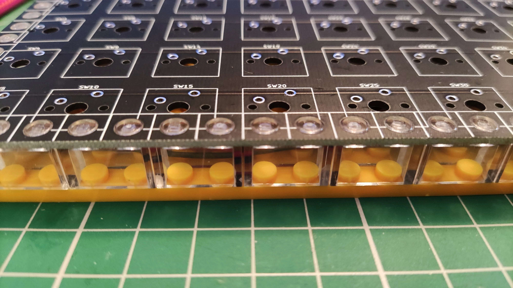{ loading=lazy }

### 3d render

=== "rev 4"

    { loading=lazy }

    { loading=lazy }

=== "rev 3"

    { loading=lazy }

    { loading=lazy }


=== "rev 2"

    { loading=lazy }

    { loading=lazy }

=== "rev 1"

    the 3d render rev1

    { loading=lazy }

    { loading=lazy }

### schematic

=== "rev 4"

    { loading=lazy }

=== "rev 3"

    { loading=lazy }

=== "rev 2"

    { loading=lazy }

=== "rev 1"

    { loading=lazy }

### pcb

=== "rev 4"

    { loading=lazy }

=== "rev 3"

    { loading=lazy }

    { loading=lazy }

    { loading=lazy }


=== "rev 2"

    { loading=lazy }

    { loading=lazy }

    { loading=lazy }

=== "rev 1"

    the pcb for rev1

    { loading=lazy }

    { loading=lazy }

    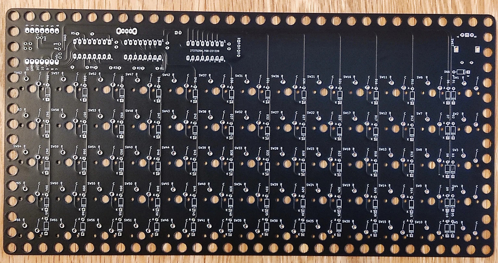{ loading=lazy }


### gerbers

  gerbers ready to be printed at jlcpcb are available

  + [rev4](https://gitlab.com/m-lego/m65/-/blob/devel/gerbers/GERBER-m66-rev4.zip)
  + [rev3](https://gitlab.com/m-lego/m65/-/blob/devel/gerbers/gerbers-rev11.zip)
  + [rev2](https://gitlab.com/m-lego/m65/-/blob/devel/gerbers/gerbers-rev10.zip)
  + [rev1](https://gitlab.com/m-lego/m65/-/blob/devel/gerbers/gerbers-rev9.zip)

  full kicad project if you want to generate your own or modify is available [here](https://gitlab.com/m-lego/m65/) to get a
specific revision see below... please note the head of the default branch is always work in progress.

#### kicad

=== "rev 4"

    ```bash

      git clone https://gitlab.com/m-lego/m65.git
      cd m65
      git checkout m66-rev4
    ```

=== "rev 3"

    ```bash

      git clone https://gitlab.com/m-lego/m65.git
      cd m65
      git checkout revision11

    ```

=== "rev 2"

    ```bash

      git clone https://gitlab.com/m-lego/m65.git
      cd m65
      git checkout revision10
    ```

=== "rev 1"

    ```bash

      git clone https://gitlab.com/m-lego/m65.git
      cd m65
      git checkout revision9
    ```

### firmware

   is qmk or zmk, I assume you already have qmk environment configured.
   can be donloaded, depending on the revision from list below or build by yourself

#### zmk

   you can get the latest firmware from the [repo actions](https://github.com/alinelena/mlego-zmk/actions/workflows/build.yml) just look for **Build mlego** workflow and the latest
successful artefacts.

   source for is available

  - [for rev4](https://github.com/alinelena/mlego-zmk)


#### qmk


  - [firmware/mlego_m66_rev4_default.uf2]()
  - [firmware/mlego_m66_rev4_uk.uf2]()
  - [firmware/mlego_m66_rev3_default.uf2](https://gitlab.com/m-lego/m65/-/blob/devel/firmware/mlego_m66_rev3_default.uf2)
  - [firmware/mlego_m66_rev3_uk.uf2](https://gitlab.com/m-lego/m65/-/blob/devel/firmware/mlego_m66_rev3_uk.uf2)
  - [firmware/mlego_m66_rev2_default.uf2](https://gitlab.com/m-lego/m65/-/blob/devel/firmware/mlego_m66_rev2_default.uf2)
  - [firmware/mlego_m66_rev2_uk.uf2](https://gitlab.com/m-lego/m65/-/blob/devel/firmware/mlego_m66_rev2_uk.uf2)
  - [firmware/mlego_m66_rev1_default.uf2](https://gitlab.com/m-lego/m65/-/blob/devel/firmware/mlego_m66_rev1_default.uf2)
  - [firmware/mlego_m66_rev1_uk.uf2](https://gitlab.com/m-lego/m65/-/blob/devel/firmware/mlego_m66_rev1_uk.uf2)

   you can get the latest firmware from the [repo actiona](https://github.com/alinelena/qmk_firmware/actions/workflows/build.yml) just look for the latest
successful artefacts.

#### qmk source

qmk build instructions

=== "rev 4"

    ```bash
      # oled version
      git clone --recurse-submodules -b mlego_dev https://github.com/alinelena/qmk_firmware.git qmk-alin
      cd qmk-alin
      qmk compile -kb mlego/m66/rev4 -km uk
      qmk compile -kb mlego/m66/rev4 -km default
    ```

=== "rev 3"

    ```bash
      # oled version
      git clone --recurse-submodules -b mlego_dev https://github.com/alinelena/qmk_firmware.git qmk-alin
      cd qmk-alin
      qmk compile -kb mlego/m66/rev3 -km uk
      qmk compile -kb mlego/m66/rev3 -km default


      #or
      make mlego/m66/rev3:uk
      make mlego/m66/rev3:default
      # copy the resulting uf2 on the mcu as per instructions.

      # eink version

      git clone --recurse-submodules -b mlego_eink https://github.com/alinelena/qmk_firmware.git qmk-alin
      cd qmk-alin
      qmk compile -kb mlego/m66/rev3 -km uk
      qmk compile -kb mlego/m66/rev3 -km default
    ```

=== "rev 2"

    ```bash
      git clone --recurse-submodules -b mlego_dev https://github.com/alinelena/qmk_firmware.git qmk-alin
      cd qmk-alin
      qmk compile -kb mlego/m66/rev2 -km uk
      qmk compile -kb mlego/m66/rev2 -km default


      #or
      make mlego/m66/rev2:uk
      make mlego/m66/rev2:default
      # copy the resulting uf2 on the mcu as per instructions.
    ```

=== "rev 1"

    ```bash
      git clone --recurse-submodules -b mlego_dev https://github.com/alinelena/qmk_firmware.git qmk-alin
      cd qmk-alin
      qmk compile -kb mlego/m66/rev1 -km uk
      qmk compile -kb mlego/m66/rev1 -km default


      #or
      make mlego/m66/rev1:uk
      make mlego/m66/rev1:default
      # copy the resulting uf2 on the mcu as per instructions.
    ```


### pictures

=== "rev 4"

    { loading=lazy }

    { loading=lazy }


=== "rev 3"

    { loading=lazy }

    { loading=lazy }

=== "rev 2"

    { loading=lazy }

    { loading=lazy }

    { loading=lazy }

    { loading=lazy }

=== "rev 1"

    { loading=lazy }


### keymaps/layout

   layout is bellow, but since is qmk can be whatever one likes. all revisions for m66 share the same layout and keymaps, below, the
ones for rev4.

#### layout

{loading=lazy}

#### keymap default


=== "layer qwerty - 0"

    {loading=lazy}

=== "layer lwr - 1"

    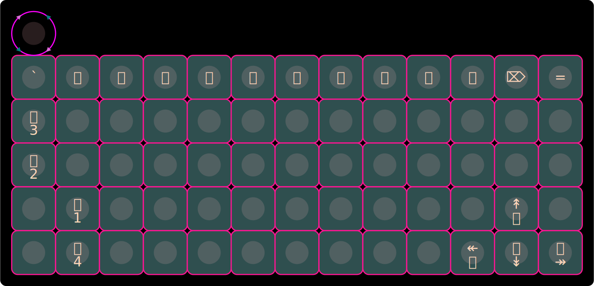{loading=lazy}

=== "layer rse - 2"

    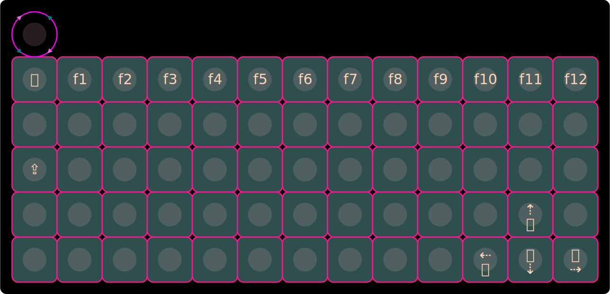{loading=lazy}

=== "layer adjust - 3"

    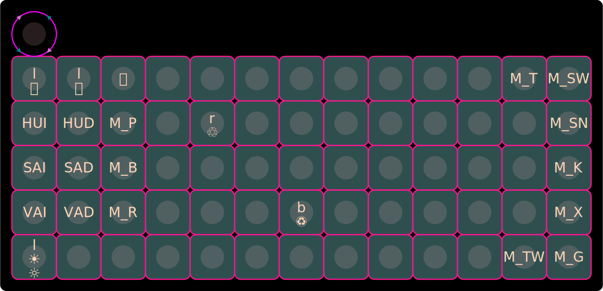{loading=lazy}


#### keymap uk

=== "layer qwerty - 0"

    {loading=lazy}

    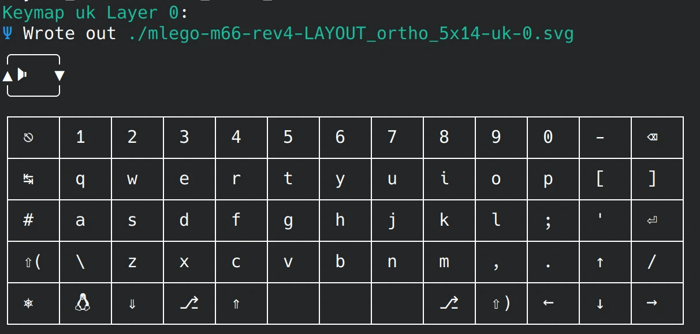{loading=lazy}

=== "layer lwr - 1"

    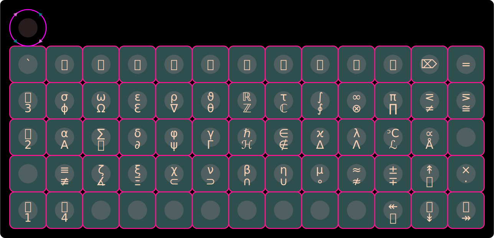{loading=lazy}

    {loading=lazy}

=== "layer rse - 2"

    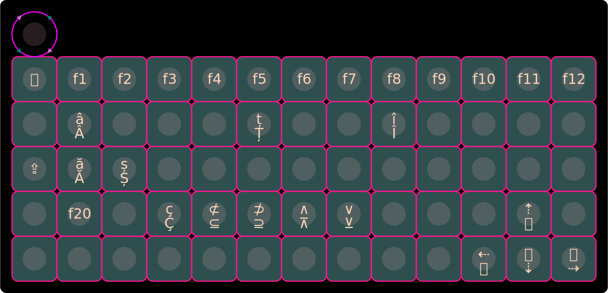{loading=lazy}

    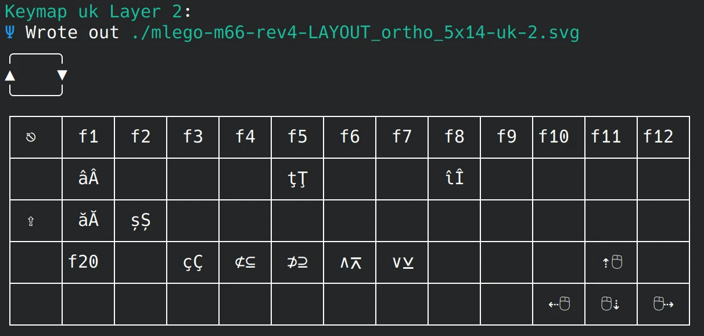{loading=lazy}

=== "layer adjust - 3"

    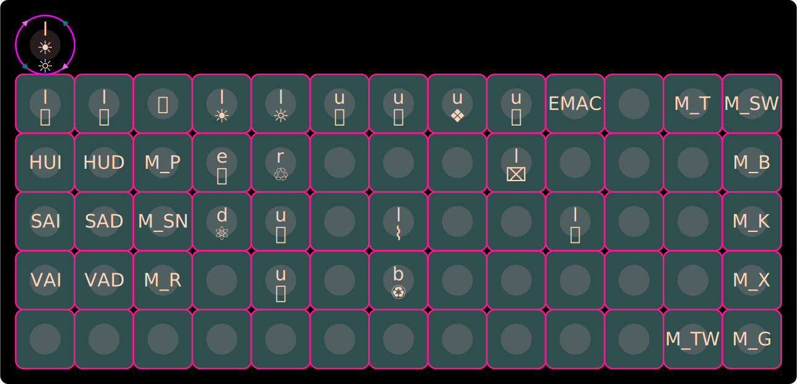{loading=lazy}

    {loading=lazy}


### matrix-pins

=== "rev 4"

    rev4 rp2040 promicro footprint

    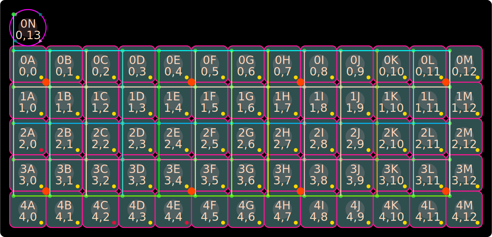{loading=lazy}

    ```

    more to be added

    ```

=== "rev 3"

    rev3 seeeduino xiao rp2040

    {loading=lazy}

    ```

    more to be added

    ```

=== "rev 2"

    rev2 seeeduino xiao rp2040

    {loading=lazy}


    ```
    more to be added

    ```


=== "rev 1"


    rev1 seeeduino xiao rp2040

    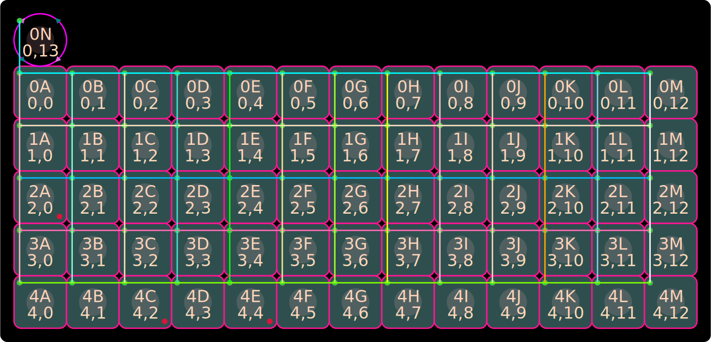{loading=lazy}


    ```
    ShiftRegister SN74HC595N

    1
    QB |1    16| VCC
    QC |2    15| QA
    QD |3    14| SER data
    QE |4    13| OE
    QF |5    12| RCLK latch
    QG |6    11| SRCLK clock
    QH |7    10| SRCLR
    G |8    9 | QH*

    2
    QB |1    16| VCC
    QC |2    15| QA
    QD |3    14| SER
    QE |4    13| OE
    QF |5    12| RCLK
    QG |6    11| SRCLK
    QH |7    10| SRCLR
     G |8    9 | QH*

    shift register 74HC165N

    3
    nPL |1    16| VCC
     CP |2    15| nCE
     D4 |3    14| D3
     D5 |4    13| D2
     D6 |5    12| D1
     D7 |6    11| D0
    nQ7 |7    10| DS
      G |8    9 | Q7
    ```

    | Rows  | C0    | C1    | C2    | C3    | C4    | C5    | C6    | C7    | C8    | C9    | C10   | C11   | C12   | C13   | Pins  |
    | :---: | :---: | :---: | :---: | :---: | :---: | :---: | :---: | :---: | :---: | :---: | :---: | :---: | :---: | :---: | :---: |
    | R0    | Esc   | 1     | 2     | 3     | 4     | 5     | 6     | 7     | 8     | 9     | 0     | -     | Bksp  | MUTE  |  3D0  |
    | R1    | Tab   | q     | w     | e     | r     | t     | y     | u     | i     | o     | p     | [     | ]     |  X*   |  3D1  |
    | R2    | #     | a     | s     | d     | f     | g     | h     | j     | k     | l     | ;     | '     | Enter |  X*   |  3D2  |
    | R3    | Shift | \     | z     | x     | c     | v     | b     | n     | m     | ,     | .     | Up    | /     |  X*   |  3D3  |
    | R4    | Ctrl  | Menu  | Lower | Alt   | Raise | Space | Space | Space | AltGr | Shift | Left  | Down  | Right |  X*   |  3D4  |
    |       | 2QB   | 2QC   | 2QD   |  2QE  | 2QF   |  2QG  |  2QH  |  2QA  |  1QH  |  1QG  |   1QF |  1QE  |   1QA |  1QD  |

    X* not connected in circuit

    **Encoders**

    - Pad_A: GP27
    - Pad_B: GP26

    **OLED**

    - I2C SCL: GP7
    - I2C SDA: GP6

    **Leds**

    | Leds        |  Pin |
    | ----------- |  --- |
    | CAPS_LOCK   | GP25 |
    | Lower       | GP16 |
    | Raise       | GP17 |
    | RGB DI | GP12 |
    | RGB on | GP11 |

    ^ only on rp2040

    ** 74HC595N **

    - data out MOSI: 11 - GP3
     - latch: 8 - GP1
    - clock: 9 - GP2

    ** 74HC165N **

    - latch: 8 - GP1
    - clock: 9 - GP2
    - data in MISO: 10 - GP4

    SPI_DIVISOR 8
    SPI_DIVISOR 3

