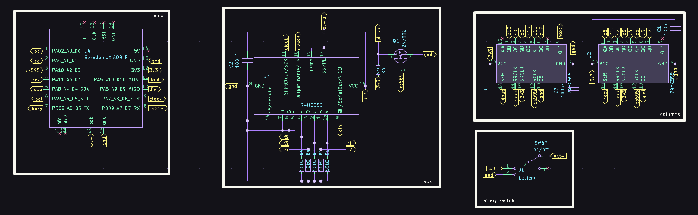

### not enough pins for matrix?

So you decided to wire your matrix keyboard but your favorite mcu does not come with enough pins...
this is more or less what happened to me when I put my hand on a xiao seeduino rp2040 some time ago.

went on the internet at the time and found one of the solutions, wire duplex... however I was not very happy with it since it
involves getting my head around too my simple things.

There is also the non matrix solution, practically direct pins. this you can see used in ghoul and uses shift registers, 589.
https://github.com/tzarc/ghoul

A popular solution was to use io expanders
https://github.com/pierrechevalier83/ferris/wiki/Understanding-the-QMK-firmware-for-the-IO-Expander
few other keyboards use demuxers likes 74HC138, check qmk repo for them.

unfortunately non matrix solution looked too complex for me and the IO exapnder one pure magic(now that I know more about is just
complicated).

I have been aware of shift registers(74HC595) and using them to blink arrays of leds in a previous life... you can see how they work in the
link https://lastminuteengineers.com/74hc595-shift-register-arduino-tutorial/
Another article that shows how shift registers work, 74HC595 and 74HC165, https://dronebotworkshop.com/shift-registers/

So googled hc595 and keyboard... and found this... https://mehmedbasic.dk/post/74hc595-keyboard/ and that was the start.

three ways to, in all three cases I look at scanning a 13x5 matrix (my original problem, that morphed in a 14x5 matrix in time,
clickable encoder) on a xiao seeduino rp2040 but this can be generalised to any rp2040 or stm32... at least the ones I encourage
using and I have been testing.

**note**: at the time of starting this, qmk did not have an examples in the official repo, now you can find the keychron keyboards
and hazel/bad wings use hc595, since version 0.20.0.
for hc165 keyboards/handwired/dqz11n1g/

to manage these a lot of wise words from sigprof and tzarc were used...

**note**: while the circuits and the code work together to produce the expected result, eg. scanning the matrix and getting the
characters in the right place, that does not mean they are optimal or "correct". use at your own risk and remember I am an entusiats
and not an expert in circuits.

#### 1. scan only columns with shift registers

you will need 2x[74HC595](https://www.ti.com/product/SN74HC595) shift registers,

  

   [qmk matrix scan example](https://github.com/alinelena/qmk_firmware/tree/mlego_dev/keyboards/mlego/m65/rev7/matrix.c)

not this version can be also implemented in zmk

   [zmk matrix scan example](https://github.com/alinelena/mlego-zmk/blob/main/config/boards/shields/mlego5x13_rev8/mlego5x13_rev8.overlay)

#### 2a. scan both columns and rows with shift registers.

you need 2x74HC595 and 1x[74HC165](https://www.ti.com/product/SN74HC165), both are cheap and are available in both through hole and surface mount...

this is an old idea nothing, new internet has few hits on it.

this approach is limited, you will not be able to share the MISO pin with other spi devices without extra circuitry

  


   [qmk matrix scan example](https://github.com/alinelena/qmk_firmware/tree/mlego_dev/keyboards/mlego/m65/rev9/matrix.c)

#### 2b. scan both columns and rows with shift registers

you need 2x74HC595 and 1x[74HC589](https://www.onsemi.com/pdf/datasheet/mc74hc589a-d.pdf), 589 is slightly more expensive compared with 165 but is buffered so you can share MISO line
unfortunately is available mainly in surface mount these days...

##### variant 1.

   while this circuit "works" and with the right qmk firmware you get the matrix working, unfortunately all this works because of
chance. **do not use it**

  

   [qmk matrix scan examples](https://github.com/alinelena/qmk_firmware/blob/mlego_dev/keyboards/mlego/m65/rev10/matrix.c)

##### variant 2.

   while this circuit "works" and with the right qmk firmware you get the matrix working, unfortunately all this works because of
chance.

  

   [qmk matrix scan examples](to be added)


***All three variants above permit mixing scanning via shft registers and pins... one will need to have a mixed matrix scanning codes.***

#### restructure the matrix

if you are just short by 1 or 2 pins an easy way away is just to transform the matrix.

Let us say you want to wire a 17 columns and 6 rows, but you do not have 23 pins... you
can wire another matrix, 11 columns and 10 rows and remap the matrix, that is 21 pins.
Now you will need a different
matrix but in qmk this is made easy in the data driven approach, similar in zmk via a transorm.

I will use as an example my mlego/m65 layout which is 13x5 ortho, and can be represented as a 5 rows 13 columns matrix, that is 18 pins. In qmk is set up like:


- the pins

```json
        "matrix_pins": {
            "cols": ["GP1", "GP6", "GP7", "GP8", "GP9", "GP15", "GP14", "GP13", "GP12", "GP11", "GP10", "GP17", "GP21"],
            "rows": ["GP22", "GP16", "GP18", "GP19", "GP20"]
        }
```

- the layout to matrix, each key has a physical position ("x","y","w") and a position in the matrix indicated by "matrix". in this case is trivial since the two map one on top of each other.

```json
        "LAYOUT_ortho_5x13": {
            "layout": [
                { "label": "⎋" , "matrix": [0, 0] , "w": 1, "x": 0 , "y": 0 },
                { "label": "1" , "matrix": [0, 1] , "w": 1, "x": 1 , "y": 0 },
                { "label": "2" , "matrix": [0, 2] , "w": 1, "x": 2 , "y": 0 },
                { "label": "3" , "matrix": [0, 3] , "w": 1, "x": 3 , "y": 0 },
                { "label": "4" , "matrix": [0, 4] , "w": 1, "x": 4 , "y": 0 },
                { "label": "5" , "matrix": [0, 5] , "w": 1, "x": 5 , "y": 0 },
                { "label": "6" , "matrix": [0, 6] , "w": 1, "x": 6 , "y": 0 },
                { "label": "7" , "matrix": [0, 7] , "w": 1, "x": 7 , "y": 0 },
                { "label": "8" , "matrix": [0, 8] , "w": 1, "x": 8 , "y": 0 },
                { "label": "9" , "matrix": [0, 9] , "w": 1, "x": 9 , "y": 0 },
                { "label": "0" , "matrix": [0, 10], "w": 1, "x": 10, "y": 0 },
                { "label": "-" , "matrix": [0, 11], "w": 1, "x": 11, "y": 0 },
                { "label": "⌫" , "matrix": [0, 12], "w": 1, "x": 12, "y": 0 },
                { "label": "↹", "matrix": [1, 0] , "w": 1, "x": 0 , "y": 1 },
                { "label": "q" , "matrix": [1, 1] , "w": 1, "x": 1 , "y": 1 },
                { "label": "w" , "matrix": [1, 2] , "w": 1, "x": 2 , "y": 1 },
                { "label": "e" , "matrix": [1, 3] , "w": 1, "x": 3 , "y": 1 },
                { "label": "r" , "matrix": [1, 4] , "w": 1, "x": 4 , "y": 1 },
                { "label": "t" , "matrix": [1, 5] , "w": 1, "x": 5 , "y": 1 },
                { "label": "y" , "matrix": [1, 6] , "w": 1, "x": 6 , "y": 1 },
                { "label": "u" , "matrix": [1, 7] , "w": 1, "x": 7 , "y": 1 },
                { "label": "i" , "matrix": [1, 8] , "w": 1, "x": 8 , "y": 1 },
                { "label": "o" , "matrix": [1, 9] , "w": 1, "x": 9 , "y": 1 },
                { "label": "p" , "matrix": [1, 10], "w": 1, "x": 10, "y": 1 },
                { "label": "[" , "matrix": [1, 11], "w": 1, "x": 11, "y": 1 },
                { "label": "]" , "matrix": [1, 12], "w": 1, "x": 12, "y": 1 },
                { "label": "#" , "matrix": [2, 0] , "w": 1, "x": 0 , "y": 2 },
                { "label": "a" , "matrix": [2, 1] , "w": 1, "x": 1 , "y": 2 },
                { "label": "s" , "matrix": [2, 2] , "w": 1, "x": 2 , "y": 2 },
                { "label": "d" , "matrix": [2, 3] , "w": 1, "x": 3 , "y": 2 },
                { "label": "f" , "matrix": [2, 4] , "w": 1, "x": 4 , "y": 2 },
                { "label": "g" , "matrix": [2, 5] , "w": 1, "x": 5 , "y": 2 },
                { "label": "h" , "matrix": [2, 6] , "w": 1, "x": 6 , "y": 2 },
                { "label": "j" , "matrix": [2, 7] , "w": 1, "x": 7 , "y": 2 },
                { "label": "k" , "matrix": [2, 8] , "w": 1, "x": 8 , "y": 2 },
                { "label": "l" , "matrix": [2, 9] , "w": 1, "x": 9 , "y": 2 },
                { "label": ";" , "matrix": [2, 10], "w": 1, "x": 10, "y": 2 },
                { "label": "'" , "matrix": [2, 11], "w": 1, "x": 11, "y": 2 },
                { "label": "⏎" , "matrix": [2, 12], "w": 1, "x": 12, "y": 2 },
                { "label": "⇧" , "matrix": [3, 0] , "w": 1, "x": 0 , "y": 3 },
                { "label": "\\", "matrix": [3, 1] , "w": 1, "x": 1 , "y": 3 },
                { "label": "z" , "matrix": [3, 2] , "w": 1, "x": 2 , "y": 3 },
                { "label": "x" , "matrix": [3, 3] , "w": 1, "x": 3 , "y": 3 },
                { "label": "c" , "matrix": [3, 4] , "w": 1, "x": 4 , "y": 3 },
                { "label": "v" , "matrix": [3, 5] , "w": 1, "x": 5 , "y": 3 },
                { "label": "b" , "matrix": [3, 6] , "w": 1, "x": 6 , "y": 3 },
                { "label": "n" , "matrix": [3, 7] , "w": 1, "x": 7 , "y": 3 },
                { "label": "m" , "matrix": [3, 8] , "w": 1, "x": 8 , "y": 3 },
                { "label": "," , "matrix": [3, 9] , "w": 1, "x": 9 , "y": 3 },
                { "label": "." , "matrix": [3, 10], "w": 1, "x": 10, "y": 3 },
                { "label": "↑" , "matrix": [3, 11], "w": 1, "x": 11, "y": 3 },
                { "label": "/" , "matrix": [3, 12], "w": 1, "x": 12, "y": 3 },
                { "label": "⎈" , "matrix": [4, 0] , "w": 1, "x": 0 , "y": 4 },
                { "label": "" , "matrix": [4, 1] , "w": 1, "x": 1 , "y": 4 },
                { "label": "⇓" , "matrix": [4, 2] , "w": 1, "x": 2 , "y": 4 },
                { "label": "⎇" , "matrix": [4, 3] , "w": 1, "x": 3 , "y": 4 },
                { "label": "⇑" , "matrix": [4, 4] , "w": 1, "x": 4 , "y": 4 },
                { "label": " " , "matrix": [4, 5] , "w": 1, "x": 5 , "y": 4 },
                { "label": " " , "matrix": [4, 6] , "w": 1, "x": 6 , "y": 4 },
                { "label": " " , "matrix": [4, 7] , "w": 1, "x": 7 , "y": 4 },
                { "label": "⎇" , "matrix": [4, 8] , "w": 1, "x": 8 , "y": 4 },
                { "label": "⇧" , "matrix": [4, 9] , "w": 1, "x": 9 , "y": 4 },
                { "label": "←", "matrix": [4, 10], "w": 1, "x": 10, "y": 4 },
                { "label": "↓" , "matrix": [4, 11], "w": 1, "x": 11, "y": 4 },
                { "label": "→" , "matrix": [4, 12], "w": 1, "x": 12, "y": 4 }
            ]
        }

```

in terms of physical connections that looks like


```
┌──┐┌──┐┌──┐┌──┐┌──┐┌──┐┌──┐┌──┐┌──┐┌──┐┌──┐┌──┐┌──┐
│0A││0B││0C││0D││0E││0F││0G││0H││0I││0J││0K││0L││0M│
└──┘└──┘└──┘└──┘└──┘└──┘└──┘└──┘└──┘└──┘└──┘└──┘└──┘
┌──┐┌──┐┌──┐┌──┐┌──┐┌──┐┌──┐┌──┐┌──┐┌──┐┌──┐┌──┐┌──┐
│1A││1B││1C││1D││1E││1F││1G││1H││1I││1J││1K││1L││1M│
└──┘└──┘└──┘└──┘└──┘└──┘└──┘└──┘└──┘└──┘└──┘└──┘└──┘
┌──┐┌──┐┌──┐┌──┐┌──┐┌──┐┌──┐┌──┐┌──┐┌──┐┌──┐┌──┐┌──┐
│2A││2B││2C││2D││2E││2F││2G││2H││2I││2J││2K││2L││2M│
└──┘└──┘└──┘└──┘└──┘└──┘└──┘└──┘└──┘└──┘└──┘└──┘└──┘
┌──┐┌──┐┌──┐┌──┐┌──┐┌──┐┌──┐┌──┐┌──┐┌──┐┌──┐┌──┐┌──┐
│3A││3B││3C││3D││3E││3F││3G││3H││3I││3J││3K││3L││3M│
└──┘└──┘└──┘└──┘└──┘└──┘└──┘└──┘└──┘└──┘└──┘└──┘└──┘
┌──┐┌──┐┌──┐┌──┐┌──┐┌──┐┌──┐┌──┐┌──┐┌──┐┌──┐┌──┐┌──┐
│4A││4B││4C││4D││4E││4F││4G││4H││4I││4J││4K││4L││4M│
└──┘└──┘└──┘└──┘└──┘└──┘└──┘└──┘└──┘└──┘└──┘└──┘└──┘

```

each key is location is represented by a number, for row and a letter for column. you wire all the ones with the same number in a row and all with the same letter in the column.
so row 0 goes to pin GP22, 1 to GP16 and so on, col A goes go GP1, col B to GP2 and so on...


now the same layout can be represented as a 8 rows and 9 columns matrix which will need only 17 pins, saving you 1 pin.

- the pins become

```json
    "matrix_pins": {
        "cols": ["GP1", "GP6", "GP7", "GP8", "GP9", "GP15", "GP14", "GP13", "GP12" ],
        "rows": ["GP11", "GP10", "GP17", "GP21", "GP16", "GP18", "GP19", "GP20"]
    }
```

- the layout to matrix becomes, note the decoupling between the matrix and the physical layout

```json
        "LAYOUT_ortho_5x13": {
            "layout": [
                { "label": "⎋" , "matrix": [0, 0] , "w": 1, "x": 0 , "y": 0 },
                { "label": "1" , "matrix": [0, 1] , "w": 1, "x": 1 , "y": 0 },
                { "label": "2" , "matrix": [0, 2] , "w": 1, "x": 2 , "y": 0 },
                { "label": "3" , "matrix": [0, 3] , "w": 1, "x": 3 , "y": 0 },
                { "label": "4" , "matrix": [0, 4] , "w": 1, "x": 4 , "y": 0 },
                { "label": "5" , "matrix": [0, 5] , "w": 1, "x": 5 , "y": 0 },
                { "label": "6" , "matrix": [0, 6] , "w": 1, "x": 6 , "y": 0 },
                { "label": "7" , "matrix": [0, 7] , "w": 1, "x": 7 , "y": 0 },
                { "label": "8" , "matrix": [0, 8] , "w": 1, "x": 8 , "y": 0 },
                { "label": "9" , "matrix": [1, 0] , "w": 1, "x": 9 , "y": 0 },
                { "label": "0" , "matrix": [1, 1], "w": 1, "x": 10, "y": 0 },
                { "label": "-" , "matrix": [1, 2], "w": 1, "x": 11, "y": 0 },
                { "label": "⌫" , "matrix": [1, 3], "w": 1, "x": 12, "y": 0 },
                { "label": "↹", "matrix": [1, 4] , "w": 1, "x": 0 , "y": 1 },
                { "label": "q" , "matrix": [1, 5] , "w": 1, "x": 1 , "y": 1 },
                { "label": "w" , "matrix": [1, 6] , "w": 1, "x": 2 , "y": 1 },
                { "label": "e" , "matrix": [1, 7] , "w": 1, "x": 3 , "y": 1 },
                { "label": "r" , "matrix": [1, 8] , "w": 1, "x": 4 , "y": 1 },
                { "label": "t" , "matrix": [2, 0] , "w": 1, "x": 5 , "y": 1 },
                { "label": "y" , "matrix": [2, 1] , "w": 1, "x": 6 , "y": 1 },
                { "label": "u" , "matrix": [2, 2] , "w": 1, "x": 7 , "y": 1 },
                { "label": "i" , "matrix": [2, 3] , "w": 1, "x": 8 , "y": 1 },
                { "label": "o" , "matrix": [2, 4] , "w": 1, "x": 9 , "y": 1 },
                { "label": "p" , "matrix": [2, 5], "w": 1, "x": 10, "y": 1 },
                { "label": "[" , "matrix": [2, 6], "w": 1, "x": 11, "y": 1 },
                { "label": "]" , "matrix": [2, 7], "w": 1, "x": 12, "y": 1 },
                { "label": "#" , "matrix": [2, 8] , "w": 1, "x": 0 , "y": 2 },
                { "label": "a" , "matrix": [3, 0] , "w": 1, "x": 1 , "y": 2 },
                { "label": "s" , "matrix": [3, 1] , "w": 1, "x": 2 , "y": 2 },
                { "label": "d" , "matrix": [3, 2] , "w": 1, "x": 3 , "y": 2 },
                { "label": "f" , "matrix": [3, 3] , "w": 1, "x": 4 , "y": 2 },
                { "label": "g" , "matrix": [3, 4] , "w": 1, "x": 5 , "y": 2 },
                { "label": "h" , "matrix": [3, 5] , "w": 1, "x": 6 , "y": 2 },
                { "label": "j" , "matrix": [3, 6] , "w": 1, "x": 7 , "y": 2 },
                { "label": "k" , "matrix": [3, 7] , "w": 1, "x": 8 , "y": 2 },
                { "label": "l" , "matrix": [3, 8] , "w": 1, "x": 9 , "y": 2 },
                { "label": ";" , "matrix": [4, 0], "w": 1, "x": 10, "y": 2 },
                { "label": "'" , "matrix": [4, 1], "w": 1, "x": 11, "y": 2 },
                { "label": "⏎" , "matrix": [4, 2], "w": 1, "x": 12, "y": 2 },
                { "label": "⇧" , "matrix": [4, 3] , "w": 1, "x": 0 , "y": 3 },
                { "label": "\\", "matrix": [4, 4] , "w": 1, "x": 1 , "y": 3 },
                { "label": "z" , "matrix": [4, 5] , "w": 1, "x": 2 , "y": 3 },
                { "label": "x" , "matrix": [4, 6] , "w": 1, "x": 3 , "y": 3 },
                { "label": "c" , "matrix": [4, 7] , "w": 1, "x": 4 , "y": 3 },
                { "label": "v" , "matrix": [4, 8] , "w": 1, "x": 5 , "y": 3 },
                { "label": "b" , "matrix": [5, 0] , "w": 1, "x": 6 , "y": 3 },
                { "label": "n" , "matrix": [5, 1] , "w": 1, "x": 7 , "y": 3 },
                { "label": "m" , "matrix": [5, 2] , "w": 1, "x": 8 , "y": 3 },
                { "label": "," , "matrix": [5, 3] , "w": 1, "x": 9 , "y": 3 },
                { "label": "." , "matrix": [5, 4], "w": 1, "x": 10, "y": 3 },
                { "label": "↑" , "matrix": [5, 5], "w": 1, "x": 11, "y": 3 },
                { "label": "/" , "matrix": [5, 6], "w": 1, "x": 12, "y": 3 },
                { "label": "⎈" , "matrix": [5, 7] , "w": 1, "x": 0 , "y": 4 },
                { "label": "" , "matrix": [5, 8] , "w": 1, "x": 1 , "y": 4 },
                { "label": "⇓" , "matrix": [6, 0] , "w": 1, "x": 2 , "y": 4 },
                { "label": "⎇" , "matrix": [6, 1] , "w": 1, "x": 3 , "y": 4 },
                { "label": "⇑" , "matrix": [6, 2] , "w": 1, "x": 4 , "y": 4 },
                { "label": " " , "matrix": [6, 3] , "w": 1, "x": 5 , "y": 4 },
                { "label": " " , "matrix": [6, 4] , "w": 1, "x": 6 , "y": 4 },
                { "label": " " , "matrix": [6, 5] , "w": 1, "x": 7 , "y": 4 },
                { "label": "⎇" , "matrix": [6, 6] , "w": 1, "x": 8 , "y": 4 },
                { "label": "⇧" , "matrix": [6, 7] , "w": 1, "x": 9 , "y": 4 },
                { "label": "←", "matrix": [6, 8], "w": 1, "x": 10, "y": 4 },
                { "label": "↓" , "matrix": [7, 0], "w": 1, "x": 11, "y": 4 },
                { "label": "→" , "matrix": [7, 1], "w": 1, "x": 12, "y": 4 }
            ]
        }

```

- the physical connections for matrix now are more complex in respect to the physical layout but we saved 1 pin. same rules as before apply for connections.

```
┌──┐┌──┐┌──┐┌──┐┌──┐┌──┐┌──┐┌──┐┌──┐┌──┐┌──┐┌──┐┌──┐
│0A││0B││0C││0D││0E││0F││0G││0H││0I││1A││1B││1C││1D│
└──┘└──┘└──┘└──┘└──┘└──┘└──┘└──┘└──┘└──┘└──┘└──┘└──┘
┌──┐┌──┐┌──┐┌──┐┌──┐┌──┐┌──┐┌──┐┌──┐┌──┐┌──┐┌──┐┌──┐
│1E││1F││1G││1H││1I││2A││2B││2C││2D││2E││2F││2G││2H│
└──┘└──┘└──┘└──┘└──┘└──┘└──┘└──┘└──┘└──┘└──┘└──┘└──┘
┌──┐┌──┐┌──┐┌──┐┌──┐┌──┐┌──┐┌──┐┌──┐┌──┐┌──┐┌──┐┌──┐
│2I││3A││3B││3C││3D││3E││3F││3G││3H││3I││4A││4B││4C│
└──┘└──┘└──┘└──┘└──┘└──┘└──┘└──┘└──┘└──┘└──┘└──┘└──┘
┌──┐┌──┐┌──┐┌──┐┌──┐┌──┐┌──┐┌──┐┌──┐┌──┐┌──┐┌──┐┌──┐
│4D││4E││4F││4G││4H││4I││5A││5B││5C││5D││5E││5F││5G│
└──┘└──┘└──┘└──┘└──┘└──┘└──┘└──┘└──┘└──┘└──┘└──┘└──┘
┌──┐┌──┐┌──┐┌──┐┌──┐┌──┐┌──┐┌──┐┌──┐┌──┐┌──┐┌──┐┌──┐
│5H││5I││6A││6B││6C││6D││6E││6F││6G││6H││6I││7A││7B│
└──┘└──┘└──┘└──┘└──┘└──┘└──┘└──┘└──┘└──┘└──┘└──┘└──┘
```
