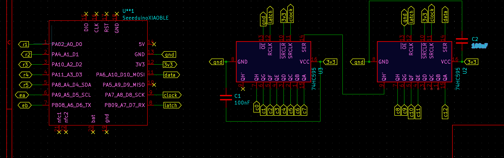
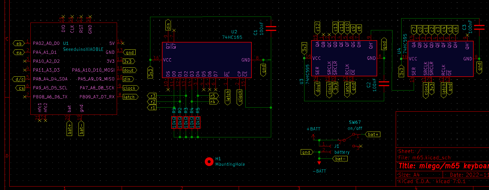

### not enough pins for matrix?

So you decided to wire your matrix keyboard but your favorite mcu does not come with enough pins...
this is more or less what happened to me when I put my hand on a xiao seeduino rp2040 some time ago.

went on the internet at the time and found one of the solutions, wire duplex... however I was not very happy with it since it
involves getting my head around too my simple things.

The other solution restructure the matrix... let us say you want to wire a 17 columns and 6 rows, but you do not have 23 pins... you
can wire another matrix, 11 columns and 10 rows and remap the matrix. In qmk this is made easy in the data driven approach

*note*: add example

There is also the non matrix solution, practically direct pins. this you can see used in ghoul and uses shift registers, 589.
https://github.com/tzarc/ghoul

A popular solution was to use io expanders
https://github.com/pierrechevalier83/ferris/wiki/Understanding-the-QMK-firmware-for-the-IO-Expander

unfortunately non matrix solution looked too complex for me and the IO exapnder one pure magic(now that I know more about is just
complicated).

I have been aware of shift registers and using them to blink arrays of leds in a previous life... you can see how they work in the
link https://lastminuteengineers.com/74hc595-shift-register-arduino-tutorial/

So googled hc595 and keyboard... and found this... https://mehmedbasic.dk/post/74hc595-keyboard/ and that was the start.

three ways to, in all three cases I look at scanning a 13x5 matrix (my original problem, that morphed in a 14x5 matrix in time,
clickable encoder) on a xiao seeduino rp2040 but this can be generalised to any rp2040 or stm32... at least the ones I encourage
using and I have been testing.

**note**: at the time of starting this, qmk did not have an examples in the official repo, now you can find the keychron keyboards
and hazel/bad wings use hc595.
for hc165 keyboards/handwired/dqz11n1g/,

1. scan only columns with shift registers

you will need 2x74HC595 shift registers,

  

qmk example

2a. scan both columns and rows with shift registers.

you need 2x74HC595 and 1xHC165, both are cheap and are available in both through hole and surface mount...

this is an old idea nothing, new internet has few hits on it.

this approach is limited, you will not be able to share the MISO pin with other spi devices without extra circuitry

  

qmk example

2b. scan both columns and rows with shift registers

you need 2x74HC595 and 1xHC589, 589 is slightly more expensive compared with 165 but is buffered so you can share MISO line
unfortunately is available only in surface mount these days...

  

qmk example

All three variants above permit mixing scanning via shft registers and pins... one will need to have a mixed matrix scanning codes.

