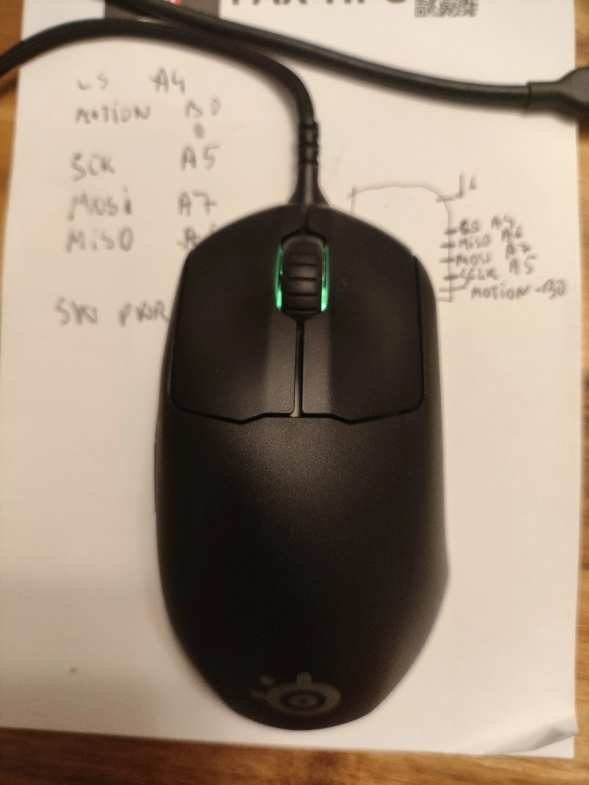
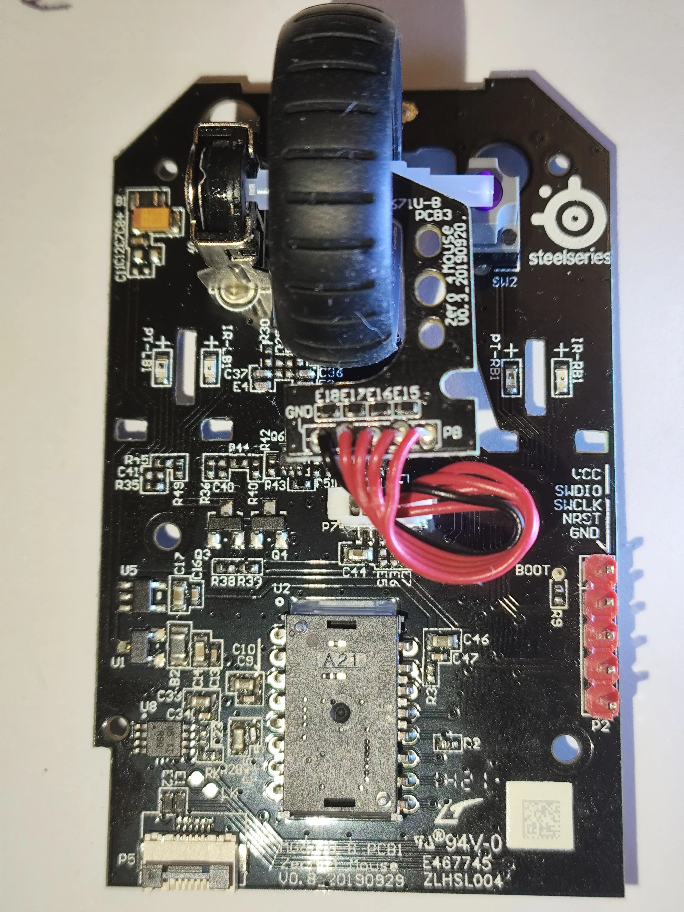
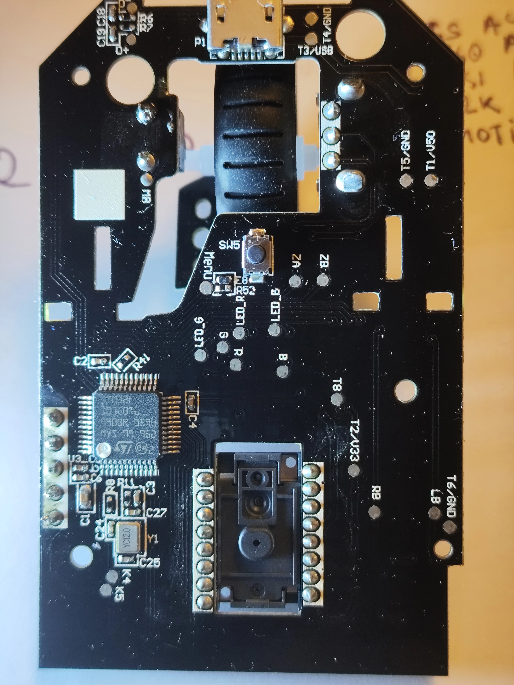

## steelseries prime


{ loading=lazy }

this is a relatively [cheap mouse](https://steelseries.com/gaming-mice/prime), the wired version, got few of them from a discounter(B&M), for £15.

It has stm32f103c8t6, truemove pro (works with pixart pmw3389 driver) sensor, 6 buttons and rgb light in the wheel. prime+ the fancier version shares same mcu and sensor
and is already available in qmk, thank to Dasky. so my task was relatively trivial.

converting it requires, some soldering, so I say is mediunm difficulty.

### pcbs

- front

{ loading=lazy }

- back -- with lens removed

{ loading=lazy }

### tools

two screwdrivers, PH0( for screws inside) and TX6 (for case screws) and an stlink v2 (I have a cheap one I got it from robotdyn but
plenty others are avaiable on aliexpress). you will also need a soldering iron, a set of pins (5 at 2.54 spacing) and at least 3
du pont female-female wires.

### prep

- remove the glued protection over the screws. if you do it with care you can reuse them after... if not you can buy new ones
- remove the 4 screws with tx6 screwdriver
- open the case with care, and remove the ribon... there is an easy realease lever on it.
- remove the 2 screws from the pcb and case, and the extra 2 screws from close to the wheel.
- separate the pcb from the case, be careful when you dislodge it, do not worry if you break the platic prong on the side of the
  pcb.
- now you are ready to solder the pins.
- solder the pins, note that on some the through holes may be filled, so you make have to remove the solder.

once soldered shall look like this..

!(pcb with headers)[]

### bootloader

- connect the stlink to the pcb(target). you need to connect only 3 wires if you power the mouse via the usb cable GND, SWCLK and
SWDIO or 4 add VCC (3.3V) with the du pont wires.

- insert the stlink into the usb.

now we assume you use openocd in command line, but you ca achieve the same with STM32CubeProgrammer.

- get the new bootloader from

[firmware/uf2boot_prime.bin](https://gitlab.com/m-lego/m65/-/blob/devel/firmware/uf2boot_prime.bin)

you can also build it from source using this [repo](https://github.com/daskygit/uf2-prime-plus), clone the repo, go to source and
build target PRIME_PLUS

you may want to edit the source code (the submodule to make it build, the config.h to have the proper name)

```diff

Submodule libopencm3 contains modified content
diff --git a/libopencm3/Makefile b/libopencm3/Makefile
index d93efeac..d5c2e4d6 100644
--- a/libopencm3/Makefile
+++ b/libopencm3/Makefile
@@ -59,7 +59,7 @@ build: lib
 LIB_DIRS:=$(wildcard $(addprefix lib/,$(TARGETS)))
 $(LIB_DIRS): $(IRQ_DEFN_FILES:=.genhdr)
        @printf "  BUILD   $@\n";
-       $(Q)$(MAKE) --directory=$@ SRCLIBDIR="$(SRCLIBDIR)"
+       $(Q)$(MAKE) --directory=$@ SRCLIBDIR=$(SRCLIBDIR)

 lib: $(LIB_DIRS)
        $(Q)true
diff --git a/src/stm32f103/prime_plus/config.h b/src/stm32f103/prime_plus/config.h
index d7c2b50..6fe0eb7 100644
--- a/src/stm32f103/prime_plus/config.h
+++ b/src/stm32f103/prime_plus/config.h
@@ -49,11 +49,11 @@
 #define UF2_FAMILY 0x5ee21072

 #undef VOLUME_LABEL
-#define VOLUME_LABEL "PRIMEPLUS"
+#define VOLUME_LABEL "PRIME"
 #undef PRODUCT_NAME
-#define PRODUCT_NAME "SteelSeries Prime+"
+#define PRODUCT_NAME "SteelSeries Prime"
 #undef BOARD_ID
-#define BOARD_ID "steelseries-prime-plus"
+#define BOARD_ID "steelseries-prime"

```

- remove write protection on the mcu

```sh
openocd -f interface/stlink.cfg -f target/stm32f1x.cfg -c "init; reset halt; stm32f1x unlock 0; flash protect 0 0 last off; reset halt; exit"

```

- flash the bootloader

```sh
openocd -f interface/stlink.cfg -f target/stm32f1x.cfg -c "program uf2boot.bin  verify reset exit 0x8000000"
```

- unpower and remove the stlink cables at this stage.

- you can reassembla the mouse at this stage.

### firmware

- power the mouse via usb, keeping the button underside pressed. you shall get a mounting notification of a new device

- copy or flash the firmware on it.

you can download the firmware from [firmware/steelseries_prime_default.uf2](https://gitlab.com/m-lego/m65/-/blob/devel/firmware/steelseries_prime_default.uf2) and copy on device.

or build your own


```bash
  git clone --recurse-submodules -b mlego_dev https://github.com/alinelena/qmk_firmware.git qmk-alin
  cd qmk-alin
  qmk compile -kb steelseries/prime -km default
  qmk flash -kb steelseries/prime -km default
```
