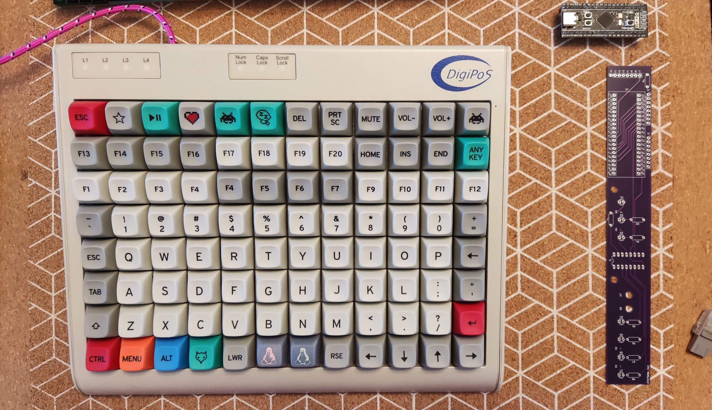
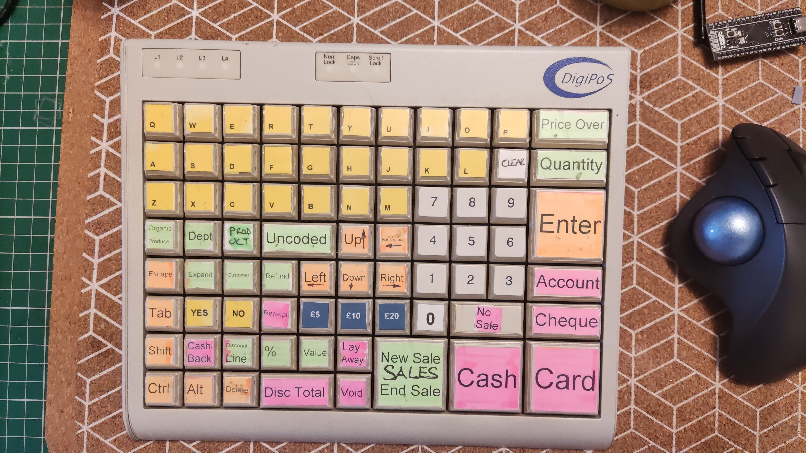
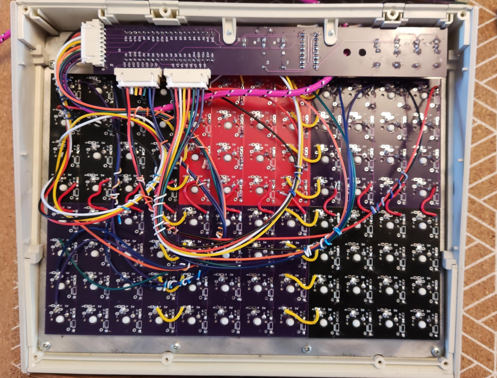

## tipro 8x12

  

### introduction

  this is another tipro this time, 8x12.


### pcb

I used the same daughter board as for tipro 8x16 more info [here](https://mlego.elena.space/tipro8x16/)

### firmware

  ready made firmware can be downloaded

  + [tipro_rev2_default_96.uf2](https://gitlab.com/m-lego/hand8x16/-/blob/develop/firmware/tipro_rev2_default_96.uf2)

  build your own

   ```bash
      git clone --recurse-submodules -b mlego https://github.com/alinelena/qmk_firmware.git qmk-alin
      cd qmk-alin
      qmk compile -kb tipro/rev2 -km default_96

   ```
   copy the resulting uf2 on the mcu.

### pins

   - cols: B9, B8, B7, B6, B5, B4, C14, C15, A0, A1, A2, A3, A7, B0, B10, B1
   - rows: B12, B13, B14, B15, A8, A10, A15, B3

  - leds: shift register - QA-QG

** 74HC595N **

  - data: A4
  - latch: A6
  - clock: A5


### pictures

original

  

converted inside

  
