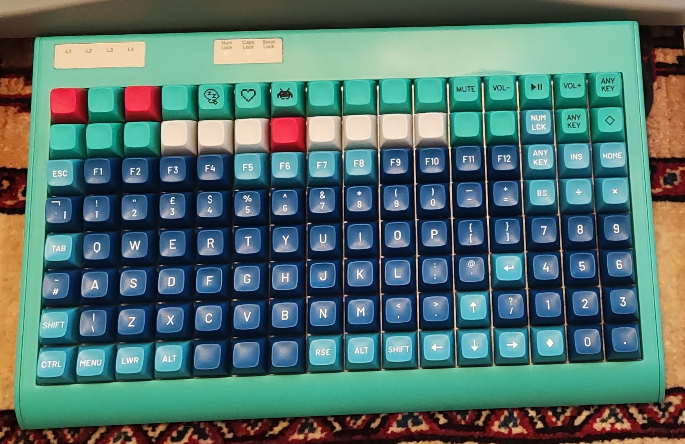
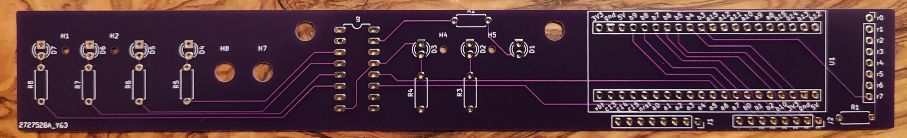
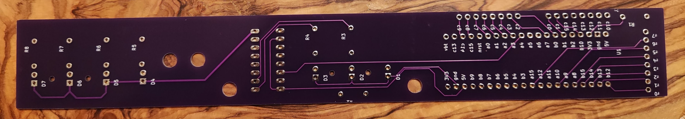
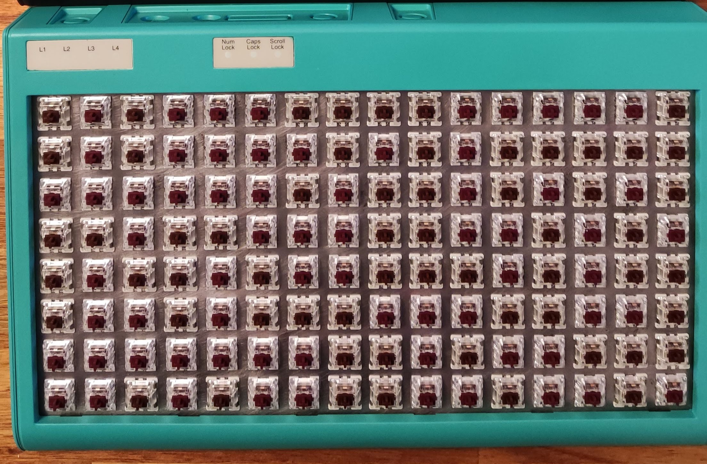

## tipro 8x16

  

### introduction

this is a pos tipro 8x16 which I converted to use qmk.
It is a handwired like project with a daugher board.

it uses stm32f401 on a pcb but since there are not enough pins for the 7 leds I used a shift register to control the leds.

### pcb

 3d render

 

 printed pcbs

 
 

 wiring

 

  full kicad project for the pcb in [here](https://gitlab.com/m-lego/hand8x16/)

### pictures

original

