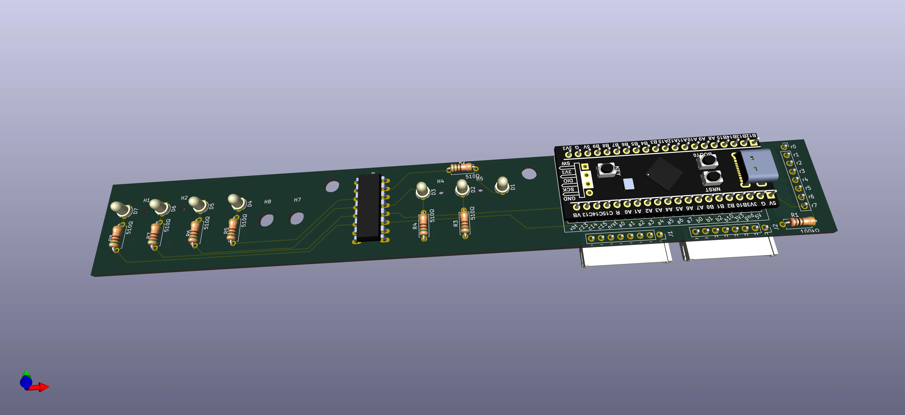
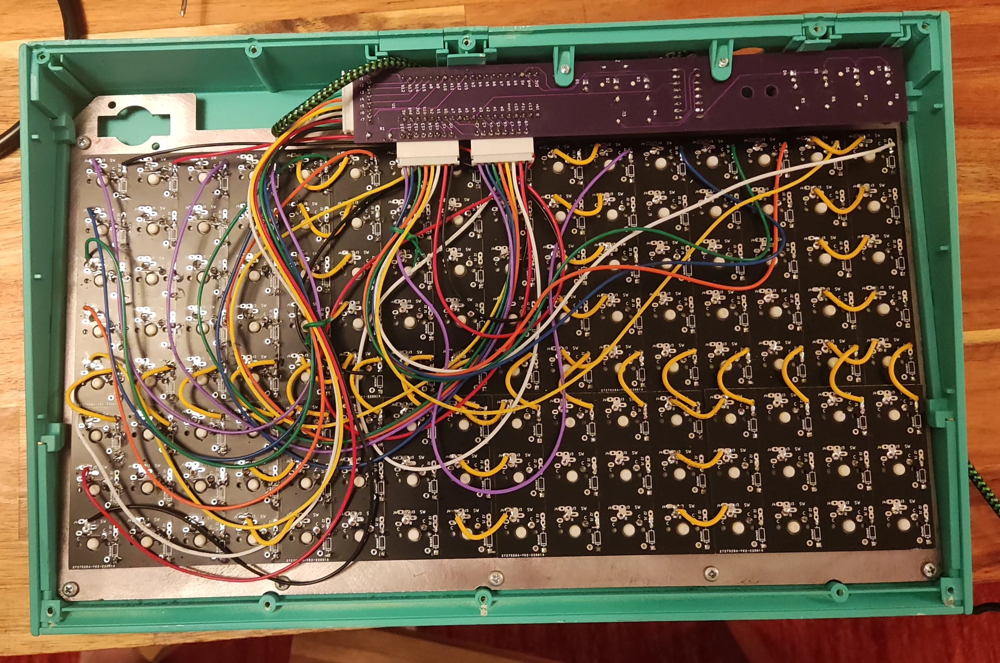
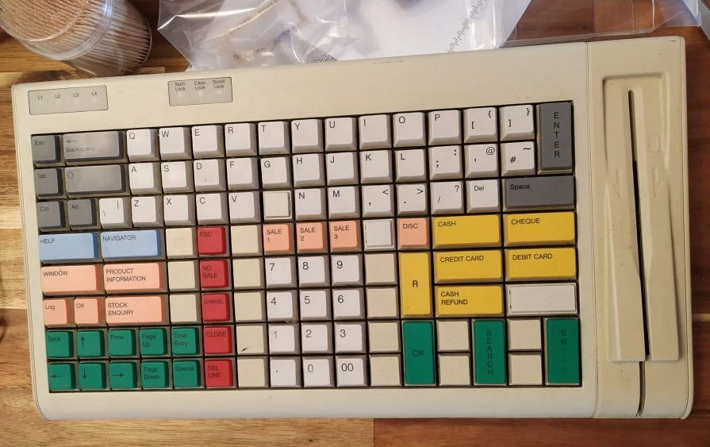

## tipro 8x16

  

### introduction

this is a pos tipro 8x16 which I converted to use qmk.
It is a "handwired" like project with a daugher board.

Originals I got from ebay, some new in box, for 15 or so years, some in bad shape. the plate is some form of painted steel that I
had to polish to remove the old paint. switches were cherry black, 3pin, that I desoldered and replaced with whatever I had handy in
the right quantity. keycaps for this mt3 dasher... with dev/tty

it uses stm32f401 on a pcb but since there are not enough pins for the 7 leds I used a shift register to control the leds.
firmware is qmk...
The case on this one is painted since was excessive yellowed by time.

total price of conversion around £10.

### pcb

 3d render

 

 printed pcbs

 

 

### wiring

 

  full kicad project for the pcb in [here](https://gitlab.com/m-lego/hand8x16/)

### firmware

  ready made firmware can be downloaded

  + [tipro_rev1_default.uf2](https://gitlab.com/m-lego/hand8x16/-/blob/develop/firmware/tipro_rev1_default.uf2)

  build your own

   ```bash
      git clone --recurse-submodules -b mlego https://github.com/alinelena/qmk_firmware.git qmk-alin
      cd qmk-alin
      qmk compile -kb tipro/rev1 -km default

   ```
   copy the resulting uf2 on the mcu.

### pins

   - cols: B9, B8, B7, B6, B5, B4, C14, C15, A0, A1, A2, A3, A7, B0, B10, B1
   - rows: B12, B13, B14, B15, A8, A10, A15, B3

  - leds: shift register - QA-QG

** 74HC595N **

  - data: A4
  - latch: A6
  - clock: A5


### pictures

original




