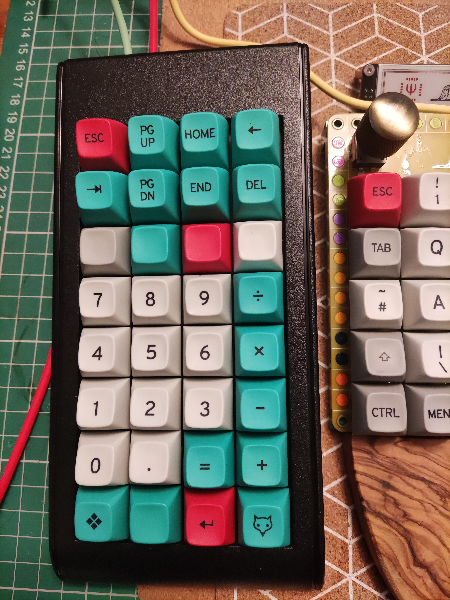
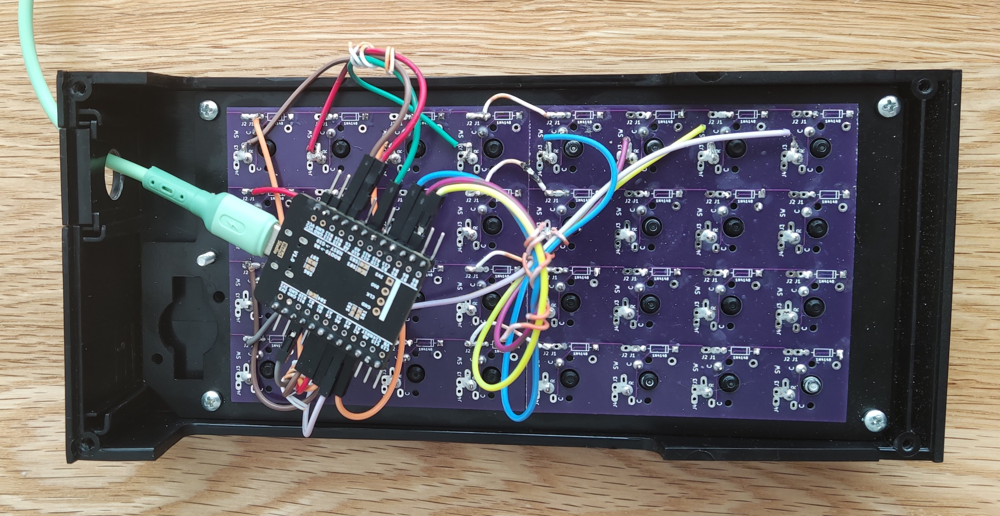
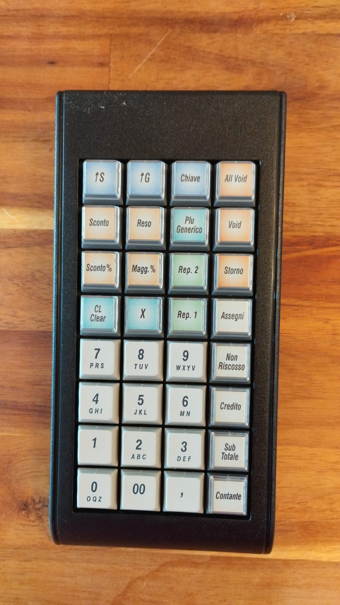

## tipro 8x4

  { loading=lazy }

### introduction

### wiring

 

### mcu

the mcu is stm32g431 from [weact](https://www.aliexpress.com/item/1005005303669884.html)

### firmware

  ready made firmware can be downloaded from [github actiona](https://github.com/alinelena/qmk_firmware/actions/workflows/build.yml)
naaviate to **build firmware for mlego** and click onthe latest successful workflow and download **tipro32_default** from the list.

### pictures

original

 
