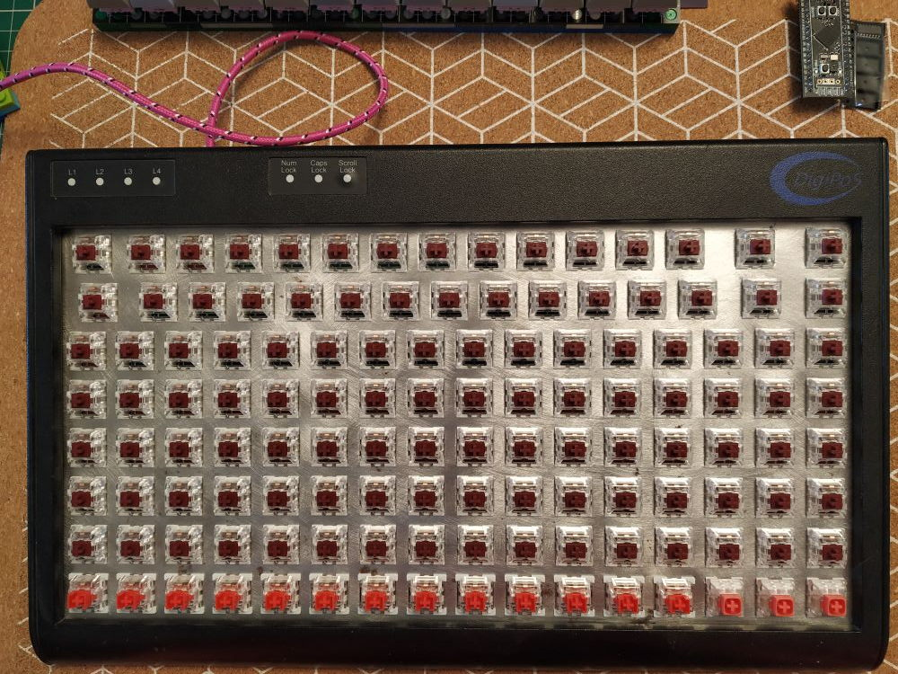
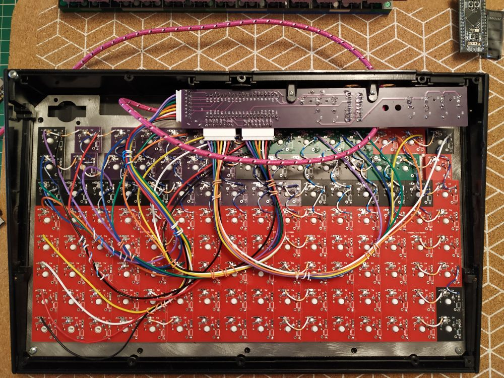
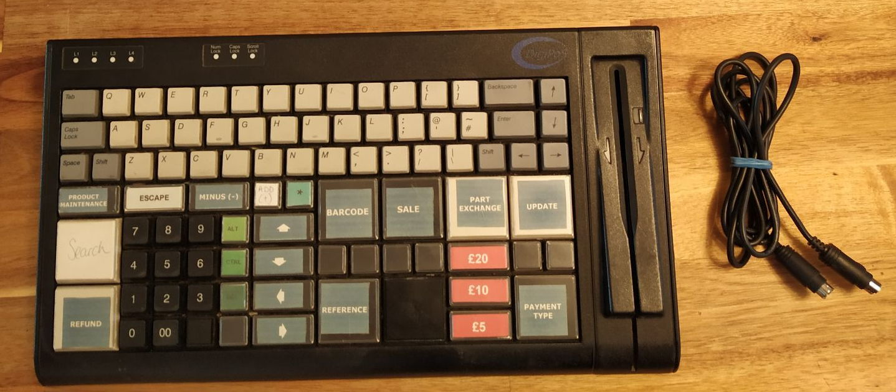

## tipro ansi ortho


  

  

### introduction

this is an ansi ortho combination from tipro that I have converted to qmk using same technique as [here](https://mlego.elena.space/tipro8x16/)

uses the same mcu.

### wiring

 

  full kicad project for the pcb in [here](https://gitlab.com/m-lego/hand8x16/)

### firmware

  ready made firmware can be downloaded

  + [tipro_rev1_default_ansiortho.uf2](https://gitlab.com/m-lego/hand8x16/-/blob/develop/firmware/tipro_rev1_default_ansiortho.uf2)

  build your own

   ```bash
      git clone --recurse-submodules -b mlego https://github.com/alinelena/qmk_firmware.git qmk-alin
      cd qmk-alin
      qmk compile -kb tipro/rev1 -km default_ansiortho

   ```

### pins

the same as 8x16

### photos

original

  
