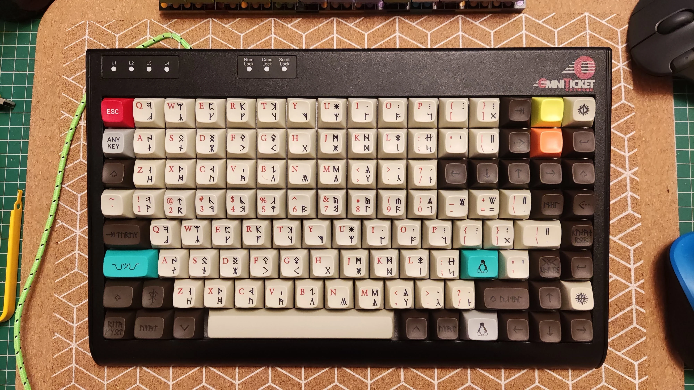
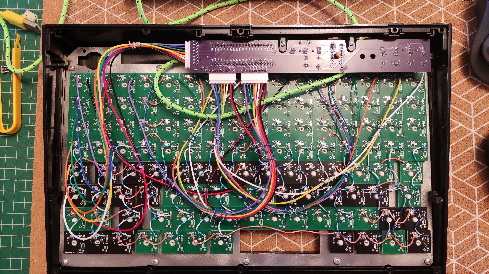
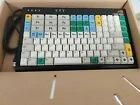
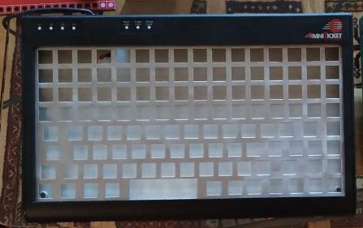
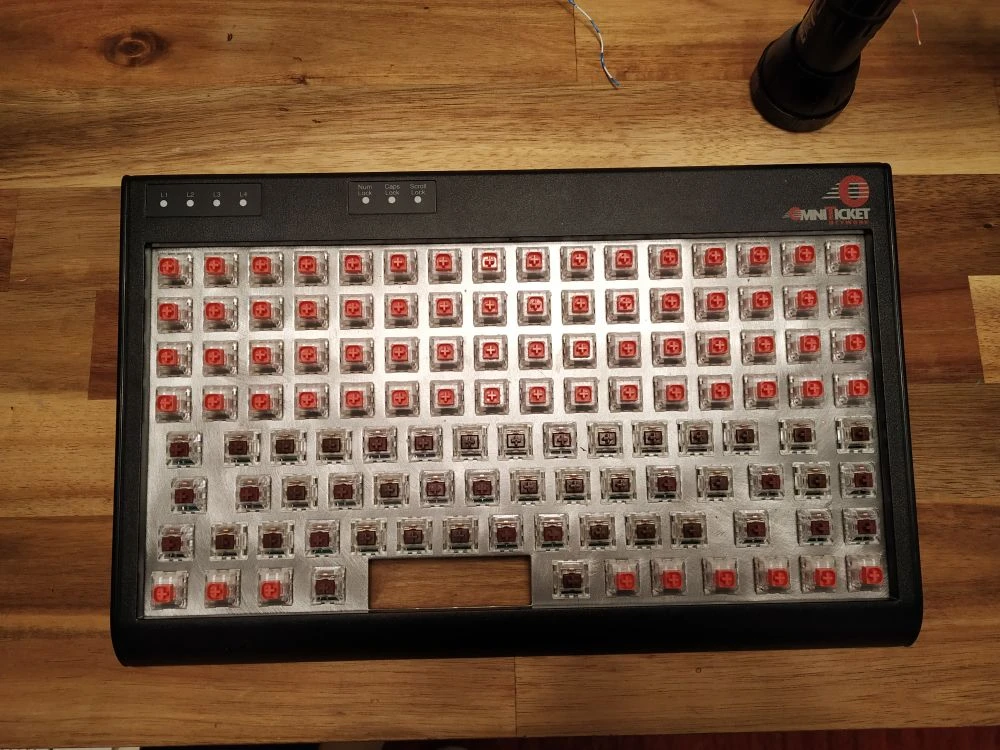

## tipro ortho ansi

  

### introduction

this is an ortho ansi combination from tipro that I have converted to use qmk using same pcb as [here](https://mlego.elena.space/tipro8x16/)

this is in working, page updated once finished.

### wiring

### firmware

### other pictures

original

cleaned

switches

